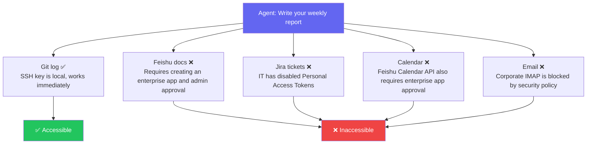
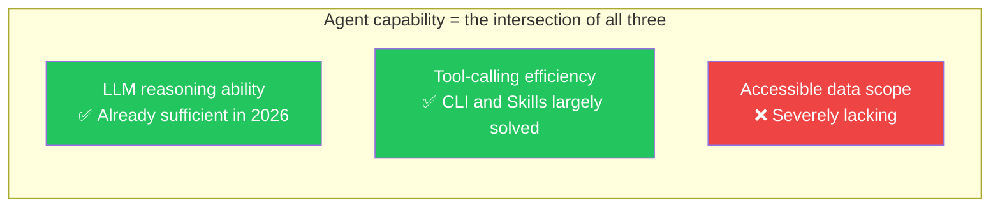
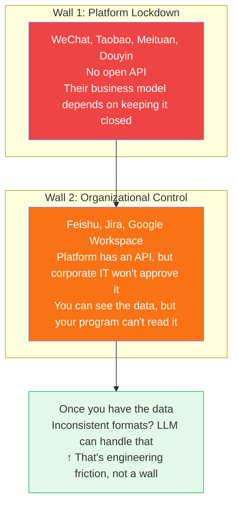
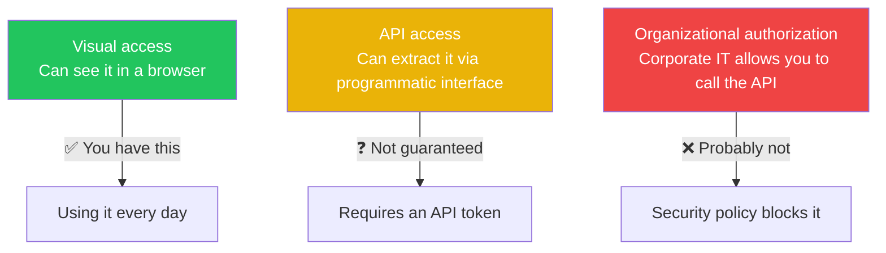
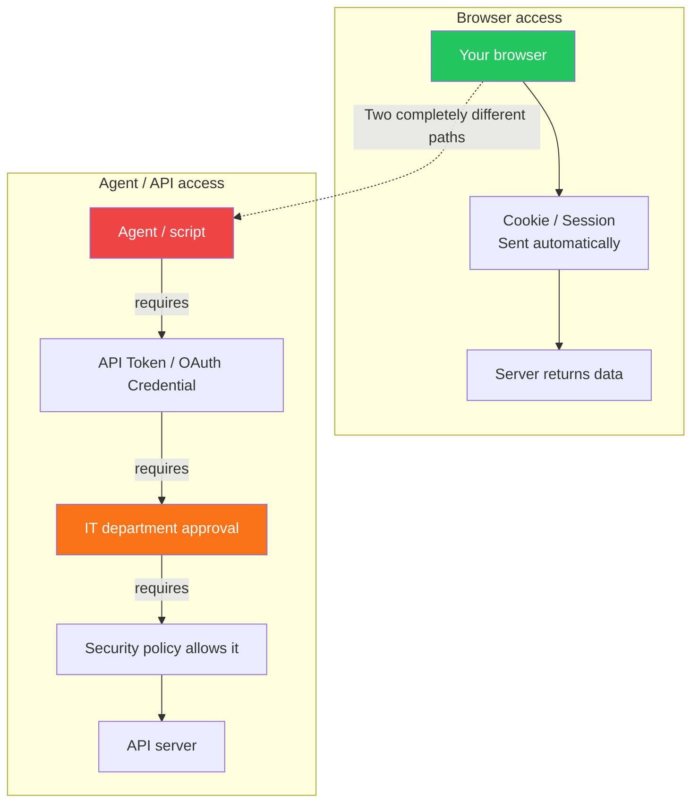

> [In the previous post](/posts/cli-vs-mcp-vs-skills/) we argued that the CLI vs. MCP debate is really a debate about pipes — and what's actually missing is the faucet. This post digs one level deeper: even if you open the faucet, you probably still can't connect to it. The reasons agents struggle in the real world are more structural than most people realize.

## A Common Promise

"Let an agent automatically write your weekly status report — it reads your Git commits, Feishu document edit history, Jira ticket updates, and calendar meetings, then generates a report your manager can actually read."

This is the story agent products love to tell. It sounds reasonable — the data is all yours, you're already using all the tools, you're just automating what you'd otherwise do by hand.

But if you actually try it, you'll find that only 1 out of 5 data sources works:

It's not that the agent isn't smart enough. It's not that the CLI isn't efficient enough. **The data simply isn't reachable.**

There are, of course, some "workaround" approaches that try to bypass this limitation: browser extensions that piggyback on your login session to scrape Feishu documents, RPA tools that simulate clicks to export Jira data, reverse-engineered wrappers around corporate email APIs. These can make a demo work. But they're fundamentally web scrapers — a UI redesign breaks them, a security policy update kills them, and the legal exposure never goes away. Building a workflow on top of these approaches is building on quicksand.

We'll take a detailed look at these "workaround" approaches and their limitations in [the third post](/posts/visual-vs-api-permission/). For now, let's focus on a more fundamental question: **why don't the legitimate paths work?**

## An Agent's Real Capability Depends on Three Variables

The entire industry is racing to improve LLM capability and tool protocols. But the real bottleneck is data access. It's like having a top-of-the-line race car and a perfect track — with an empty fuel tank.

## Two Walls: Why the Data Is Out of Reach

"Data is inaccessible" isn't a vague problem. It has two distinct walls, each with a fundamentally different character:

Wall 1 gets the most attention, but in practice, **Wall 2 is the one most people actually hit.**

### Wall 1: Platform Lockdown

WeChat won't ship `wx auth login`. Taobao won't open a price-comparison API. Douyin won't give you access to its recommendation data. [The previous post](/posts/cli-vs-mcp-vs-skills/) argued from a technical standpoint that CLI is perfectly capable of implementing OAuth (`gh auth login` is proof), so this isn't a technical barrier[^1].

**So why don't they do it? Because data enclosure is the foundation of these platforms' business models.**

Once an agent can make optimal decisions on a user's behalf — comparing prices, comparing ratings, searching across platforms — the platform loses its ability to steer user behavior through recommendation algorithms. That directly threatens the core revenue from advertising and traffic monetization.

A simple heuristic: **whether a platform will open up to agents depends entirely on whether opening up serves its commercial interests.**

| Platform type | Examples | Open to agents? | Logic |
|--------------|---------|----------------|-------|
| Sells subscriptions / services | GitHub, Notion, Vercel | ✅ Actively open | More agent integrations → users more dependent → more paid conversions |
| Sells traffic / advertising | WeChat, Taobao, Douyin | ❌ Locked down | Agents help users skip recommendations → ad value drops |
| Sells enterprise software | Feishu (ByteDance's enterprise platform), DingTalk (Alibaba's Slack equivalent) | ⚠️ Partially open | Rich bot ecosystem → enterprises more dependent on the platform |

### Wall 2: Organizational Control — Visible Doesn't Mean Accessible

Here's a concrete example. You open Feishu in your browser at work and can see all your group chat history and shared documents. Now you want to write a script so an agent can read the same messages. You'll discover you need to create an "enterprise internal application" on the Feishu Open Platform, apply for `im:message` permission, and then submit it to your company's admin for approval. The admin might ask what you need the permission for — and then deny you.

**Data you can see in a browser is not necessarily data your program can read.** The two paths use completely different authentication chains:

Every day you open Feishu to read documents, check Jira tickets, and read email — that's **visual access**. Your browser holds the session, cookies are sent automatically, everything is seamless.

But an agent takes a completely different authentication path:

**Having the former doesn't mean you have the latter. Agents can only take the latter path.**

From the perspective of an ordinary developer (non-admin), here's the actual API accessibility of common tools:

| Tool | Visible in browser | Callable via API | Where it gets stuck |
|------|-------------------|-----------------|-------------------|
| **Git (local)** | ✅ | ✅ | SSH key is local — no approval needed |
| **Feishu (ByteDance's enterprise platform) docs** | ✅ | ❌ | Creating an enterprise internal app requires admin approval[^2] |
| **DingTalk (Alibaba's Slack equivalent)** | ✅ | ❌ | Same — internal apps require organizational admin authorization |
| **Jira Cloud** | ✅ | ⚠️ | Depends on whether the company has disabled Personal Access Tokens |
| **Corporate email** | ✅ | ❌ | IMAP/SMTP typically blocked by security policy |
| **Google Workspace** | ✅ | ❌ | OAuth apps require admin to whitelist them |
| **Notion (personal)** | ✅ | ✅ | Personal Integrations don't require workspace admin involvement[^3] |

The conclusion is clear: **the only things you can freely access via API are local files, personal Git repositories, and personal Notion workspaces.** Everything else is blocked at the organizational admin approval step.

This also explains a pattern: why is coding assistance currently the most successful agent use case? Because code lives in your local filesystem — no one's permission required.

### A Note: What Happens After You Get the Data?

Someone might ask: even if you break through both walls, the data is scattered across Git, Feishu, Jira, email, and other systems in different formats — doesn't that count as a third wall?

Honestly, **with 2026-era LLMs, this isn't a real barrier.** Git log is plain text, Jira's API returns JSON, Feishu documents can be exported as Markdown — as long as data can be converted to text, current models can read and synthesize it. Identity mapping (Git email ≠ Feishu user_id) just needs to be told to the model once. Time alignment, semantic extraction, deduplication and categorization — these are exactly what LLMs are best at.

Inconsistent data formats are engineering friction, not an architectural barrier. They're not in the same league as the first two walls (platform lockdown and organizational denial of access).

**The only two things that actually block agents are: platforms that won't open up, and organizations that won't allow it.** Once the data is in hand, the model can handle the rest.

## The Real Boundaries of Agent Capability

Taking both walls into account, here are the true capability boundaries for agents in 2026:

| Use case | Technically feasible | Actually usable | Blocked by |
|---------|---------------------|----------------|-----------|
| Coding assistance (writing code, debugging) | ✅ | ✅ | No wall — code is local |
| Search public information and summarize | ✅ | ✅ | No wall — public internet data |
| Auto-write weekly status report | ✅ | ❌ | Wall 2: Feishu / Jira API permissions |
| Cross-platform price comparison (flights, hotels) | ✅ | ❌ | Wall 1: Ctrip / 12306 not open |
| Customer relationship management | ✅ | ❌ | Wall 2: CRM API requires IT approval |
| Auto-process email | ✅ | ❌ | Wall 2: IMAP is blocked |
| Cross-platform content publishing | ✅ | ❌ | Wall 1: platforms don't interoperate |
| Personal health data analysis | ✅ | ❌ | Wall 1: health apps don't open up |

**Technically feasible across the board. Actually doable for almost none of them.**

## Conclusion

Your agent can't help you — not because it isn't smart enough. It's because of two walls:

1. **Platform lockdown**: Business models are built on data enclosures. They won't voluntarily open their APIs. This is a commercial negotiation problem.
2. **Organizational control**: Even when a platform has an API, your company's IT security policy may not allow you to use it. This is an organizational management problem.

As for inconsistent data formats and the need to integrate information across systems — with current LLM capability, that's just engineering friction, not a real obstacle. **Once the data is in hand, the model can handle it. The problem is that the data never gets there.**

And most agent product marketing never mentions any of this. It simply assumes "you have API access."

Next time someone pitches you on "automating your workflow with agents," ask two questions first:

> 1. Does the platform provide an API for this data?
> 2. Does my organization allow individuals to use that API?

Both need to be Yes for anything to actually work. In the reality of 2026, scenarios where both are Yes are still rare.

---

*This is the second post in the "Thinking About the Agent Ecosystem" series. Next up: since the data is out of reach, who is working around it and how? Alibaba's closed-loop ecosystem, Doubao's screen-scraping phone agent, and what forces might eventually push things toward openness.*

---

## References

[^1]: On the relationship between platform data lockdown and business models, see [MCP vs. CLI for AI Agents: The Answer Is Both](https://aiproductivity.ai/news/mcp-vs-cli-ai-agents-comparison/) and [The MCP vs CLI Debate Is Missing the Point](https://mkweb.dev/blog/mcp-vs-cli-missing-the-point). The [first post in this series](/posts/cli-vs-mcp-vs-skills/) argued from a technical standpoint that CLI is fully capable of implementing OAuth — so the reason platforms don't open up is a business choice, not a technical limitation.

[^2]: Creating a Feishu enterprise internal application requires approval from the enterprise administrator; see the [Feishu Open Platform documentation](https://open.feishu.cn/document/home/index). Ordinary employees cannot independently create applications with permissions such as `im:message`.

[^3]: Notion's Internal Integration allows individual users to create integrations directly, without involving a workspace administrator; see the [Notion API documentation](https://developers.notion.com/docs/create-a-notion-integration). This makes it one of the few collaboration tools that supports personal-level OAuth.
