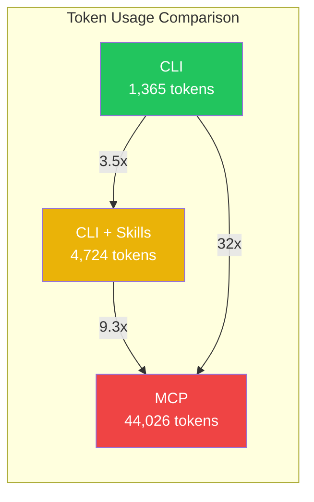
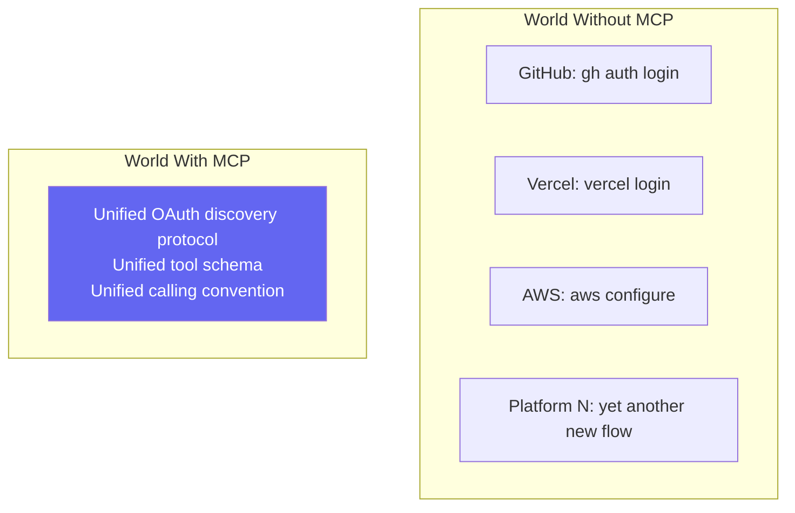
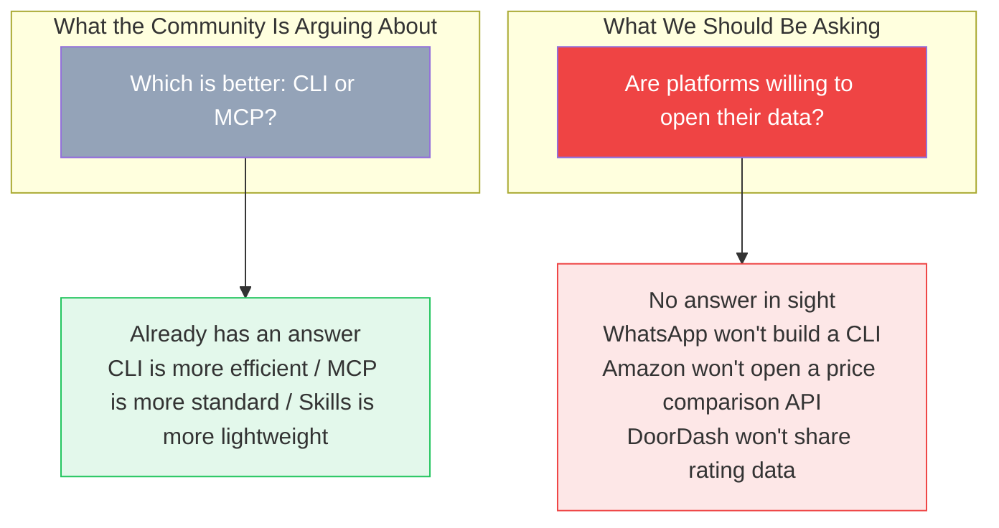

## What They're Fighting About

In March 2026, the hottest topic in the AI Agent world isn't which model is smarter — it's a deceptively boring architecture question:

> How should an Agent call external tools?

Three camps, three answers:

**The MCP Camp** (Model Context Protocol): An open standard Anthropic launched in late 2024[^1]. It wraps service interfaces in a unified JSON-RPC protocol so an Agent can call multiple tools across platforms after a single integration. OpenAI, Google, Microsoft, and AWS have all followed suit[^2]. Sounds great on paper.

**The CLI Camp**: Just let the Agent run shell commands — `git log`, `gh pr list`, `curl`, `kubectl`. No protocol layer, no extra servers. The `grep` and `awk` from 50 years ago are having a second life in the AI era.

**The Skills Camp**: A Markdown file acts as a "cheat sheet," teaching the Agent which tool to use in which situation. It sits idle at ~30 tokens and only loads the full instructions when triggered. Flask creator Armin Ronacher has fully switched to this approach[^3].

## March 2026: Where Things Stand

Pressure on the MCP camp:

- Perplexity published a blog post announcing they're dropping MCP entirely in favor of CLI[^4]
- Eric Holmes's "MCP is dead. Long live the CLI" hit the top of Hacker News[^5]
- ScaleKit benchmarks: MCP had a 28% failure rate (timeouts), CLI was 100% reliable[^9]
- Worth noting: Anthropic, the very company that created MCP, built their own product Claude Code on an architecture that looks much more like CLI than MCP

Momentum behind the CLI camp:

- Andrej Karpathy said in February 2026 on X that CLIs are "super exciting precisely because they are legacy"[^6]
- Smithery published 756 benchmark runs systematically comparing CLI vs MCP on Codex and Claude Code[^13]
- Google open-sourced command-line tools specifically designed for AI use[^7]

The rise of the Skills camp:

- Simon Willison (prominent Python community developer) called Claude Skills "maybe a bigger deal than MCP" when it launched[^11]
- Armin Ronacher fully migrated from MCP to Skills and explained why[^3]:

> "Skills are essentially just a short summary that tells the Agent what capabilities exist and where to find more details. The key thing is — Skills don't inject any tool definitions into the context. The tools are still the same tools: bash and whatever the Agent already has."

- The community is starting to see "delete all your MCPs, replace with Skills + CLI" posts gaining traction[^8]

## Where CLI Wins: A Technical Breakdown

### 1. MCP's Context Pollution Problem

MCP's biggest issue: **the moment an Agent starts up, it has to stuff every tool's schema into the context.**

GitHub's Copilot MCP Server exposes 43 tools. Connecting to it injects roughly 55,000 tokens of tool definitions into your context[^8]. You haven't done anything yet and you've already burned through a huge chunk of your token budget. Hook up 10 MCP Servers with 100 tools? Context explodes.

CLI is completely different — **progressive discovery**. The Agent runs `gh --help` to see what commands exist, then `gh pr --help` when it needs subcommand details. Information loads on demand, not all at once at startup.

### 2. LLMs Already Know CLI

LLM training data contains decades of Unix documentation, Stack Overflow answers, and shell scripts from GitHub. Models natively understand `git`, `curl`, `grep`, `docker`.

MCP? Lots of JSON schema that's harder for models to process, plus the overhead of generating formatted JSON tokens. Your custom MCP tools don't appear in training data — the model has no prior knowledge of how to call them.

### 3. Pipes

If an MCP tool's output needs post-processing (filtering, searching, slicing), you need to write extra code. With CLI, you just pipe:

```bash
gh pr list --json number,title | jq '.[] | select(.title | contains("fix"))'
```

The Agent outputs a few commands connected with `|` and post-processing is done. Simpler, more flexible, lower maintenance cost.

### 4. CLI and Skills Are a Natural Pair

Teaching an Agent to use CLI inside a Skill file is clean and readable:

```markdown
## Check PR Status
gh pr list --state open --json number,title,author
```

Try doing that with MCP? The Skill file fills up with function calls and JSON schema. The whole document becomes a mess.

### The Numbers

ScaleKit ran 75 benchmark tests[^9] on the same GitHub task (Claude Sonnet 4, same prompt):



| Approach | Monthly Cost (10k calls) | Reliability |
|----------|--------------------------|-------------|
| CLI | ~$3.20 | 100% |
| CLI + Skills | ~$4.50 | 100% |
| MCP | ~$55.20 | 72% (28% timeouts) |

CLI is 17x cheaper, with 100% reliability vs 72%. Costs calculated at Claude Sonnet 4 pricing ($3/M input, $15/M output)[^10]. The gap is significant.

## At This Point, CLI Looks Like a Clear Winner

Fewer tokens, more familiar to models, supports pipes, pairs naturally with Skills. On every efficiency metric, MCP is at a disadvantage.

### To Be Fair: MCP Is Adapting

MCP isn't standing still. In January 2026, Anthropic introduced **progressive discovery**[^12] — essentially borrowing the on-demand loading idea from Skills:

- Initially load only tool names and short descriptions (20–50 tokens per tool)
- Full schema only loads when the Agent decides to actually use that tool

Results:
- Token overhead reduced by 85% (77,000 → 8,700 tokens in a 50+ tool scenario)
- Tool call accuracy improved: Claude Opus 4 went from 49% to 74%

The gap is narrowing. But Skills still wins on pure efficiency — because it doesn't inject schema at all, only knowledge.

**But even if MCP's efficiency problems were completely solved, there's a more fundamental question nobody is asking:**

Every benchmark runs in the same scenario — **one developer, using their own credentials, automating their own workflow.**

A lot of articles at this point would say: "But MCP has OAuth — it's irreplaceable for multi-tenant scenarios! CLI can't handle authentication!"

**Can it though?**

## Something I Experienced Today

I deployed this blog today using OpenCode (an AI Agent that works via CLI). The Agent called the Vercel CLI:

```bash
$ vercel login
→ Browser OAuth page opens automatically
→ Click to authorize
→ CLI grabs the token, saves it locally
→ All subsequent commands work seamlessly
```

**Ten seconds. One CLI tool. A complete OAuth browser authorization flow.**

Then I thought about `gh auth login` — GitHub CLI does exactly the same thing. Browser pops up, OAuth authorization, scoped token, local persistence.

So:

> **CLI doesn't "architecturally lack OAuth support." `gh` and `vercel` have already proven that.**

If WhatsApp wanted to build a `whatsapp auth login`, the flow would be identical to `gh`:

```bash
$ whatsapp auth login
→ Browser opens WhatsApp authorization page
→ Confirm on your phone
→ Token saved locally
→ whatsapp send alice "hello"
→ whatsapp groups list
```

**Zero technical barriers. But it will never exist.**

Not because it can't be done — because doing it would mean voluntarily dismantling the walled garden and anti-scraping infrastructure that Meta has spent years building.

## So What Is MCP Actually Good For?

MCP's value isn't "doing things CLI can't do" — `gh` has already proven CLI can handle OAuth.

MCP's value is **standardization**:



For one platform, `gh` is enough. But when you need to integrate 50 platforms, the maintenance cost of each having its own CLI auth flow becomes unacceptable. MCP offers the possibility of "all platforms opening up via the same protocol."

**But standardization has a prerequisite: platforms have to be willing to implement it.**

## So the Whole Debate Is Asking the Wrong Question



GitHub built `gh` — CLI dominates within the GitHub ecosystem.
Vercel built `vercel login` — the deployment experience is seamless.
WhatsApp never built a CLI — your only options are scraping, or waiting.

Amazon, DoorDash, TikTok — they're all in the same boat. The data exists, the technical capability exists, the willingness doesn't.

**What determines the boundaries of what an Agent can do isn't whether you chose CLI or MCP. It's whether the platform is willing to give you a pipe — in whatever form.**

CLI vs MCP is a debate about what the pipe is made of. **The real problem is that there's no faucet.**

Token cost is an engineering problem. Protocol choice is an architecture problem. **Data openness is a political problem.** The first two are being solved. The third is the actual bottleneck choking the entire Agent ecosystem. And the whole community is using a technical framework to avoid the genuinely hard political question.

---

*This is the first post in the "Thinking About the Agent Ecosystem" series. Next up: even when a platform has an API, you probably still can't use it — the two layers of friction blocking Agent adoption are thicker than you think.*

---

## References

[^1]: Anthropic, ["Introducing the Model Context Protocol"](https://www.anthropic.com/news/model-context-protocol), Nov 2024. MCP was released in November 2024 and donated to the Linux Foundation's Agentic AI Foundation (AAIF) in December 2025.

[^2]: OpenAI announced MCP support in March 2025, Google DeepMind in April 2025, Microsoft Copilot Studio and AWS in July 2025. See [CLI-Based Agents vs MCP: The 2026 Showdown](https://lalatenduswain.medium.com/cli-based-agents-vs-mcp-the-2026-showdown-that-every-ai-engineer-needs-to-understand-7dfbc9e3e1f9).

[^3]: Armin Ronacher (Flask creator), "Skills vs Dynamic MCP Loadouts," explaining why he fully switched from MCP to Skills. See the quote in [Skills vs MCP: The Token Efficiency War](https://menonlab-blog-production.up.railway.app/blog/skills-vs-mcp-token-efficiency-ai-agents/).

[^4]: Perplexity CTO Denis Yarats announced at the Ask 2026 developer conference (March 11, 2026) that they were deprecating MCP internally in favor of REST APIs and CLI. See [Awesome Agents coverage](https://awesomeagents.ai/news/perplexity-agent-api-mcp-shift/) and [Agent Engineering deep dive](https://www.agent-engineering.dev/article/why-perplexity-is-stepping-back-from-the-model-context-protocol-mcp-internally).

[^5]: Eric Holmes, ["MCP is dead. Long live the CLI"](https://ejholmes.github.io/2026/02/28/mcp-is-dead-long-live-the-cli.html), Feb 28, 2026. Hit the top of Hacker News with 400+ upvotes and nearly 300 comments.

[^6]: Andrej Karpathy posted on X (Twitter) in February 2026 calling CLIs for Agent workflows "super exciting precisely because they are a legacy." See [Why CLIs Beat MCP for AI Agents](https://lalatenduswain.medium.com/why-clis-beat-mcp-for-ai-agents-and-how-to-build-your-own-cli-army-8db9e0467dd8).

[^7]: Google's open-source AI CLI tools: [gws](https://github.com/googleworkspace/cli) (Google Workspace CLI, 21.8k stars, 100+ Agent Skills) and [Gemini CLI](https://github.com/google-gemini/gemini-cli) (Apache-2.0).

[^8]: Agent Native, ["Delete your MCPs: Skills + CLI outperform at ~20x lower cost"](https://agentnativedev.medium.com/i-deleted-all-my-mcps-skills-cli-outperform-at-20x-lower-cost-8e86e05fcca6), Mar 2026. Notes that GitHub Copilot MCP Server exposes 43 tools and injects approximately 55,000 tokens on initialization.

[^9]: ScaleKit, ["MCP vs CLI: Benchmarking AI Agent Cost and Reliability"](https://www.scalekit.com/blog/mcp-vs-cli-use), Mar 2026. Full data and methodology from 75 benchmark runs. Benchmark code open-sourced on [GitHub](https://github.com/scalekit-inc/mcp-vs-cli-benchmark).

[^10]: Anthropic Claude pricing page: Claude Sonnet 4 — $3/M input tokens, $15/M output tokens. Monthly cost estimates based on median token data from ScaleKit benchmarks.

[^11]: Simon Willison, ["Claude's Skills"](https://simonwillison.net/2025/Oct/16/claude-skills/), Oct 2025. Called it "maybe a bigger deal than MCP" at launch.

[^12]: Anthropic MCP progressive discovery. See ["MCP Tool Search: Claude Code Context Pollution Guide"](https://www.atcyrus.com/stories/mcp-tool-search-claude-code-context-pollution-guide). The 85% token reduction and accuracy improvement figures come from [Skills vs MCP: The Token Efficiency War](https://menonlab-blog-production.up.railway.app/blog/skills-vs-mcp-token-efficiency-ai-agents/).

[^13]: Smithery (Henry Mao), ["MCP vs CLI is the wrong fight"](https://smithery.ai/blog/mcp-vs-cli-is-the-wrong-fight), Mar 2026. 756 benchmark runs across 3 APIs covering Codex and Claude Code, with analysis across skills, code mode, and pretraining bias dimensions.
