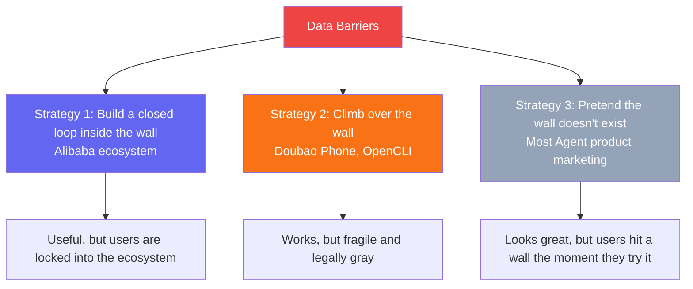
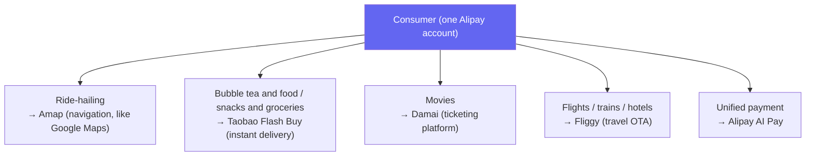
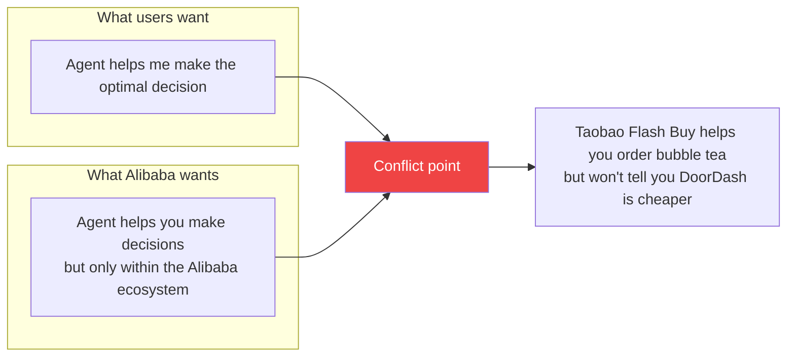
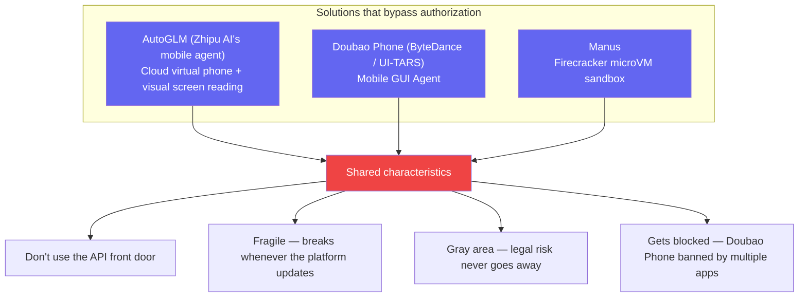
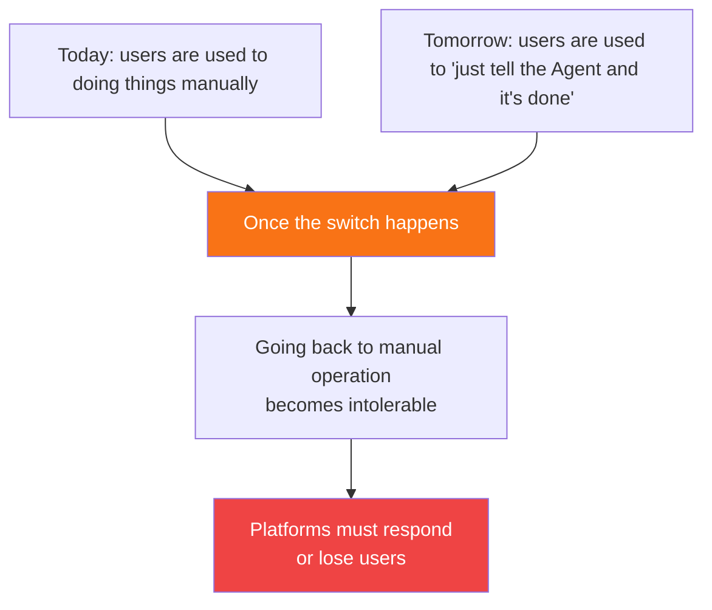
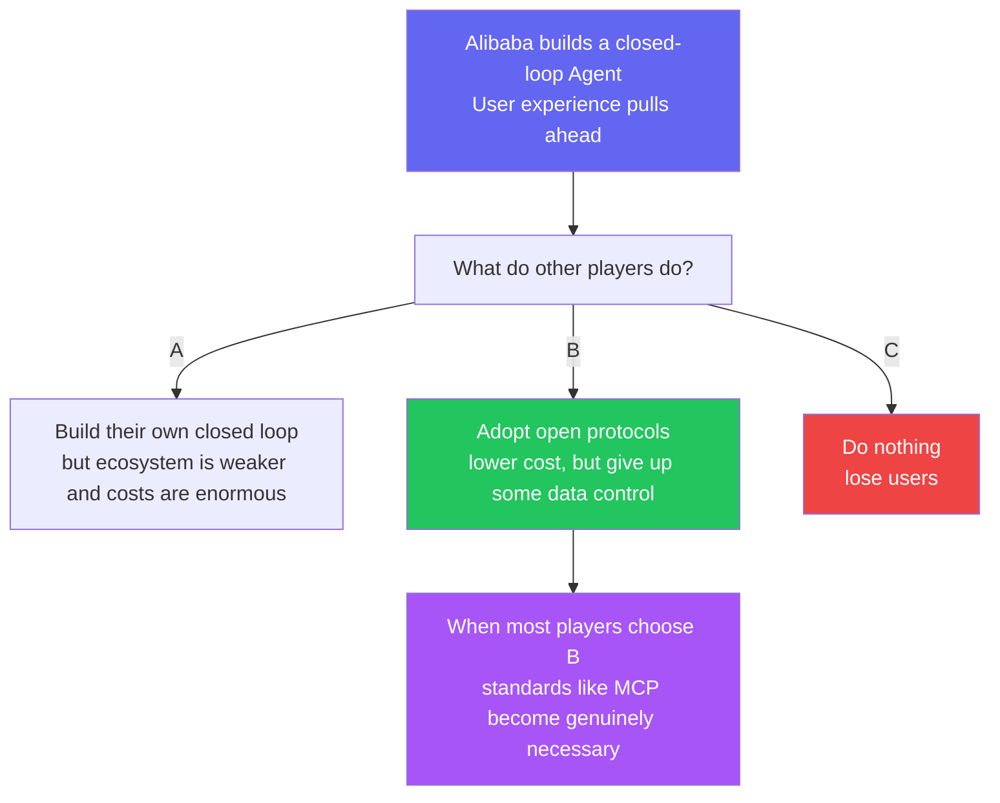
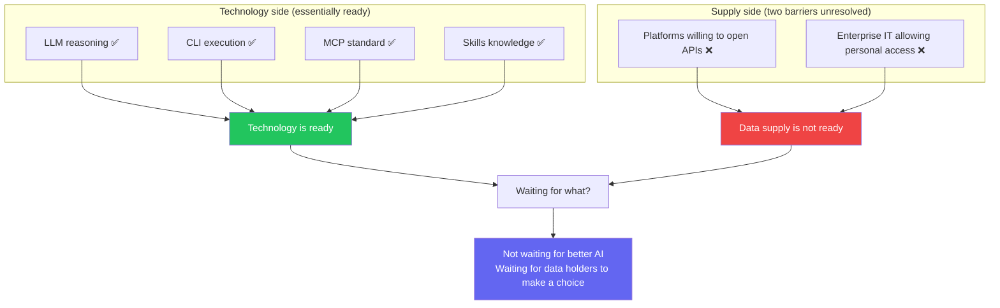

> The first two posts covered: CLI vs MCP is a fight over pipes — what's actually missing is the faucet ([post one](/posts/cli-vs-mcp-vs-skills/)); Agent adoption is blocked by two layers of barriers — platform lock-in and organizational control ([post two](/posts/agent-bottleneck-data-sovereignty/)). This post looks at how different players are actually responding to those two walls.

## Three Strategies

Faced with data barriers, three distinct strategies have emerged:

Strategy 3 has plenty of representatives. OpenClaw runs 24/7 on a Mac mini, and the community has built Skills for auto-generating daily standup reports[^2] and financial statements. Perplexity launched Personal Computer[^5] in March 2026, also running on a Mac mini, connecting to 40+ services including Gmail, Slack, GitHub, Notion, and Salesforce for $200/month. Anthropic's Claude Cowork positions itself as a locally autonomous Agent. The demo videos show data flowing seamlessly across platforms.

These capabilities are real. But they all share one prerequisite: **you already have API access to every tool involved.** As analyzed in [post two](/posts/agent-bottleneck-data-sovereignty/), that prerequisite simply doesn't hold in most real work environments — platforms may not expose APIs at all, and even when they do, your company's IT department may not approve access.

There's a telling asymmetry worth noting: the same idea — having AI operate apps on behalf of users — is celebrated on the PC side (OpenClaw) while being actively blocked on mobile (Doubao Phone (ByteDance's AI phone)), where WeChat, Alipay, and other major apps banded together to shut it down[^6]. The reason is obvious: every app on mobile is a closed ecosystem, and a system-level AI assistant strikes directly at the heart of their traffic monetization.

Let's focus on the first two strategies.

## Strategy 1: Build a Closed Loop Inside the Wall — Alibaba's Two-Front Push

Alibaba's strategy is the clearest: **don't break down the walls — build the closed loop inside your own walls first.** And they're doing it on both the consumer and enterprise sides simultaneously.

### Consumer Side: Qwen App — The Full "Search → Decision → Payment → Fulfillment" Chain

The "Qwen Do It" feature in the Qwen (Alibaba's AI assistant app) App has already integrated the core consumer scenarios across the Alibaba ecosystem[^9]:

This isn't a demo — Alibaba is putting real money behind making this closed loop work. The Qwen App's "First Order of the Day" promotion[^10] distributes **15 million coupons daily**, covering food delivery, hotels, flights, ride-hailing, and movie tickets, with all payments processed through Alipay AI Pay. A user can say "order 30 cups of bubble tea for me" and Qwen handles the entire flow: understanding the request, selecting items, automatically claiming coupons, and landing directly on the checkout page.

Quantum Bit's assessment: Alibaba has become "the world's first tech company to open the full AI 'search-decision-payment-fulfillment' chain at scale"[^9]. Technically, it's built on MCP + A2A protocols with a multi-Agent architecture — a primary Agent breaks down tasks, and multiple sub-Agents execute independently within their respective domains.

**Auth within the ecosystem is nearly invisible** — on first use, you complete an OAuth-style account binding between Qwen and Amap/Taobao/Fliggy (similar to `gh auth login`), and every subsequent operation carries the session automatically. The entire Alibaba ecosystem shares the Alipay account system, so users never have to re-authorize.

### Enterprise Side: Wukong — Enterprise AI Agent Platform

On March 17, 2026, Alibaba launched "Wukong (Alibaba's enterprise AI agent platform)"[^4], an enterprise AI Agent platform embedded inside DingTalk (Alibaba's enterprise chat), which serves over 20 million business organizations. DingTalk CEO Chen Hang was direct about the positioning:

> "Unlike every other lobster Agent on the market, Wukong is natively embedded in the enterprise organization."

DingTalk, with its 800 million users, underwent a complete rewrite of its underlying codebase for this — a **comprehensive CLI transformation**[^11]. Wukong natively operates DingTalk's thousands of capabilities rather than simulating human clicks. Notably, this CLI was designed specifically for AI: commands can be long and detailed (AI doesn't need to memorize them), and output is directly in JSON (AI parses structured data far more efficiently than reading formatted text). This validates the efficiency advantage of CLI for Agent tool-calling discussed in [post one](/posts/cli-vs-mcp-vs-skills/). Alibaba's enterprise capabilities — Taobao, Tmall, 1688, Alipay, Alibaba Cloud — are being progressively integrated as Skills, with the first batch covering ten industry verticals[^4]. AI Agents automatically inherit enterprise permission rules, bypassing the "organizational control" barrier analyzed in [post two](/posts/agent-bottleneck-data-sovereignty/).

### Ecosystem Comparison

| Player | Has | Missing |
|--------|-----|---------|
| **Alibaba (Qwen + Wukong)** | E-commerce + payments + mobility + local services + enterprise collaboration + cloud | Social, content |
| **Tencent** | Social + content + payments + WeCom | E-commerce loop, mobility |
| **ByteDance** | Content + local services + Lark | Payments, supply chain |
| **Google** | Search + maps + AI models | Transaction loop, enterprise collaboration |

Alibaba's edge: **closest to the transaction, and closed loops on both consumer and enterprise sides.** The ultimate value of an Agent isn't conversation — it's completing the full chain of decision → execution → payment. Alibaba is currently the only platform that has made this chain work on both the consumer side (Qwen App) and the enterprise side (Wukong).

### But There's a Structural Tension Here

**The essence of a private-ecosystem Agent: trading the convenience of AI for the user's right to comparison-shop.** Qwen can help you automatically claim coupons, bundle orders, and check out on Taobao Flash Buy — but it won't tell you the same order might be cheaper on DoorDash.

## Strategy 2: Climb Over the Wall — Scraping in a New Form

Rather than waiting for platforms to open up, some players are forcing their way through:

Several representative products have taken this route, each with different technical approaches but the same underlying logic:

**AutoGLM (Zhipu AI's mobile agent)**[^7]: Gives AI a "cloud virtual phone." The Agent runs inside a cloud VM, uses a vision model to understand screen content, and simulates human interactions to complete cross-app tasks (ordering food, booking flights, posting on Weibo). No API required — it just "sees" the screen.

**Doubao Phone (ByteDance / UI-TARS)**[^6]: A mobile GUI Agent, also vision-driven. A single voice command can handle everything from scheduling a dinner to booking the venue and syncing everyone's calendars. After launch, it was blocked by WeChat, Alipay, and several other major apps. A phone that retails for ¥3,499 was being resold on the secondhand market for ¥36,000.

**Manus**[^8]: Each task gets its own dedicated Firecracker microVM (the same technology behind AWS Lambda). The Agent runs a browser, writes code, and manipulates files inside a full cloud sandbox environment, then delivers results when the task is done.

**Different technical forms, same fundamental approach: bypassing the platform's authorization system to access data and execute actions without going through the API front door.** From scraping web pages to scraping screens to spinning up virtual machines, the techniques keep evolving — but the fragility and legal gray areas haven't fundamentally improved. A UI redesign breaks everything. A platform ban shuts it down. Legal risk hangs over it indefinitely.

And "climbing the wall" isn't just fragile — **it's dangerous.** The OpenClaw security incident[^1] is a cautionary tale:

- **10,000+ instances** leaked user credentials due to misconfiguration
- **12% of community Skills** were found to be malicious — injecting code, stealing data, establishing persistent backdoors
- **770,000 Agents** were found to be vulnerable to remote hijacking

These aren't code bugs. They're **inevitable consequences of the architecture** — when you give an Agent shell access without authorization boundaries, security incidents are a matter of when, not if. This is also why MCP's OAuth and permission isolation still have real value in enterprise contexts.

These products are genuinely pushing something important forward, but doing it in a way that's unsustainable — not just technically, but from a security standpoint as well.

## Analogy: The Evolution of Video Streaming

The Agent ecosystem today looks like video streaming in 2008 — delivering value to users on the back of "scraped" content (data). Users genuinely benefit, but the model isn't sustainable.

Legitimization requires platforms to proactively open up — just as video streaming eventually moved toward licensing deals. But in the Agent world, that means platforms surrendering control over data, which strikes at the foundation of their business models.

## What Forces Will Push Over the First Brick?

Not technology. Three things drive change:

### 1. The Irreversibility of User Expectations

If Alibaba's closed-loop Agent gets there first, and users experience "say one sentence and get a hotel booked, flights arranged, and a route planned" inside the Alibaba ecosystem — going back to manually searching on other platforms becomes unbearable.

### 2. Regulatory Pressure from Outside

The EU's Digital Markets Act (DMA) has already produced real enforcement results[^12]:

- **6 gatekeepers designated**: Alphabet, Amazon, Apple, ByteDance, Meta, Microsoft (September 2023)
- **First fines issued in April 2025**: Apple €500 million (restricting App Store openness) + Meta €200 million (forced "pay or consent") = €700 million combined
- Maximum penalty: **10% of global annual revenue** (20% for repeat violations)
- **Article 7** mandates interoperability for messaging services (WhatsApp and Messenger must support cross-platform messaging)
- Apple and Google have been forced to open cross-platform data portability (iOS 26.3 beta added a "Transfer to Android" feature)

China's Personal Information Protection Law (PIPL), Article 45, also establishes data portability rights — users can request that their personal information be transferred to another processor of their choosing. But current enforcement has focused on privacy protection (cracking down on doxxing, facial recognition abuse, etc.), and there are no cases yet of data portability rights being used to force platforms to open data to third-party Agents.

**The gap is stark: the EU is using fines to force openness, while China's data portability provisions remain largely on paper.** If China were to introduce enforcement comparable to the DMA, that would be the real turning point.

### 3. The Prisoner's Dilemma of Competition

Just like UnionPay/NetsUnion (China's payment clearing networks) opening up payments — nobody chose to open up voluntarily. It was driven by regulation, competition, and user expectations working together.

What Alibaba is doing right now looks, in the short term, like reinforcing its own walls. **In the long run, it may actually be the first domino that knocks the walls down** — because it creates a user experience gap that forces other platforms to follow.

## So What Are We Waiting For?

**The bottleneck in the AIGC era isn't that AI isn't powerful enough — it's that data holders have no incentive to let AI make choices on behalf of users.**

Because the moment an Agent can help users make optimal decisions, platforms lose their ability to manipulate user choices. The value Agents deliver to people's lives and the threat they pose to platform profits are two sides of the same coin.

There's no technical solution to this problem — it requires user expectations, regulatory pressure, and market competition to push it forward together. And those three forces are slowly building.

Where will the first brick fall? My guess: Alibaba's closed-loop Agent creates an experience gap first, then competitive pressure propagates to other platforms, then regulation gives it a final push.

As for how long that takes — probably slower than the tech optimists think, and faster than the pessimists expect.

---

*This is the third post in the "Thinking About the Agent Ecosystem" series. The core thesis of this series comes down to one sentence: **CLI vs MCP is a fight over pipes — what's missing is the faucet.** The technology is all ready. We're waiting for data holders to make their choice.*

---

## References

[^1]: OpenClaw security incident data from ScaleKit, ["MCP vs CLI: Benchmarking AI Agent Cost & Reliability"](https://www.scalekit.com/blog/mcp-vs-cli-use), Mar 2026. Also cited in [Skills vs MCP: The Token Efficiency War](https://menonlab-blog-production.up.railway.app/blog/skills-vs-mcp-token-efficiency-ai-agents/).

[^2]: OpenClaw community Feishu integration Skills, including [feishu-ai-dailyreport](https://playbooks.com/skills/openclaw/skills/feishu-ai-dailyreport) (automated team daily reports) and [finance-report-analyzer](https://playbooks.com/skills/openclaw/skills/finance-report-analyzer) (financial statement generation).

[^3]: Microsoft AutoGen framework (55,000+ GitHub stars), unified with Semantic Kernel into Microsoft Agent Framework in Q1 2026. Early enterprise adoption cases include KPMG audit automation and BMW vehicle telemetry analysis. See [Microsoft Agent Framework GA: Production Adoption Strategy](https://jangwook.net/en/blog/en/microsoft-agent-framework-ga-production-strategy/).

[^4]: Alibaba launched enterprise AI Agent platform "Wukong" on March 17, 2026, embedded in DingTalk, with Alibaba enterprise capabilities integrated as Skills. See [Sina Finance report](https://finance.sina.com.cn/roll/2026-03-17/doc-inhrhxzp8083854.shtml) and [Jinglin Xianghai in-depth analysis](https://www.itsolotime.com/archives/26159).

[^5]: Perplexity launched Personal Computer on March 11, 2026 at the Ask 2026 developer conference, running on a Mac mini at $200/month (Perplexity Max subscription), connecting to 40+ services. See [The Verge report](https://www.theverge.com/ai-artificial-intelligence/893536/perplexitys-personal-computer-turns-your-spare-mac-into-an-ai-agent).

[^6]: Doubao Phone (ByteDance UI-TARS technology) launched a technical preview in December 2025, subsequently blocked by WeChat, Alipay, and several other major apps. A phone retailing at ¥3,499 was resold on the secondhand market for ¥36,000. See [Sina Finance: "What Manus and Doubao Phone couldn't do — why did a 'lobster' pull it off?"](https://finance.sina.com.cn/wm/2026-03-17/doc-inhrieik2013061.shtml).

[^7]: AutoGLM (Zhipu AI's mobile agent): the world's first mobile Agent, based on the GLM-4.5V multimodal model, using a "cloud virtual phone" architecture where the Agent runs in a sandbox. Open-sourced in December 2025 (Apache-2.0). See [GitHub: Open-AutoGLM](https://github.com/zai-org/Open-AutoGLM).

[^8]: Manus: a general-purpose Agent platform where each task gets its own dedicated Firecracker microVM sandbox (2 vCPU, 8GB RAM), with the Agent running autonomously in a full cloud environment. Acquired by Meta in 2026. See [Manus Sandbox core mechanism explained](https://www.53ai.com/news/LargeLanguageModel/2026011671960.html).

[^9]: Qwen App's "Qwen Do It" feature integrates Taobao Flash Buy, Fliggy, Amap, Damai, Alipay, and other Alibaba ecosystem services, enabling the full "search → decision → payment → fulfillment" chain. Built on MCP + A2A protocols with a multi-Agent architecture. See Quantum Bit, ["AI is starting to 'take action' — and Alibaba's Qwen is leading the world"](https://zhuanlan.zhihu.com/p/1995444089915728132).

[^10]: Qwen App "First Order of the Day" promotion rules: 15 million coupons distributed daily, covering food delivery, snacks and groceries, hotels, movie tickets, flights, train tickets, and ride-hailing. Services fulfilled by Taobao Flash Buy, Damai, Fliggy, and Amap; payments and coupon redemption handled by Alipay. Data source: Qwen App promotion rules page (effective February 18, 2026).

[^11]: DingTalk's comprehensive CLI transformation: DingTalk, with 800 million users, completed a full rewrite of its underlying codebase and shifted entirely to a CLI architecture. Unlike the DOS-era CLI, this one is designed specifically for AI — commands can be long (AI doesn't need to memorize them), and output is in JSON (structured data). See Tencent News, ["DingTalk has gone fully CLI"](https://view.inews.qq.com/a/20260319A05MMX00); Chaoji Net, ["DingTalk 2.0 major upgrade: full underlying code rewrite, comprehensive CLI command-line interface transformation"](https://www.ichaoqi.com/ganhuo/2026/0317/81048.html).

[^12]: EU DMA enforcement data: first fines issued April 23, 2025 — Apple €500 million + Meta €200 million = €700 million combined. See 36Kr, ["€700 million: EU issues first fines under the Digital Markets Act against Apple and Meta"](https://www.36kr.com/p/3263607955078913); Security Insider, ["The EU Digital Markets Act compliance exam is over — what did the six gatekeepers submit?"](https://www.secrss.com/articles/88435), March 2026. China's Personal Information Protection Law Article 45 establishes data portability rights, but enforcement has focused on privacy protection; see the Supreme People's Procuratorate's [typical cases of personal information protection procuratorial public interest litigation](http://www.news.cn/government/20260123/f95a39d03b7649c08fe143b3450cac34/c.html), January 2026.
