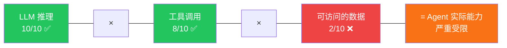
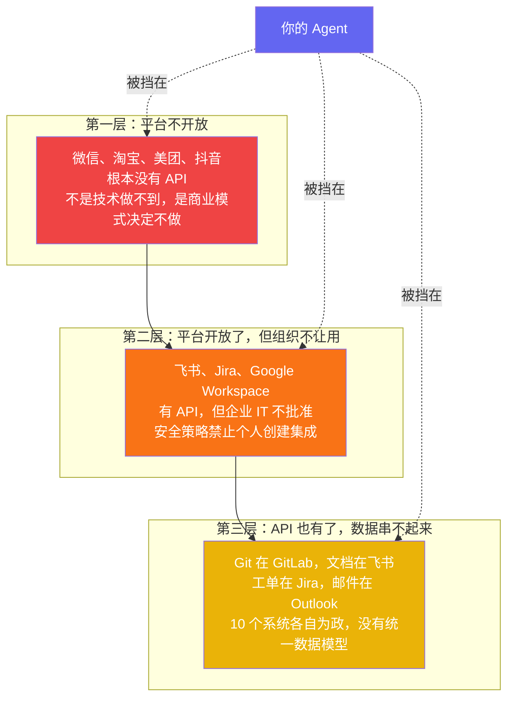
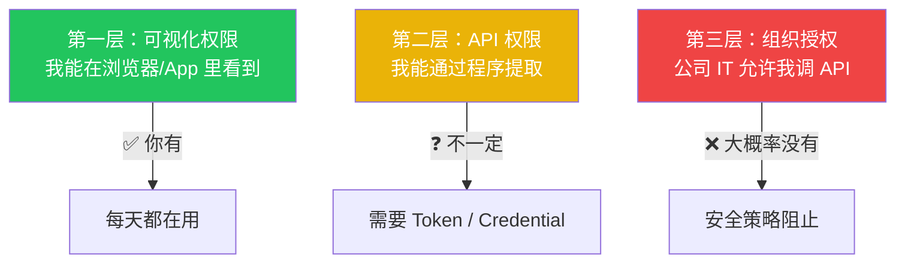
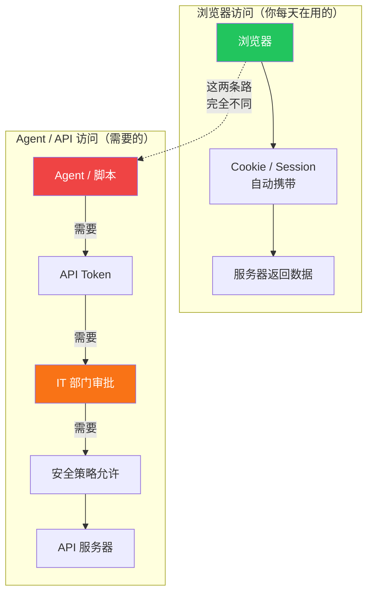
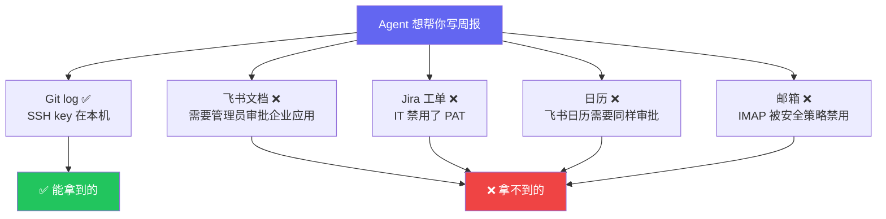
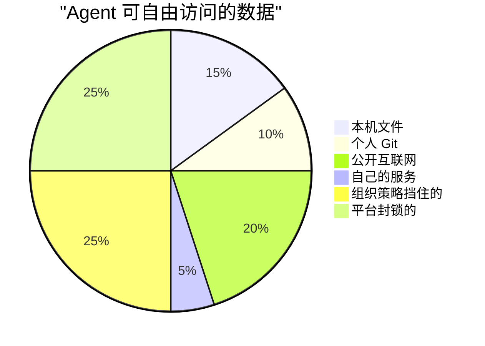

> 上一篇我们聊了 CLI vs MCP 的争论其实问错了问题。这篇往下挖一层：就算协议问题全解决了，Agent 在现实中依然寸步难行。原因比你想的更结构化。

## 一个很美好的想象

有人跟你说："让 Agent 帮你自动写周报。它去翻你的 Git commit、飞书文档编辑记录、Jira 状态变更、日历会议，生成一份你老板能看的周报。"

听起来很棒。

但你真的试过吗？

## Agent 的能力公式

LLM 推理能力？2026 年了，够用了。工具调用？CLI + Skills + MCP，上一篇聊过，基本解决了。

**短板在第三项：可访问的数据。** 这就像你有一辆法拉利和一条完美的赛道，但油箱是空的。

## 三层壁垒

数据拿不到不是一个笼统的问题，它有三层，每层的原因和性质完全不同：

大部分人只看到第一层。**第二层是最被低估的。**

## 第一层：平台不开放

上一篇详细聊过。微信不会做 `wx auth login`，淘宝不会让你的 Agent 比价，抖音不会开放推荐数据。因为它们的商业模式建立在数据围墙上——开放数据等于自杀。

这一层被讨论得最多，这里不再展开。

## 第二层：可视化权限 ≠ API 权限

**这才是大多数人掉进去的坑。**

当有人说"你对这个数据有权限"，实际可能指三件完全不同的事：

你每天打开飞书看文档、在 Jira 看工单、在邮箱收邮件——这些都是**可视化权限**。浏览器里有登录态，Cookie 自动带上，一切无感。

但 Agent 走的是另一条路：

**你有前者不代表你有后者。而 Agent 只能走后者。**

### 你真的拿得到 API 权限吗？

以一个普通程序员（非管理员、可能是实习生）的视角：

| 工具 | 浏览器能看 | API 能调 | 卡在哪 |
|------|----------|---------|--------|
| **Git (本地)** | ✅ | ✅ | SSH key 在本机，不需要审批 |
| **飞书文档** | ✅ | ❌ | 创建企业应用要管理员审批 |
| **钉钉** | ✅ | ❌ | 同上 |
| **Jira Cloud** | ✅ | ⚠️ | 看公司是否禁用 PAT |
| **企业邮箱** | ✅ | ❌ | IMAP 通常被安全策略禁用 |
| **Google Workspace** | ✅ | ❌ | OAuth 要管理员白名单 |
| **Notion (个人)** | ✅ | ✅ | 个人 integration 不需要管理员 |

结论：**能自由 API 访问的基本只有本机文件、个人 Git、Notion。** 其他全部卡在"组织管理员不批"。

### 回到周报场景

5 个数据源，只有 Git 能用。

**"让 Agent 自动写周报"在大部分公司里根本做不到。** 不是 Agent 不够聪明，不是 CLI 不够高效，而是你作为一个普通员工，拿不到 API 权限。

## 第三层：数据孤岛

就算前两层都打通了——平台有 API，公司也批了——你还会遇到第三个问题：

- Git 的 commit 格式跟飞书的文档修改记录完全不同
- Jira 的工单状态跟日历的会议记录没有关联
- 邮件里的讨论跟 Git PR 的 review comment 是两套系统

要把这些串成一份周报，你需要一个跨系统的数据模型。目前没有人做好这件事。

## 所以 Agent 真正能自由操作的数据有多少？

**一半的数据被两层壁垒挡住了。** 而这一半恰恰是你日常工作中最有价值、最想自动化的部分。

## "Agent 能做什么"的现实版本

| 场景 | 技术上可行？ | 实际能做到？ | 卡在哪 |
|------|-----------|-----------|--------|
| 帮你写代码 | ✅ | ✅ | 本地文件，无壁垒 |
| 帮你搜索公开信息 | ✅ | ✅ | 互联网公开数据 |
| 帮你写周报 | ✅ | ❌ | 飞书/Jira API 权限 |
| 帮你订机票比价 | ✅ | ❌ | 携程/12306 不开放 |
| 帮你管理客户 | ✅ | ❌ | CRM API 需要 IT 审批 |
| 帮你处理邮件 | ✅ | ❌ | IMAP 被禁用 |
| 帮你跨平台搬运内容 | ✅ | ❌ | 各平台不互通 |

**技术上全部可行。实际上大部分做不到。**

这就是为什么 Agent 目前最成功的场景是编程辅助——因为代码在你本地，不需要任何人的许可。

## 结论

Agent 帮不了你，不是因为它不够聪明。是因为三层壁垒：

1. **平台不开放**：商业模式建立在数据围墙上，不会给你 API
2. **组织不让用**：就算平台有 API，你的公司 IT 可能不批准
3. **数据串不起来**：就算前两层都通了，10 个系统的数据格式各不相同

第一层是商业博弈问题，第二层是组织管理问题，第三层是数据工程问题。

而大部分 Agent 产品的营销文案只字不提这些，直接假设"你有 API 权限"。

下次有人跟你说"用 Agent 自动化你的工作流很简单"，先问自己：

> **这些数据，平台给 API 了吗？API 公司 IT 让我用吗？数据能跨系统串起来吗？**

三个都是 Yes 才行。现实中，三个都是 Yes 的场景少得可怜。

---

*这是 "Agent 生态思考" 系列第二篇。下一篇聊聊：既然数据拿不到，那谁在用什么方式绕路？阿里的闭环生态、豆包手机的屏幕爬虫、以及什么力量可能真正推动开放。*
