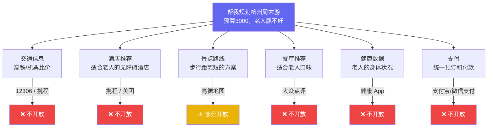
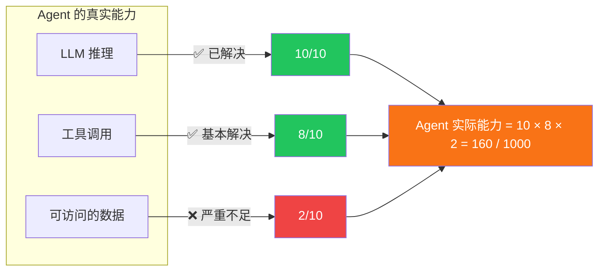
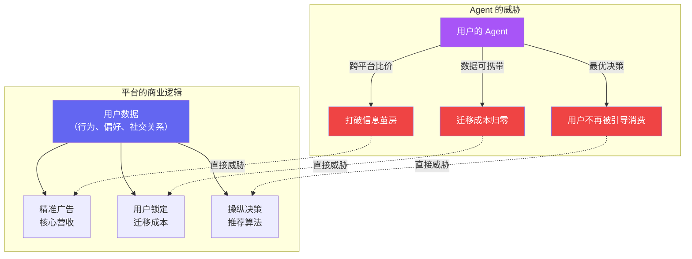
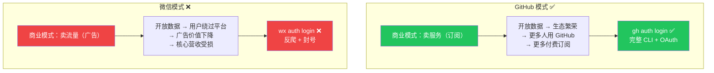
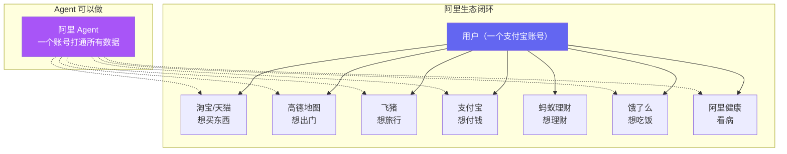
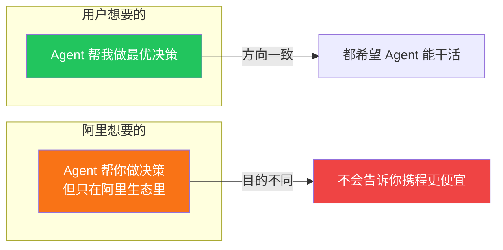
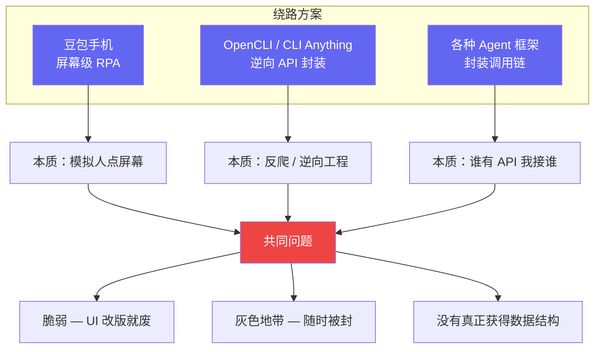
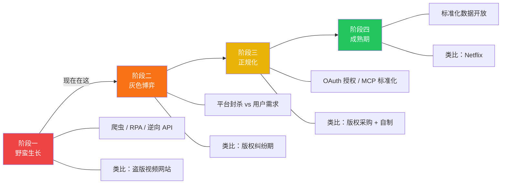
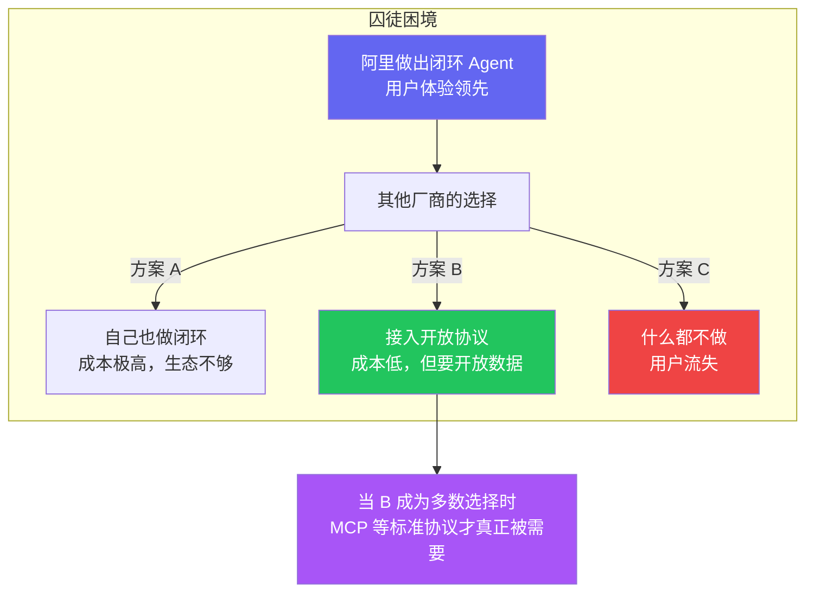

> LLM 够聪明了，CLI 够高效了，MCP 够标准了。但你的 Agent 依然帮不了你什么忙。不是因为技术不行，是因为数据拿不出来。这篇文章聊的不是技术架构，是 Agent 生态真正的卡脖子问题。

## 一个思想实验

假设现在有一个完美的 Agent：

- 推理能力顶级（Claude Opus / GPT-5 级别）
- 工具调用零延迟（CLI + MCP 混合架构）
- 上下文无限（不存在 token 限制）

你跟它说："帮我规划下周末带家人去杭州玩两天，预算 3000，我妈腿不好别走太多路。"

它需要什么？

6 个数据源，5 个完全不开放，1 个部分开放。

**Agent 的能力被截断在数据入口。** 不是不够聪明，是根本拿不到做决策需要的信息。

## Agent 能力公式

**整个行业在卷 LLM 能力和工具协议，但真正的短板是数据访问。** 这就像你有一辆法拉利和一条完美的赛道，但油箱是空的。

## 为什么数据拿不出来？

### 不是技术问题，是商业模式问题

**Agent 对民生的价值和对平台利润的威胁，是同一件事的两面。**

当 Agent 能帮用户做最优选择时，平台就失去了操纵用户决策的能力。而这恰恰是大多数平台最大的利润来源。

所以微信不会做 `wx send` CLI，淘宝不会让你的 Agent 比价，美团不会开放商家评分的原始数据。不是技术做不到，是做了会动摇商业根基。

## GitHub 模式 vs 微信模式

有些平台开放了，有些没有。差别在哪？

| 平台类型 | 代表 | 对 Agent 开放？ | 原因 |
|---------|------|----------------|------|
| 卖服务的 | GitHub, Notion, Linear, Vercel | ✅ 主动开放 | 开放 = 更多用户 = 更多订阅 |
| 卖流量的 | 微信, 淘宝, 抖音, 美团 | ❌ 封锁 | 开放 = 用户绕过推荐 = 广告贬值 |
| 卖企业服务的 | 飞书, 钉钉, 企微 | ⚠️ 有限开放 | 开放 Bot API = 企业更依赖平台 |

**一个平台会不会开放数据给 Agent，取决于开放是否符合它的商业利益。** 技术标准（MCP 也好，CLI 也好）只是管道，管道再好，水龙头不开也没用。

## 私有生态闭环：阿里的路径

在跨平台开放看不到希望的情况下，有人选择了另一条路：**在自己的围墙里先把闭环做了。**

阿里手上的牌恰好覆盖了一个人日常生活的完整链路。一个 Agent 只接阿里系的数据，就已经能回答那个杭州旅行的问题——高德知道路线和步行距离，飞猪知道酒店，淘宝能买装备，支付宝能付钱，健康数据知道老人身体状况。

**Auth 问题天然解决了——你已经登录了支付宝，整个阿里系共享一套账号体系。**

### 但这里面有个微妙的问题

阿里的 Agent 帮你在飞猪订了酒店，但它不会告诉你携程同一家店便宜 200 块。帮你在淘宝下了单，但不会告诉你拼多多有更低价。

**私有生态 Agent 的本质是：用 AI 的便利性换取用户对比价权的放弃。**

## 那些"绕路"的尝试

等不及平台开放，有人开始用技术手段强行突破：

这些产品确实在推动一件对的事——让 Agent 真正帮到用户。但用的是一种注定不可持续的方式。

就像早期的视频网站靠盗版起量——用户确实获益了，但这个模式不可能长久。

## Agent 生态的演进阶段

我们大概在第一到第二阶段之间。

## 什么会���正推动变化？

技术不会。推动变化的是三件事：

### 1. 用户预期

当足够多的用户习惯了"跟 Agent 说一句话就能办事"，回不去手动操作了，平台就必须响应。阿里如果率先做出好用的闭环 Agent，其他平台的用户体验落差会变得不可忍受。

### 2. 监管压力

欧盟 DMA（数字市场法案）已经在强制大平台开放互操作。国内的《个人信息保护法》有数据可携带条款，但执行力度未知。如果出台类似政策并认真执行，这就是真正的转折点。

### 3. 竞争的囚徒困境

就像当年银联/网联打通支付——不是谁主动想开放，是监管 + 竞争 + 用户预期共同推动的。

## 结论

> **AIGC 时代的瓶颈不是 AI 不够强，是数据持有者没有动力让 AI 替用户做选择。**

因为一旦 Agent 能帮用户做最优选择，平台就失去了操纵用户决策的能力——而这恰恰是它们最大的利润来源。

Token 成本是工程问题，CLI vs MCP 是架构问题，**数据开放是政治问题**。前两个正在被解决，第三个才刚刚开始被意识到。

下一次当你看到有人在争论 "MCP 浪费 token" 或 "CLI 不安全" 时，想一想：就算这些问题全解决了，你的 Agent 能帮你做什么？

**答案取决于数据的主人愿不愿意开门。** 而这个问题，不在任何技术规范的讨论范围内。

---

*这是 "Agent 生态思考" 系列的第二篇。下一篇聊一个更隐蔽的问题：为什么你在浏览器里能看到的数据，Agent 依然拿不到。*
