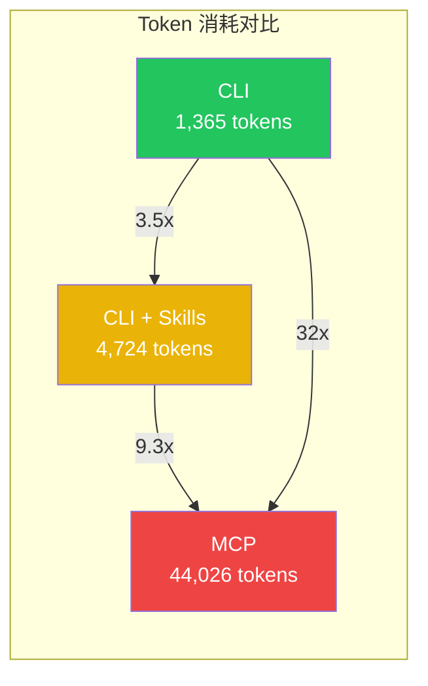
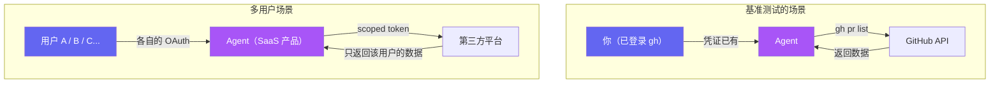
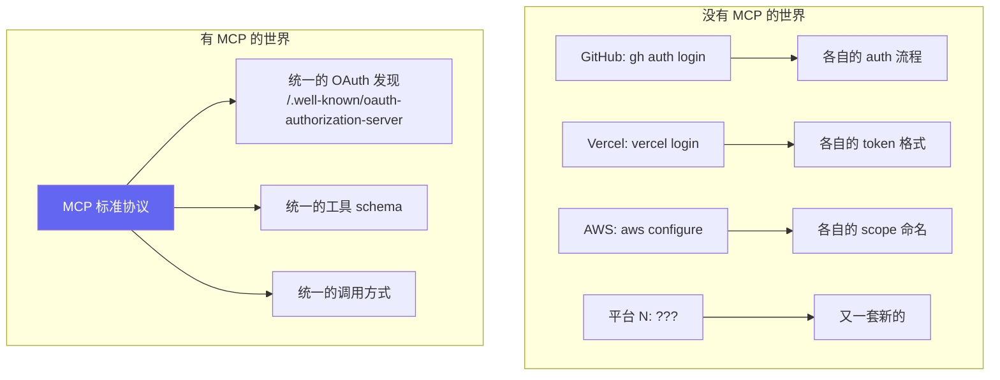
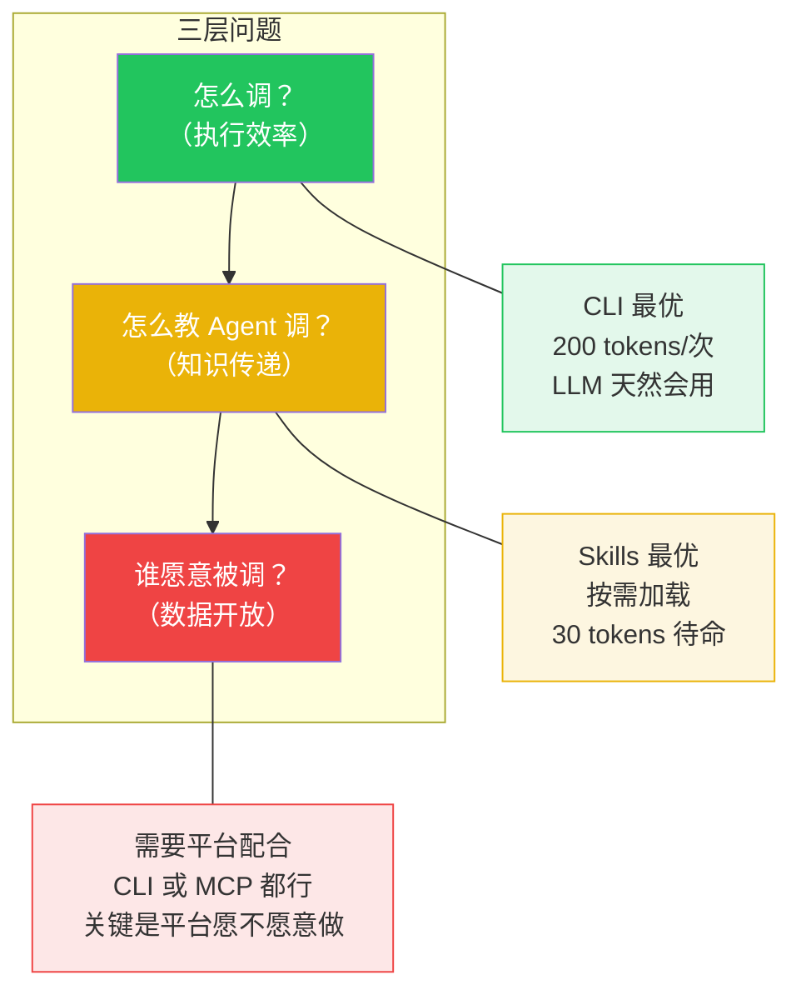
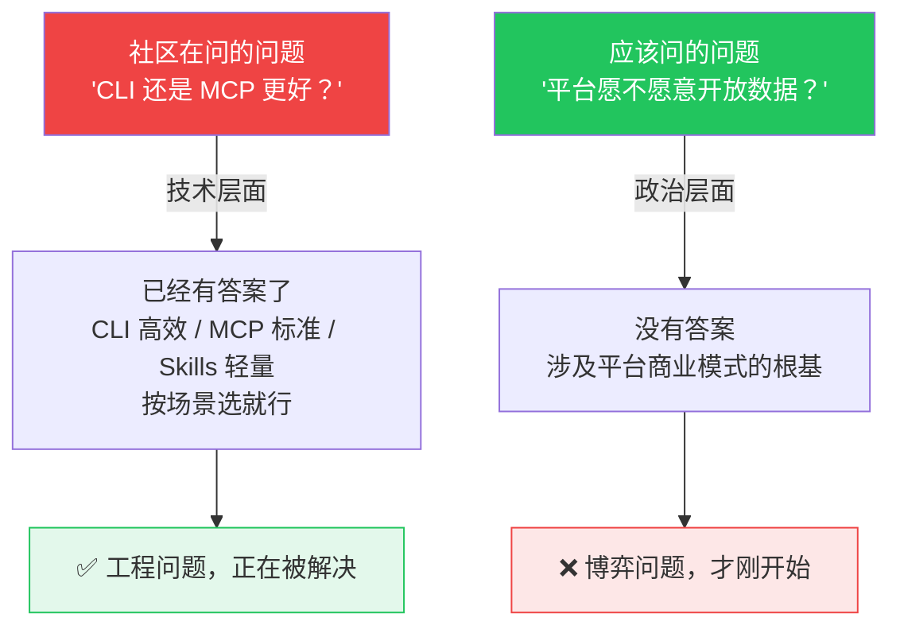

## 从一次部署说起

今天我用 OpenCode（一个 CLI 形式的 AI Agent）部署这个博客。过程中它调用了 Vercel CLI：

```bash
$ vercel login
→ 自动打开浏览器 OAuth 页面
→ 点一下授权
→ CLI 自动拿到 token
→ 后续所有操作无感

$ vercel --prod
→ 构建、上传、部署，一气呵成
```

整个 auth 流程十秒钟。我甚至没意识到它发生了。

这让我想到 `gh auth login`——GitHub 的 CLI 也是同样的体验。弹出浏览器，OAuth 授权，本地保存 token，之后 `gh pr create`、`gh repo clone` 随便用。

然后我想：如果微信也有一个 `wx auth login` 呢？

```bash
$ wx auth login
→ 弹出微信扫码页面
→ 手机确认授权
→ 本地保存 token
→ wx send abin "你好"
→ wx moments list
→ wx pay transfer ...
```

**技术上，跟 `vercel login` 和 `gh auth login` 一模一样。** 没有任何技术障碍。

但它永远不会出现。

## 2026 年最热的技术争论

AI Agent 社区今年最火的话题：Agent 该用什么方式调用外部工具？

三个阵营：

- **CLI 派**：直接跑 shell 命令，`git`、`gh`、`curl`，LLM 训练数据里就有，便宜、快、可靠
- **MCP 派**：Anthropic 推出的标准协议，JSON schema + OAuth，大厂全部跟进
- **Skills 派**：一个 Markdown 文件当"小抄"，教 Agent 怎么用工具，30 token 待命

ScaleKit 做了 75 次基准测试，同一个 GitHub 任务：



| 方案 | 月成本（1 万次） | 可靠性 |
|------|-----------------|--------|
| CLI | ~$3.20 | 100% |
| CLI + Skills | ~$4.50 | 100% |
| MCP | ~$55.20 | 72% |

CLI 阵营的结论：MCP 就是浪费钱。Andrej Karpathy 说 CLI "super exciting"，19 万 star 的 Agent 框架作者说 "MCP was a mistake"，Flask 作者全面转向 Skills。

MCP 完败？

## 但这个比较有一个致命前提

**所有基准测试都在同一个场景下跑：一个开发者，用自己的凭证，自动化自己的工作流。**



在左边的场景里，CLI 赢得毫无悬念。在右边——你需要多用户 OAuth、权限隔离、审计日志。

很多文章写到这里就会说："所以 MCP 不可替代。"

**但这是错的。**

## `gh` 就是反例

回到开头的体验。`gh auth login` 做了什么？

1. 发起 OAuth 浏览器授权
2. 用户确认，拿到 scoped token
3. 本地持久化登录态
4. 后续所有命令自动带 token

这是一个 **CLI 工具完整实现了 OAuth 授权流程**。

`vercel login` 也是。我今天亲手体验了——Agent 调用 Vercel CLI，OAuth 在浏览器里完成，整个过程对 Agent 来说完全透明。

所以 CLI 不是"架构上不支持 OAuth"，而是**大多数平台根本没有提供 CLI**。GitHub 做了 `gh`，CLI 就碾压 MCP。微信没做 `wx`，你只能走 MCP 或者爬虫。

那 MCP 的价值到底是什么？

## MCP 的真正价值：不是不可替代，是标准化



当你只接 GitHub，`gh` 就够了。当你要接 50 个平台，每个都搞一套 CLI auth 流程就崩溃了。MCP 的价值是**"大家都用同一套协议开放"**——是标准化，不是不可替代。

**但标准化有个前提：平台愿意实现它。**

## 三个方案，三个层面



第一层和第二层是技术问题，基本已经解决了。

**第三层不是技术问题。** `gh` 证明了 CLI 能做 OAuth。MCP 提供了标准化方案。技术全部就绪。

**缺的是水龙头，不是管道。**

## 所以整个争论都问错了问题



我今天部署博客时 `vercel login` 的体验，跟 `gh auth login` 一样丝滑。如果 `wx auth login` 也能这样——

```bash
$ wx auth login
→ 弹出微信扫码
→ 确认授权
→ wx send abin "你好"
```

——那 Agent 立刻就能帮你发消息、管朋友圈、处理微信支付。技术上没有任何障碍。

**但微信不会做。** 不是做不到，是做了等于把苦苦经营的生态壁垒和反爬体系直接关掉。

Token 成本是工程问题，协议选择是架构问题，**数据开放是政治问题。** 前两个正在被解决，第三个才是真正卡住 Agent 生态的瓶颈。

而整个社区都在用技术问题的框架，回避那个真正难的政治问题。

---

*这是 "Agent 生态思考" 系列第一篇。下一篇聊聊：就算平台有 API，你也大概率用不了——Agent 落地的三层壁垒远比你想的厚。*
