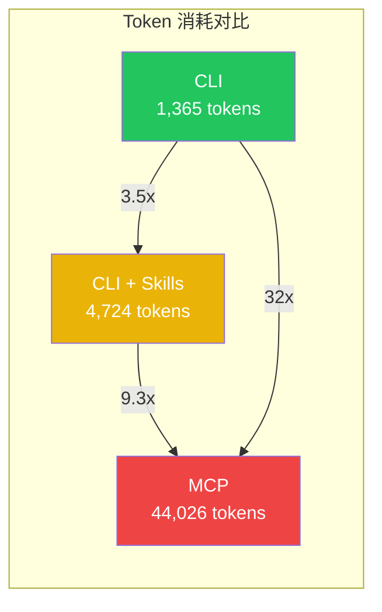
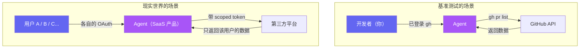
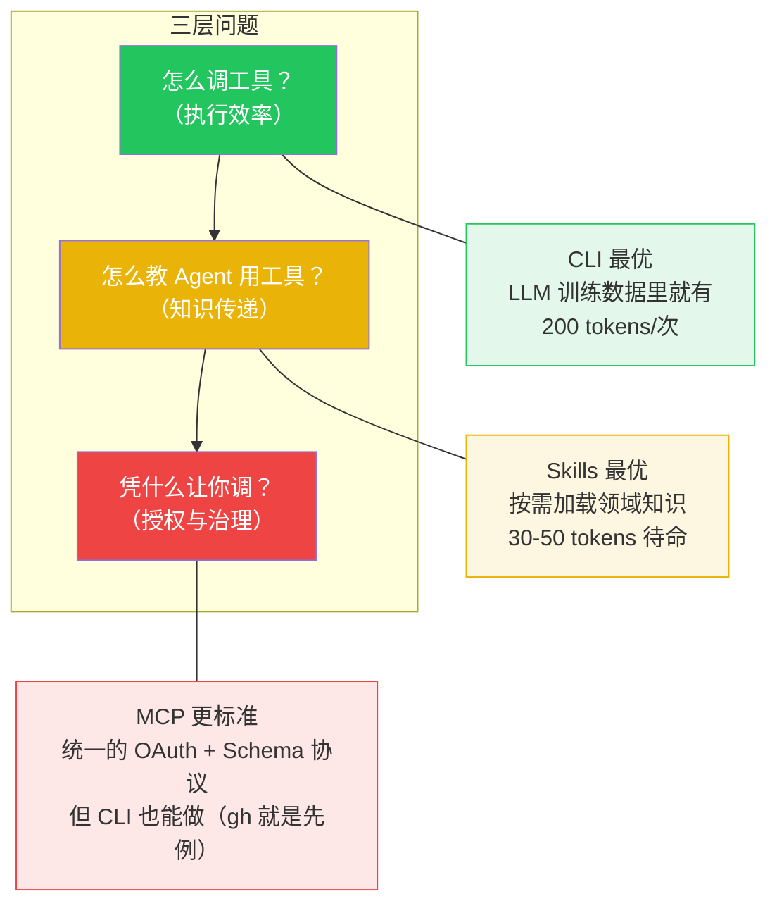
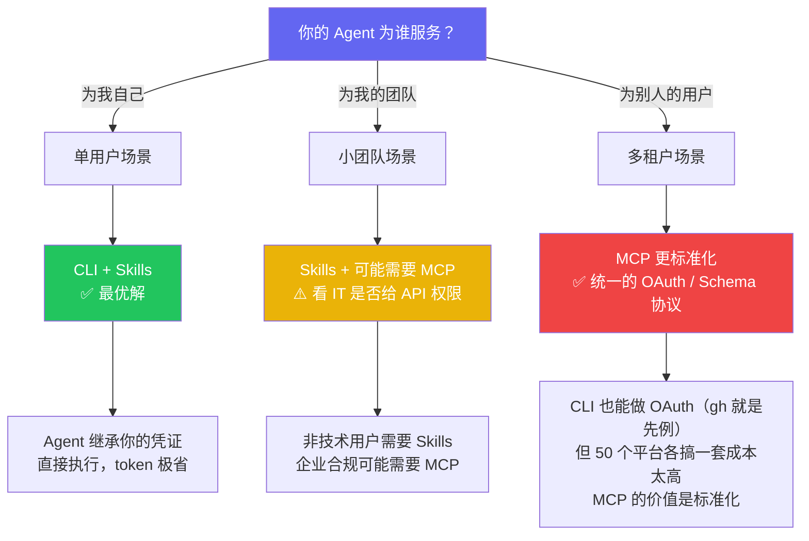
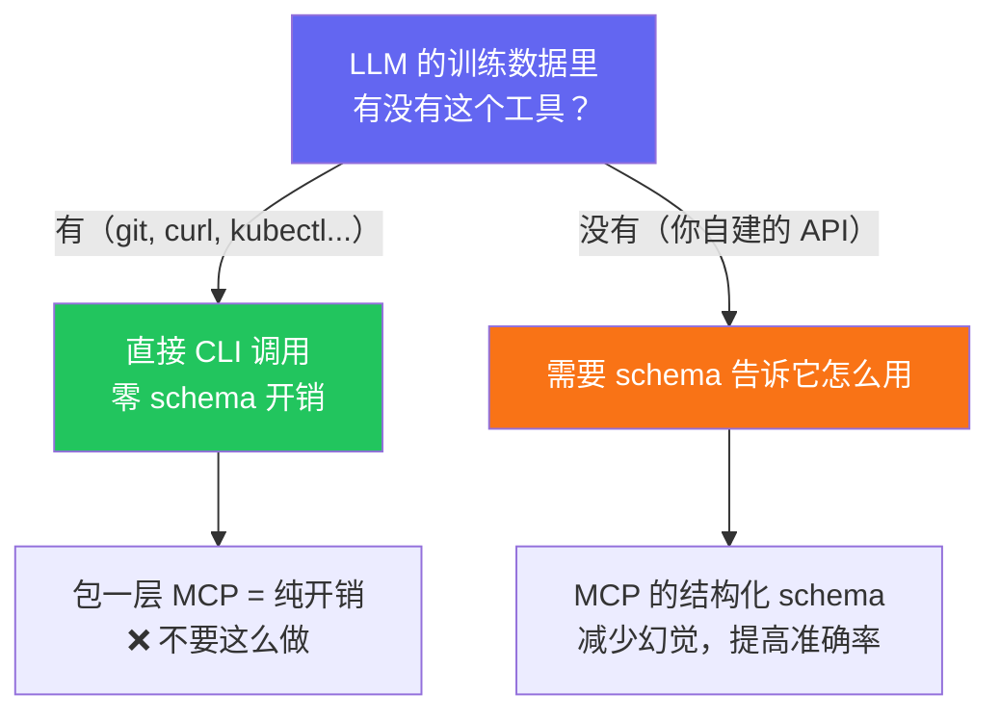
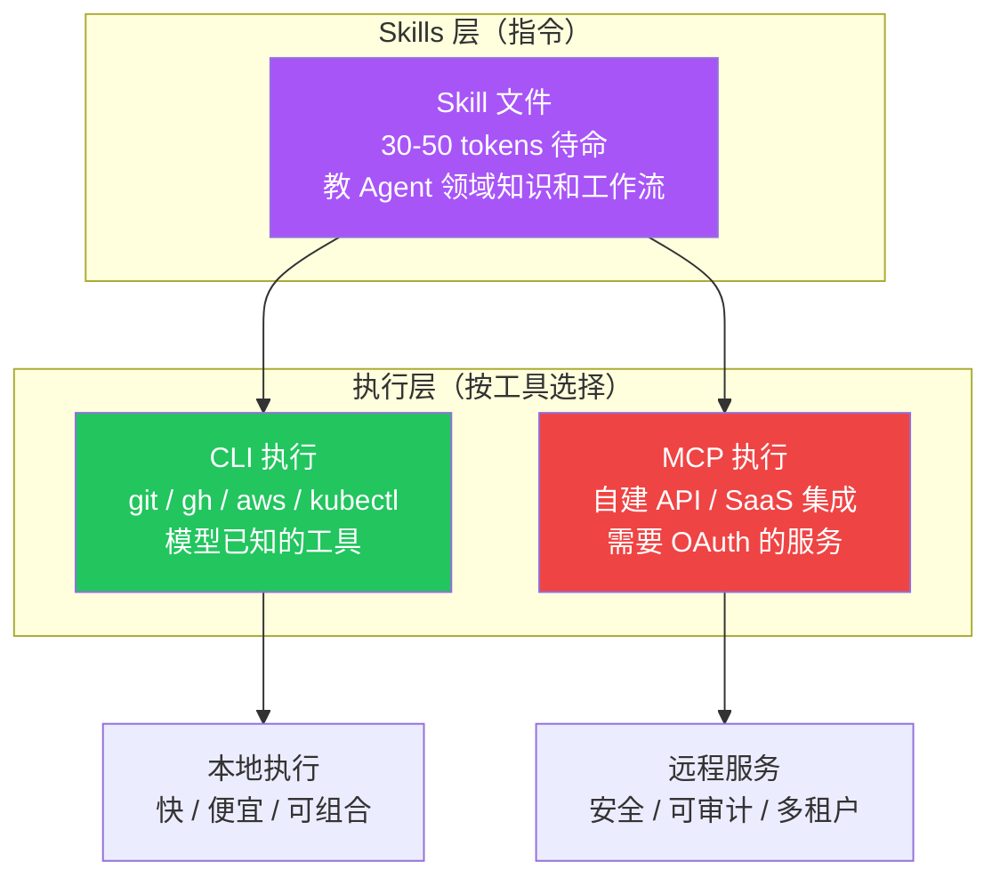

> 2026 年初，AI Agent 社区最热的架构之争不是该用哪个框架，而是 Agent 该怎么调用外部工具。CLI 派说 Bash 就够了，MCP 派说标准协议才是未来，Skills 派说一个 Markdown 文件解决一切。三方各有数据支撑，各有信徒。但我认为，这场争论从根本上就问错了问题。

## 争论的表面：谁更省 Token

先看大家在吵什么。ScaleKit 做了 75 次基准测试，同一个 GitHub 任务，三种方案的 token 消耗：

换算成钱（Claude Sonnet 4 定价，每月 1 万次调用）：

| 方案 | 月成本 | 可靠性 |
|------|--------|--------|
| CLI | ~$3.20 | 100% |
| CLI + Skills | ~$4.50 | 100% |
| MCP | ~$55.20 | 72%（28% 超时） |

数据很震撼。CLI 阵营的结论是：MCP 就是浪费钱。

Andrej Karpathy 2026 年 2 月在 X 上说 CLI 是 "super exciting precisely because they are legacy"。某个 19 万 star 的 Agent 框架作者直接说 "MCP was a mistake"。Flask 的作者 Armin Ronacher 全面转向 Skills。

看起来 MCP 完败？

## 但这个比较有一个致命前提

**所有基准测试都在同一个场景下跑：一个开发者，自动化自己的工作流。**

在左边的场景里，CLI 赢是必然的——你已经有 `gh auth login` 的凭证，Agent 直接用你的身份调命令，简单、高效、零额外开销。

**但右边的场景呢？**

当你做的不是给自己用的工具，而是一个服务多个用户的 SaaS 产品时，你需要：

- 每个用户独立的 OAuth 授权
- Scoped permission（用户 A 不能看用户 B 的数据）
- 审计日志（谁在什么时间访问了什么）
- Token 刷新和吊销

等等，CLI 真的做不了这些吗？

**`gh` 就是反例。** `gh auth login` 完整实现了 OAuth 浏览器授权流程，拿到 scoped token，本地持久化登录态。如果微信愿意做一个 `wx auth login`，技术上跟 `gh` 一模一样——弹出授权页，用户扫码确认，本地保存 token，之后 `wx send`、`wx moments` 全部可用。

**所以 CLI 不是"架构上不支持" OAuth，而是大多数平台根本没有提供 CLI。** GitHub 做了 `gh`，所以 CLI 在 GitHub 生态里碾压 MCP。微信没做 `wx`，所以你只能走 MCP 或者爬虫。

那 MCP 的价值是什么？**不是不可替代，是更标准化。** 它定义了一套统一的 OAuth 发现机制（`/.well-known/oauth-authorization-server`）和工具 schema 格式。当你需要接入 50 个不同的平台时，每个平台自己搞一套 CLI auth 流程的成本太高——MCP 提供了一个"大家都用同一套协议"的可能性。

**但标准化的前提是：平台愿意实现它。** 协议再好，水龙头不开，管道也是空的。

## 三个方案解决的是不同层面的问题

注意第三层：很多人说"授权治理只有 MCP 能做"，这是错的。`gh auth login` 证明了 CLI 完全可以跑 OAuth。MCP 的真正价值不是"能做什么 CLI 做不了的事"，而是"提供了一套标准让所有平台用同一种方式开放"。

但标准只是管道。真正决定 Agent 能力边界的，是有多少平台愿意接上这根管道——不管它是 CLI 形式还是 MCP 形式。

## "谁更高效"是错误的问题。正确的问题是——

### 你的 Agent 在为谁服务？

### 模型认不认识这个工具？

## 聪明的架构：三层混合

争论谁赢没有意义。真正的工程决策是 **per-tool 选择**，不是 per-system 选择。

Claude Code 现在用的就是这个架构——Skills 作为指令层，CLI 和 MCP 作为可互换的执行层。Agent 不关心底层是什么协议，它只调用 Skill。

## 结论：争论的是管道，缺的是水龙头

CLI vs MCP vs Skills 不是一场需要分出胜负的战争。它们是三个不同层面问题的解决方案：

- **CLI** 解决执行效率（怎么调）
- **Skills** 解决知识传递（怎么教）
- **MCP** 解决标准化（让所有平台用同一种方式开放）

注意，我说的是"标准化"，不是"授权治理"——因为 CLI 本身完全可以做 OAuth。`gh auth login` 就是最好的证明。如果微信愿意做一个 `wx auth login`，技术上毫无障碍，流程跟 `gh` 一模一样：弹出授权页 → 扫码确认 → 本地保存 token → 后续命令直接用。

**但微信不会做。** 不是技术做不到，是做了会把苦苦经营的生态壁垒和反爬体系直接关掉。

所以当你在比较 CLI 和 MCP 的 token 消耗时，你已经在问错误的问题了。正确的问题是：

> **你的 Agent 需要访问谁的数据？数据的主人愿不愿意让它访问？**

这不是 CLI 还是 MCP 能回答的问题。这是一个数据主权问题，一个商业模式问题，一个平台博弈问题。

Token 成本是工程问题，协议选择是架构问题，**数据开放是政治问题。** 前两个正在被解决，第三个才是真正卡住 Agent 生态的瓶颈。而整个社区都在用技术问题的框架，回避那个真正难的政治问题。

---

*这是 "Agent 生态思考" 系列的第一篇。下一篇聊聊为什么 Agent 的真正瓶颈不是 AI 能力，而是数据主权。*
