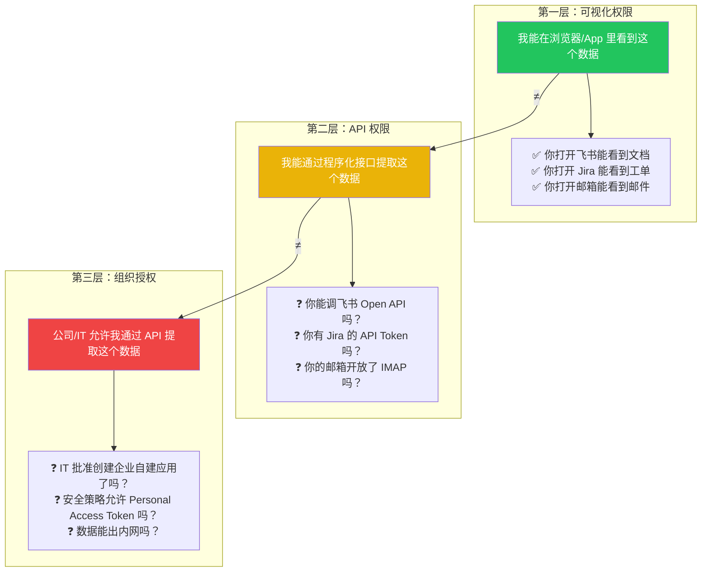
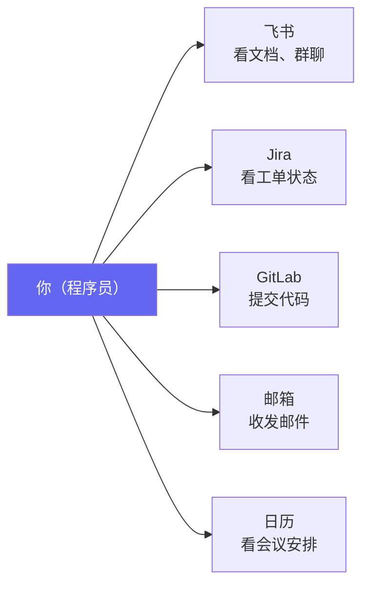
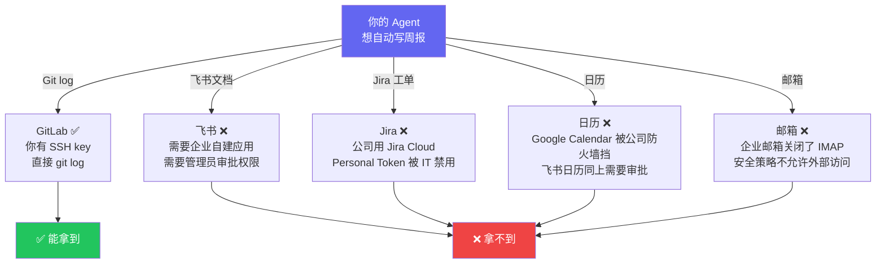
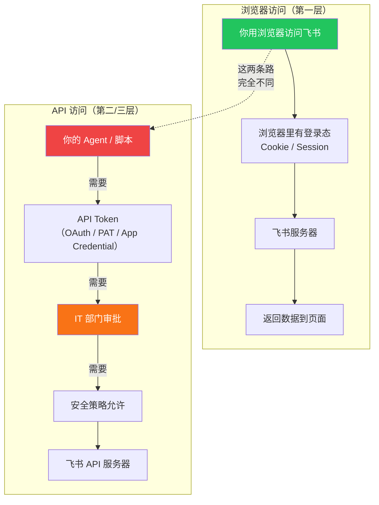
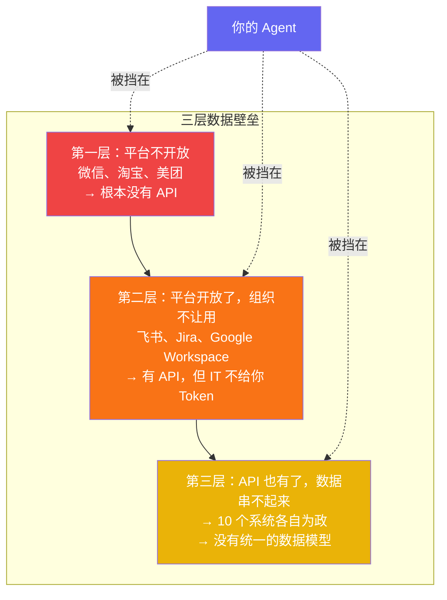
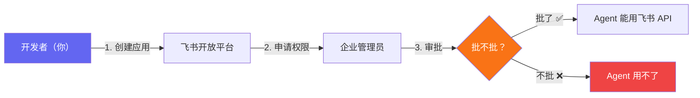
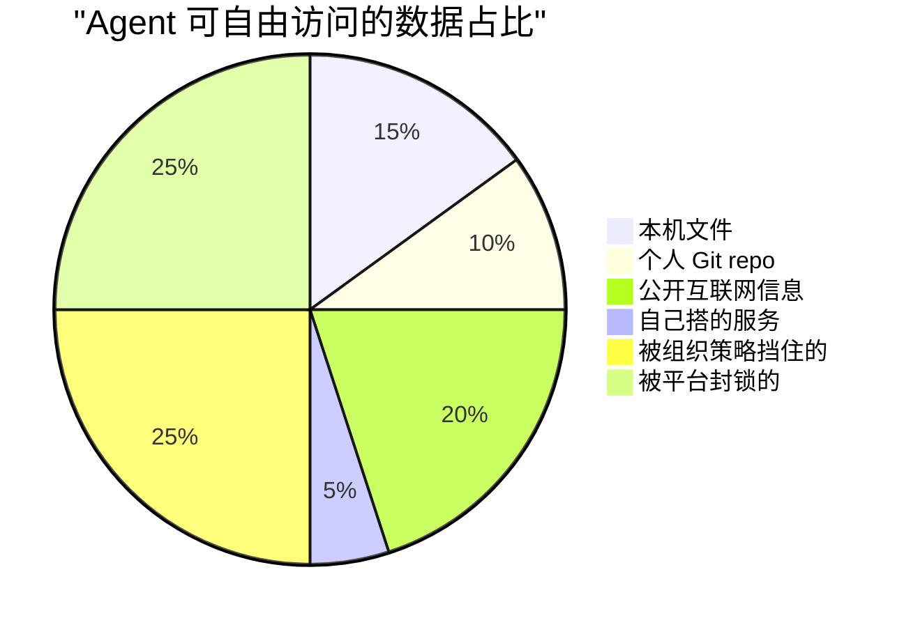

> Agent 圈的人常说"你已经有这些数据的权限了，直接让 Agent 调就行"。真的吗？你打开飞书能看到的文档，不代表你能通过 API 把它读出来。这篇文章聊一个被严重忽视的问题：为什么你在屏幕上能看到的东西，你的 Agent 依然碰不到。

## "你有权限"这句话的三层含义

当有人说"你对这个数据有权限"，实际上可能指三件完全不同的事：

**大部分人在说"有权限"时，指的是第一层。但 Agent 需要的是第三层。**

## 一个真实场景

你是公司里的程序员。你每天的工作涉及：

有人跟你说："用 Agent 自动写周报多好？让它自动去翻 Git commit、飞书文档编辑记录、Jira 状态变更、日历会议，生成周报。"

听起来很美。实际执行：

5 个数据源，只有 Git 能用——因为你本机就有 SSH key，不需要任何人批准。

其他 4 个，你每天都在浏览器里看，但 Agent 碰不到。

## 为什么会有这个断层？

浏览器访问和 API 访问走的是**完全不同的认证链路**。

- 浏览器：你登录一次，Cookie 自动带上，后续请求无感
- API：需要显式的 Token/Credential，通常需要管理员配置

你有前者不代表你有后者。而 Agent 只能走后者。

## 各种工具的真实 API 可访问性

以一个普通程序员（非管理员）的视角：

| 工具 | 能在浏览器看 | 能 API 访问 | 拦在哪里 |
|------|------------|------------|---------|
| **Git (GitHub/GitLab)** | ✅ | ✅ | SSH key 在本机，不需要任何人批准 |
| **飞书文档** | ✅ | ❌ 大概率 | 需要创建企业自建应用 → 管理员审批 |
| **钉钉** | ✅ | ❌ 大概率 | 同上，企业内部应用需要组织管理员 |
| **Jira Cloud** | ✅ | ⚠️ 看配置 | 有些公司禁用 PAT，有些允许 |
| **Confluence** | ✅ | ⚠️ 看配置 | 同 Jira |
| **企业邮箱** | ✅ | ❌ 通常 | IMAP/SMTP 通常被安全策略禁用 |
| **Google Workspace** | ✅ | ❌ 通常 | OAuth 需要管理员设置应用白名单 |
| **Notion** | ✅ | ✅ | 个人 integration 不需要管理员 |
| **本机文件** | ✅ | ✅ | 本地文件，无需任何授权 |

**能自由 API 访问的，基本只有：本机文件、个人 Git repo、Notion。** 其他都卡在组织管理员这一关。

## 这是第二层数据壁垒

在之前的文章里我们聊了第一层壁垒——平台不开放（微信、淘宝不给你 API）。

但还有第二层，更隐蔽：

第一层壁垒是技术和商业问题（平台不做 API）。
第二层壁垒是组织和安全问题（IT 不批准）。
第三层壁垒是数据工程问题（数据孤岛）。

**大部分 Agent 产品的营销跳过了第二层和第三层**，直接假设"你有 API 权限"。

## 那 OpenClaw 是怎么解决的？

答案是：**它没解决。**

OpenClaw 接飞书的方式是标准的企业自建应用——你需要在飞书开放平台创建应用，拿到 App ID 和 App Secret，配置权限，然后**管理员审批发布**。

如果你是企业管理员或者在一个宽松的小公司，这没问题。
如果你是大公司的普通员工或实习生？**这条路走不通。**

## 所以 Agent 真正能自由操作的数据有多少？

对一个普通程序员来说：

**一半的数据被两层壁垒挡住了。** 而这一半恰恰是你日常工作中最有价值、最想自动化的部分。

## 真正的解法在哪？

短期内没有银弹。但有几个方向值得关注：

### 1. 推动企业 IT 认知升级

很多企业 IT 禁用 API Token 是因为"不了解 → 不信任 → 一刀切禁止"。如果有足够多的安全、可审计的 Agent 接入案例，IT 部门的态度可能会松动。

### 2. 平台提供更细粒度的个人授权

现在的模式是：开发者创建应用 → 管理员审批 → 整个组织可用。

更理想的模式：**个人级别的 OAuth**——员工自己授权自己的数据给自己的 Agent，不需要管理员参与。Notion 的个人 integration 已经是这种模式了。

### 3. 浏览器扩展作为过渡方案

既然浏览器里有登录态，那用浏览器扩展把数据"导出"给 Agent 是一种 hack。Chrome 扩展的权限模型比直接给 shell 访问更可控，安全团队可能更容易接受。

## 结论

> **"你有权限"是 Agent 圈最大的隐性假设，也是最容易被打脸的假设。**

下次有人跟你说"用 Agent 自动化你的工作流很简单"，先问自己三个问题：

1. 这些数据，平台给 API 了吗？（第一层）
2. 这些 API，公司 IT 让我用吗？（第二层）
3. 这些数据，能跨系统串起来吗？（第三层）

三个都是 Yes 的场景，确实可以自动化。但在现实中，三个都是 Yes 的场景少得可怜。

**Agent 的落地不是一个技术问题。它是三层权限壁垒的穿透问题——平台、组织、数据，每一层都需要不同的力量来打破。** 而我们现在讨论的 CLI vs MCP vs Skills，充其量只是在解决穿透之后的"用什么管道输送"的问题。

管道再好，墙不开，水也流不过来。

---

*这是 "Agent 生态思考" 系列的第三篇。如果你在实际工作中也遇到过类似的权限壁垒，欢迎在评论区聊聊你的经历。*
