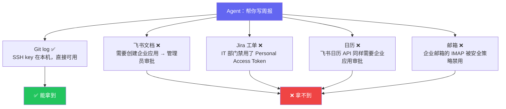
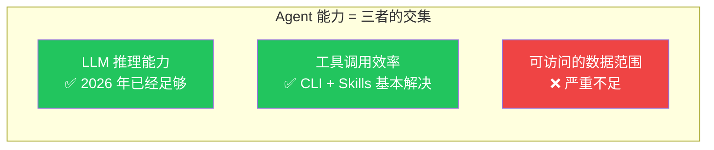
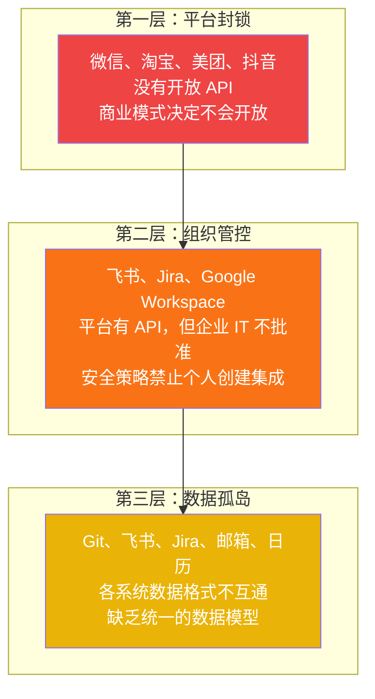
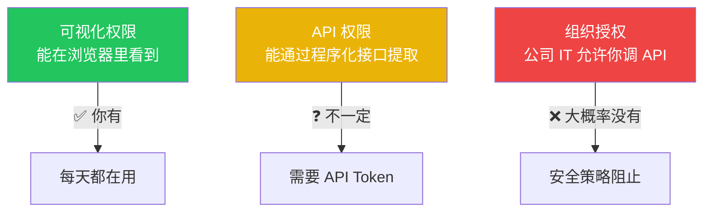
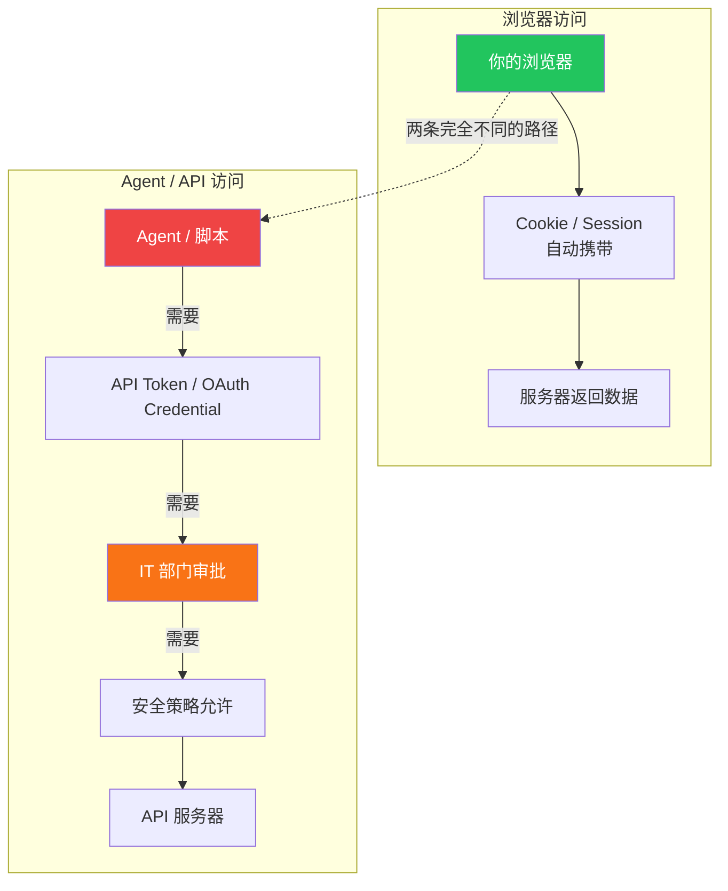

> [上一篇](/posts/cli-vs-mcp-vs-skills/)我们分析了 CLI vs MCP 的争论本质上是在讨论"管道"，而真正缺的是"水龙头"。这篇继续往下挖：就算水龙头开了，你也大概率接不上。Agent 在现实中寸步难行的原因，比大多数人想的更结构化。

## 一个常见的许诺

"让 Agent 帮你自动写周报——它去翻你的 Git commit、飞书文档编辑记录、Jira 状态变更、日历会议，生成一份你老板能看的周报。"

这是 Agent 产品最爱讲的故事。听起来很合理——数据都是你自己的，工具也都在用，只是把手动汇总的过程自动化了而已。

但如果你真的动手试一下，会发现 5 个数据源里只有 1 个能用：

不是 Agent 不够聪明，不是 CLI 不够高效——是**数据根本拿不到**。

当然，市面上有一些"投机方案"试图绕过这个限制：用浏览器扩展借用登录态抓取飞书文档、用 RPA 模拟点击导出 Jira 数据、用逆向工程封装企业邮箱接口。这些方案确实能跑通 demo，但它们本质上是爬虫——UI 改版即失效、安全策略升级即封杀、法律层面始终存在风险。把工作流建立在这类方案上，等于在流沙上盖楼。

我们在[第三篇](/posts/visual-vs-api-permission/)会详细讨论这些"翻墙"方案的现状和局限。这里先聚焦于一个更根本的问题：**为什么正规途径走不通？**

## Agent 的实际能力取决于三个变量

整个行业在卷 LLM 能力和工具协议，但真正的短板是数据访问。就像拥有一辆性能顶级的赛车和一条完美的赛道，但油箱是空的。

## 三层壁垒：为什么数据拿不到

数据拿不到不是一个笼统的问题。它分三层，每层的性质、原因和解法完全不同：

大部分讨论集中在第一层。但实际工作中，**第二层才是最多人撞上的墙。**

### 第一层：平台封锁

微信不会做 `wx auth login`，淘宝不会开放比价 API，抖音不会给你推荐数据。[上一篇](/posts/cli-vs-mcp-vs-skills/)从技术角度论证了 CLI 完全能实现 OAuth（`gh auth login` 就是先例），所以这不是技术障碍。

**那为什么不做？因为数据封锁是这些平台商业模式的根基。**

Agent 一旦能替用户做最优决策——比价、比评分、跨平台搜索——平台就失去了通过推荐算法引导用户消费的能力。这直接威胁广告和流量变现的核心营收。

一个简单的判断标准：**平台会不会对 Agent 开放，取决于开放是否符合其商业利益。**

| 平台类型 | 代表 | 对 Agent 开放？ | 逻辑 |
|---------|------|----------------|------|
| 卖订阅/服务的 | GitHub, Notion, Vercel | ✅ 主动开放 | 越多 Agent 接入 → 用户越依赖 → 更多付费 |
| 卖流量/广告的 | 微信, 淘宝, 抖音 | ❌ 封锁 | Agent 帮用户跳过推荐 → 广告价值下降 |
| 卖企业服务的 | 飞书, 钉钉 | ⚠️ 有限开放 | Bot 生态丰富 → 企业更依赖平台 |

### 第二层：组织管控——被严重低估的壁垒

这才是大多数开发者在实际工作中会撞上的墙。

当有人说"你对这个数据有权限"，实际上涉及三个完全不同的层面：

你每天打开飞书看文档、在 Jira 看工单、在邮箱收邮件——这些是**可视化权限**。浏览器持有登录态，Cookie 自动携带，一切无感。

但 Agent 走的是完全不同的认证链路：

**你有前者不代表你有后者。Agent 只能走后者。**

以一个普通程序员（非管理员）的视角，各工具的实际 API 可访问性：

| 工具 | 浏览器可看 | API 可调 | 卡在哪里 |
|------|----------|---------|---------|
| **Git（本地）** | ✅ | ✅ | SSH key 在本机，无需任何审批 |
| **飞书文档** | ✅ | ❌ | 创建企业自建应用需要管理员审批[^2] |
| **钉钉** | ✅ | ❌ | 同上，企业内部应用需要组织管理员授权 |
| **Jira Cloud** | ✅ | ⚠️ | 取决于公司是否禁用 Personal Access Token |
| **企业邮箱** | ✅ | ❌ | IMAP/SMTP 通常被安全策略禁用 |
| **Google Workspace** | ✅ | ❌ | OAuth 应用需要管理员设置白名单 |
| **Notion（个人）** | ✅ | ✅ | 个人 Integration 不需要管理员参与[^3] |

结论很清晰：**能自由通过 API 访问的，基本只有本地文件、个人 Git 仓库和 Notion 个人空间。** 其余全部卡在组织管理员审批环节。

这也解释了一个现象：为什么 Agent 目前最成功的应用场景是编程辅助？因为代码在你的本地文件系统里，不需要任何人的许可。

### 第三层：数据孤岛——最容易被忽视的工程问题

假设前两层都打通了——平台有 API，公司 IT 也批了。你还是会遇到第三个问题：**数据散落在多个系统中，格式互不兼容。**

以"自动写周报"为例，即使所有数据源都可访问，Agent 需要处理的是：

| 数据源 | 数据格式 | 时间粒度 | 标识方式 |
|--------|---------|---------|---------|
| **Git** | commit hash + diff + message | 精确到秒 | 作者邮箱 |
| **飞书文档** | 文档修改记录 JSON | 精确到分钟 | 飞书 user_id |
| **Jira** | issue 状态变更 REST API | 精确到秒 | Jira account_id |
| **日历** | iCal / CalDAV 事件 | 时间段 | 邮箱地址 |
| **邮箱** | MIME 格式邮件 | 精确到秒 | 邮箱地址 |

五个系统、五种数据格式、三种用户标识方式。要把它们关联成"这周我做了什么"，需要：

1. **身份映射**：你的 Git 邮箱、飞书 user_id、Jira account_id 是同一个人——谁来维护这个映射？
2. **时间对齐**：Git commit 和 Jira 状态变更怎么关联？一个 commit 可能关联多个 issue，一个 issue 可能跨多个 commit。
3. **语义提取**：从 commit message、文档修改记录、邮件正文中提取出"做了什么事"，然后去重、归类、排序。

这不是 LLM 推理能力的问题——是缺少一个跨系统的数据编排层。目前没有成熟的解决方案。

## Agent 实际能力的边界

综合三层壁垒，以下是 Agent 在 2026 年的真实能力边界：

| 场景 | 技术可行 | 实际可用 | 受阻于 |
|------|---------|---------|--------|
| 编程辅助（写代码、调试） | ✅ | ✅ | 无壁垒——代码在本地 |
| 搜索公开信息并整理 | ✅ | ✅ | 无壁垒——互联网公开数据 |
| 自动写周报 | ✅ | ❌ | 第二层：飞书/Jira API 权限 |
| 跨平台比价（机票、酒店） | ✅ | ❌ | 第一层：携程/12306 不开放 |
| 客户关系管理 | ✅ | ❌ | 第二层：CRM API 需 IT 审批 |
| 自动处理邮件 | ✅ | ❌ | 第二层：IMAP 被禁用 |
| 跨平台内容发布 | ✅ | ❌ | 第一层：各平台不互通 |
| 个人健康数据分析 | ✅ | ❌ | 第一层：健康 App 不开放 |

**技术上全部可行。实际上大部分做不到。**

## 结论

Agent 帮不了你，不是因为它不够聪明。是因为三层壁垒：

1. **平台封锁**：商业模式建立在数据围墙上，不会主动开放 API
2. **组织管控**：就算平台有 API，企业 IT 的安全策略可能不允许个人使用
3. **数据孤岛**：就算前两层都通了，多个系统的数据格式和用户标识互不兼容

第一层是商业博弈问题，第二层是组织管理问题，第三层是数据工程问题。性质不同，解法不同，但效果一样——Agent 拿不到它需要的数据。

而大部分 Agent 产品的营销只字不提这些，直接假设"你有 API 权限"。

下次有人向你推销"用 Agent 自动化工作流"时，不妨先问三个问题：

> 1. 这些数据，平台提供了 API 吗？
> 2. 这些 API，公司 IT 允许我使用吗？
> 3. 不同系统的数据，能关联起来吗？

三个都是 Yes 才能真正落地。在 2026 年的现实中，三个都是 Yes 的场景仍然屈指可数。

---

*这是 "Agent 生态思考" 系列第二篇。下一篇聊：既然数据拿不到，那谁在用什么方式绕路？阿里的闭环生态、豆包手机的屏幕爬虫、以及什么力量可能最终推动开放。*

---

## 参考资料

[^1]: 关于平台数据封锁与商业模式的关系，参见 [MCP vs. CLI for AI Agents: The Answer Is Both](https://aiproductivity.ai/news/mcp-vs-cli-ai-agents-comparison/) 以及 [The MCP vs CLI Debate Is Missing the Point](https://mkweb.dev/blog/mcp-vs-cli-missing-the-point)。本系列[第一篇](/posts/cli-vs-mcp-vs-skills/)从技术角度论证了 CLI 完全能做 OAuth，因此平台不开放的原因是商业选择而非技术限制。

[^2]: 飞书企业自建应用创建流程需要企业管理员审批，参见[飞书开放平台文档](https://open.feishu.cn/document/home/index)。普通员工无法自行创建具有 `im:message` 等权限的应用。

[^3]: Notion 的 Internal Integration 允许个人用户直接创建，无需工作区管理员参与，参见 [Notion API 文档](https://developers.notion.com/docs/create-a-notion-integration)。这是目前少数支持个人级别 OAuth 的协作工具之一。
