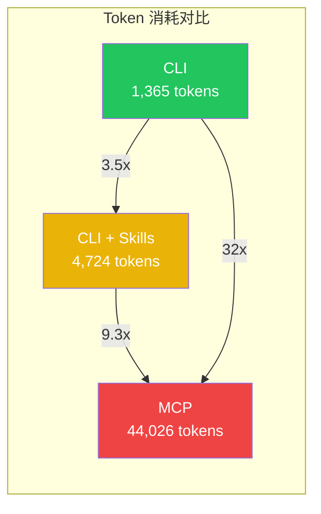
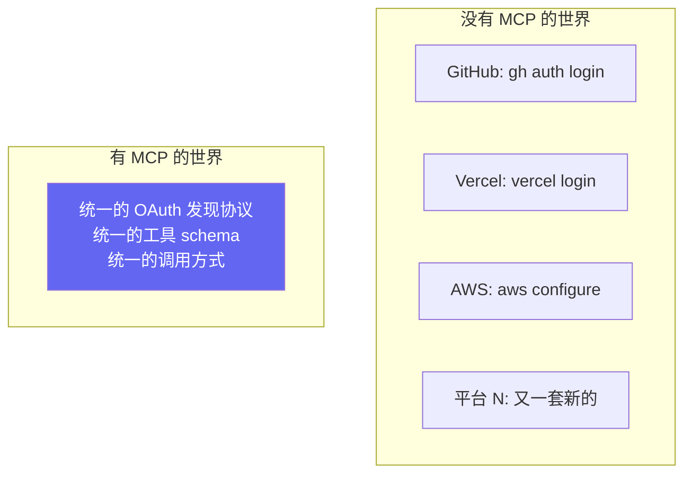
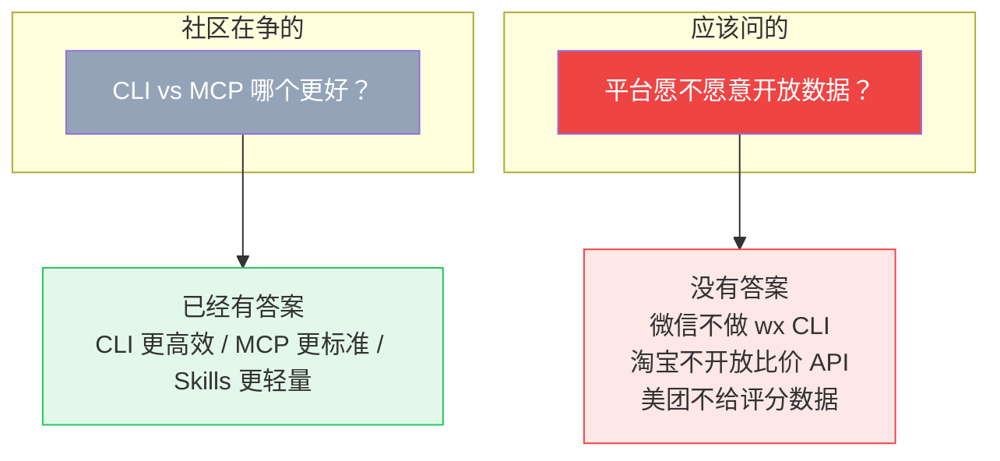

## 他们在吵什么

2026 年 3 月，AI Agent 圈最热的话题不是哪个模型更强，而是一个听起来很无聊的架构问题：

> Agent 该用什么方式调用外部工具？

三个阵营打得不可开交：

**MCP 派**（Model Context Protocol）：Anthropic 2024 年底推出的开放标准[^1]。通过 JSON-RPC 协议统一封装各类服务接口，Agent 一次接入就能跨平台调用多种工具。OpenAI、Google、Microsoft、AWS 全部跟进[^2]。听起来很美好。

**CLI 派**：直接让 Agent 跑 shell 命令——`git log`、`gh pr list`、`curl`、`kubectl`。不需要任何协议层，不需要额外服务器。50 年前的 `grep` 和 `awk` 在 AI 时代焕发第二春。

**Skills 派**：一个 Markdown 文件当"小抄"，教 Agent 在什么场景用什么工具。30 token 待命，触发时才加载完整指令。Flask 作者 Armin Ronacher 全面转向这个方案[^3]。

## 最新战况（吃瓜指南）

MCP 正在被"退货"：

- Perplexity 发博客宣布准备全面抛弃 MCP 转向 CLI[^4]
- Eric Holmes 的 "MCP is dead. Long live the CLI" 登上 Hacker News 热榜[^5]
- ScaleKit 基准测试：MCP 28% 失败率（超时），CLI 100% 成功[^9]
- **连 MCP 的"亲爹" Anthropic，自家的 Claude Code 也更像 CLI 而非 MCP**

CLI 的"文艺复兴"：

- Andrej Karpathy 2026 年 2 月在 X 上说 CLI "super exciting precisely because they are legacy"[^6]
- Smithery 发布 756 次基准测试，系统对比 CLI vs MCP 在 Codex 和 Claude Code 上的表现[^13]
- Google 专门开源了给 AI 用的命令行工具[^7]

Skills 的悄然崛起：

- Simon Willison（Python 社区知名开发者）在 Claude Skills 发布时称其 "maybe a bigger deal than MCP"[^11]
- Armin Ronacher 全面从 MCP 转向 Skills，并给出了核心理由[^3]：

> "Skills 本质上只是一份简短的摘要，告诉 Agent 有哪些能力、去哪个文件了解更多。关键是——Skills 不会往上下文里塞任何工具定义。工具还是原来的工具：bash 和 Agent 已有的那些。"

- 社区开始出现"删掉所有 MCP，用 Skills + CLI 替代"的实践文章[^8]

## CLI 赢在哪？技术层面拆解

### 1. MCP 的上下文污染

MCP 最大的问题：**Agent 一启动就要把所有工具的 schema 塞进上下文。**

GitHub 的 Copilot MCP Server 暴露 43 个工具，连接它就往上下文注入约 55,000 token 的工具定义[^8]。还没开始干活，token 预算花掉一大半。接 10 个 MCP Server、100 个工具？上下文直接爆炸。

CLI 完全不同——**渐进式发现**。Agent 先跑 `gh --help` 看有什么命令，需要时再 `gh pr --help` 看子命令参数。信息按需加载，不是开局全塞。

### 2. LLM 天然会用 CLI

LLM 训练数据里有几十年的 Unix 文档、Stack Overflow 回答、GitHub 上的 shell 脚本。模型天生认识 `git`、`curl`、`grep`、`docker`。

MCP 呢？大量的 JSON schema，模型更难处理，还要输出格式化的 JSON token。你自定义的 MCP 工具，模型从训练数据里学不到怎么调。

### 3. 管道操作

MCP 工具返回结果如果需要后处理（过滤、搜索、截取），得写额外代码。CLI 直接 pipe：

```bash
gh pr list --json number,title | jq '.[] | select(.title | contains("fix"))'
```

Agent 输出几个命令用 `|` 连起来，后处理就搞定了。更简单、更灵活、维护成本更低。

### 4. CLI + Skills 天然搭配

Skill 文件里教 Agent 用 CLI，干净利落：

```markdown
## 查看 PR 状态
gh pr list --state open --json number,title,author
```

换成 MCP？Skill 文件会充斥 function call、JSON schema，整个文档混乱不堪。

### 数据说话

ScaleKit 75 次基准测试[^9]，同一个 GitHub 任务（Claude Sonnet 4，同一 prompt）：



| 方案 | 月成本（1 万次） | 可靠性 |
|------|-----------------|--------|
| CLI | ~$3.20 | 100% |
| CLI + Skills | ~$4.50 | 100% |
| MCP | ~$55.20 | 72%（28% 超时） |

CLI 便宜 17 倍，可靠性 100% vs 72%。成本按 Claude Sonnet 4 定价（$3/M input，$15/M output）计算[^10]。碾压。

## 到这里，CLI 似乎完胜

Token 更省、模型更熟悉、可以 pipe、跟 Skills 搭配更好。各个维度 MCP 都被吊打。

### 公允地说：MCP 在自我修正

MCP 没有坐以待毙。2026 年 1 月，Anthropic 推出了 **progressive discovery**[^12]——本质上借鉴了 Skills 的按需加载思路：

- 初始只加载工具名 + 短描述（20-50 token/工具）
- 完整 schema 仅在 Agent 决定使用该工具时才加载

效果：
- Token 开销降低 85%（77,000 → 8,700 token，50+ 工具场景）
- 工具调用准确率提升：Claude Opus 4 从 49% 升到 74%

差距在缩小。但 Skills 在纯效率上仍然胜出——因为它根本不注入 schema，只注入知识。

**不过，即使 MCP 的效率问题被完全解决，还有一个更根本的问题没人提：**

所有基准测试都在同一个场景下跑——**一个开发者，用自己的凭证，自动化自己的工作流。**

很多文章写到这就会说："但 MCP 有 OAuth，多租户场景不可替代！CLI 做不了认证！"

**真的吗？**

## 一个来自今天的亲身体验

我今天用 OpenCode（CLI 形式的 AI Agent）部署了这个博客。Agent 调了 Vercel CLI：

```bash
$ vercel login
→ 自动弹出浏览器 OAuth 页面
→ 点一下授权
→ CLI 自动拿到 token，本地保存
→ 之后所有命令无感使用
```

**十秒钟。一个 CLI 工具，完整跑了 OAuth 浏览器授权流程。**

我又想到 `gh auth login`——GitHub CLI 也是一模一样。弹出浏览器，OAuth 授权，scoped token，本地持久化。

所以：

> **CLI 不是"架构上不支持 OAuth"。`gh` 和 `vercel` 已经证明了。**

如果微信愿意做一个 `wx auth login`，流程跟 `gh` 一模一样：

```bash
$ wx auth login
→ 弹出微信扫码页面
→ 手机确认授权
→ 本地保存 token
→ wx send abin "你好"
→ wx moments list
```

**技术上零障碍。但它永远不会出现。**

不是做不到，是做了等于把苦苦经营的生态壁垒和反爬体系直接关掉。

## 那 MCP 到底有什么用？

MCP 的价值不是"做了 CLI 做不了的事"——`gh` 已经证明 CLI 能做 OAuth。

MCP 的价值是**标准化**：



接 1 个平台，`gh` 就够了。接 50 个平台，每个都搞一套 CLI auth 就崩溃了。MCP 提供了"大家都用同一套协议开放"的可能性。

**但标准化有个前提：平台愿意实现它。**

## 所以整个争论都问错了问题



GitHub 做了 `gh` → CLI 碾压一切。
Vercel 做了 `vercel login` → 部署丝滑无比。
微信没做 `wx` → 你只能爬虫，或者等。

**决定 Agent 能力边界的，不是你选了 CLI 还是 MCP，而是平台愿不愿意给你一根管道——不管什么形式的管道。**

CLI vs MCP 争的是管道的材质。**真正缺的是水龙头。**

Token 成本是工程问题，协议选择是架构问题，**数据开放是政治问题。** 前两个正在被解决，第三个才是真正卡住整个 Agent 生态的瓶颈。而整个社区都在用技术问题的框架，回避那个真正难的政治问题。

---

*这是 "Agent 生态思考" 系列第一篇。下一篇聊：就算平台有 API，你也大概率用不了——Agent 落地的三层壁垒比你想的厚得多。*

---

## 参考资料

[^1]: Anthropic, ["Introducing the Model Context Protocol"](https://www.anthropic.com/news/model-context-protocol), Nov 2024. MCP 于 2024 年 11 月发布，2025 年 12 月捐赠给 Linux Foundation 的 Agentic AI Foundation (AAIF)。

[^2]: OpenAI 于 2025 年 3 月、Google DeepMind 于 2025 年 4 月、Microsoft Copilot Studio 及 AWS 于 2025 年 7 月先后宣布支持 MCP。参见 [CLI-Based Agents vs MCP: The 2026 Showdown](https://lalatenduswain.medium.com/cli-based-agents-vs-mcp-the-2026-showdown-that-every-ai-engineer-needs-to-understand-7dfbc9e3e1f9)。

[^3]: Armin Ronacher (Flask creator), "Skills vs Dynamic MCP Loadouts"，解释了他为什么从 MCP 全面转向 Skills。参见 [Skills vs MCP: The Token Efficiency War](https://menonlab-blog-production.up.railway.app/blog/skills-vs-mcp-token-efficiency-ai-agents/) 中的引用。

[^4]: Perplexity 关于抛弃 MCP 转向 CLI 的博文。

[^5]: Eric Holmes, "MCP is dead. Long live the CLI"，登上 Hacker News 热榜。参见 [MCP Token Cost Problem](https://www.buildmvpfast.com/blog/mcp-hidden-cost-cli-agent-infrastructure-2026)。

[^6]: Andrej Karpathy 于 2026 年 2 月在 X (Twitter) 上发言，称 CLI 对 Agent 工作流 "super exciting precisely because they are a legacy"。参见 [Why CLIs Beat MCP for AI Agents](https://lalatenduswain.medium.com/why-clis-beat-mcp-for-ai-agents-and-how-to-build-your-own-cli-army-8db9e0467dd8)。

[^7]: Google 开源的 AI CLI 工具：[gws](https://github.com/nicholasgasior/gws)（Google Workspace CLI）等项目。

[^8]: Agent Native, ["Delete your MCPs: Skills + CLI outperform at ~20x lower cost"](https://agentnativedev.medium.com/i-deleted-all-my-mcps-skills-cli-outperform-at-20x-lower-cost-8e86e05fcca6), Mar 2026. 文中指出 GitHub Copilot MCP Server 暴露 43 个工具，初始化注入约 55,000 token。

[^9]: ScaleKit, ["MCP vs CLI: Benchmarking AI Agent Cost & Reliability"](https://www.scalekit.com/blog/mcp-vs-cli-use), Mar 2026. 75 次基准测试的完整数据和方法论。基准测试代码开源于 [GitHub](https://github.com/scalekit-inc/mcp-vs-cli-benchmark)。

[^10]: Anthropic Claude 定价页：Claude Sonnet 4 — $3/M input tokens, $15/M output tokens。月成本估算基于 ScaleKit 基准测试的 median token 数据。

[^11]: Simon Willison, ["Claude's Skills"](https://simonwillison.net/2025/Oct/16/claude-skills/), Oct 2025. 在 Claude Skills 发布时称其 "maybe a bigger deal than MCP"。

[^12]: Anthropic MCP progressive discovery，参见 ["MCP Tool Search: Claude Code Context Pollution Guide"](https://www.atcyrus.com/stories/mcp-tool-search-claude-code-context-pollution-guide)。Token 开销降低 85%，准确率提升数据来自 [Skills vs MCP: The Token Efficiency War](https://menonlab-blog-production.up.railway.app/blog/skills-vs-mcp-token-efficiency-ai-agents/)。

[^13]: Smithery (Henry Mao), ["MCP vs CLI is the wrong fight"](https://smithery.ai/blog/mcp-vs-cli-is-the-wrong-fight), Mar 2026. 756 次跨 3 个 API 的基准测试，覆盖 Codex 和 Claude Code，含 skills、code mode、pretraining bias 等维度分析。
