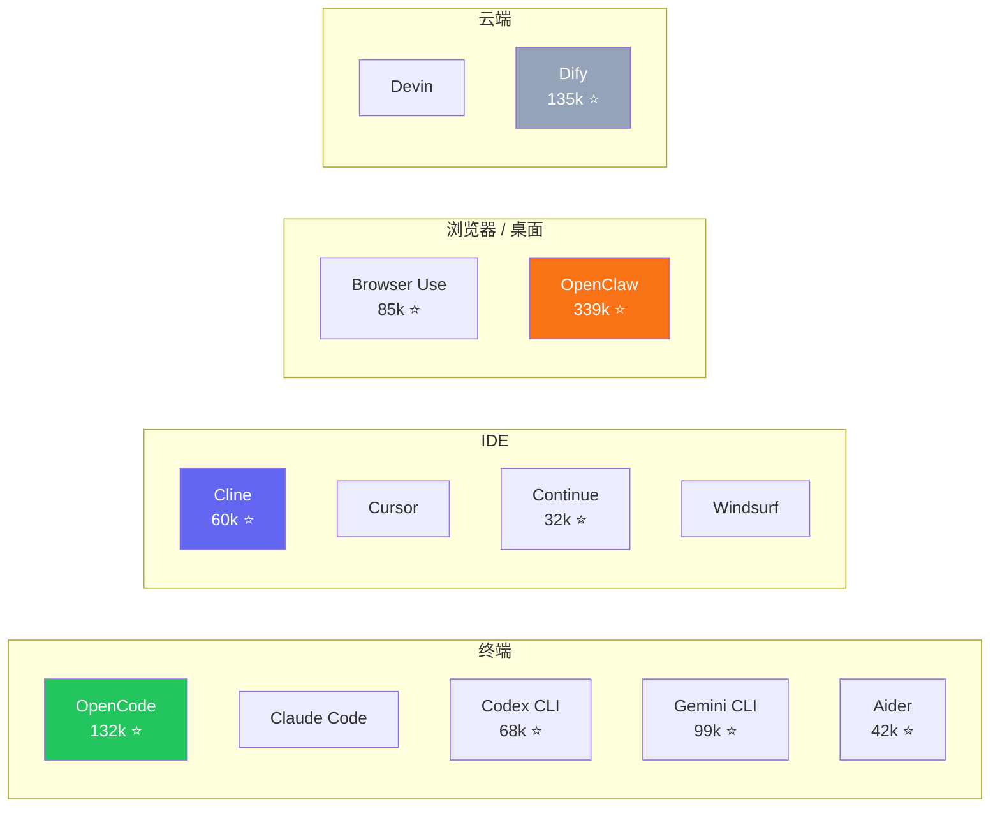

> [上一篇](/posts/harness-engineering-software-engineering/)我们讨论了 Harness Engineering 正在从散装实践变成一门工程学科。但学科刚有雏形，生态就已经很热闹了。这篇不站队，只画地图：**当前的 harness 生态长什么样？竞争沿着哪些方向在发生？各自的取舍是什么？**

## Harness 生态已经很大了

如果你只关注 coding agent，会以为 harness 就是 Claude Code 和 OpenCode 在打擂台。实际上，当前的 harness 生态远不止于此。

仅看几个头部项目的规模：

| 产品 | 领域 | 规模 |
|---|---|---|
| OpenClaw | 个人助理（邮件/航班/智能家居） | 339k ⭐ |
| Dify | 通用 agent 平台 | 135k ⭐ |
| OpenCode | 终端 coding agent | 132k ⭐ |
| ECC | Harness 优化层 | 114k ⭐ |
| Gemini CLI | 终端 coding agent | 99k ⭐ |
| Browser Use | 浏览器自动化 | 85k ⭐ |
| Claude Code | 终端 coding agent | npm 周下载 1058 万 |
| Codex CLI | 终端 coding agent | 68k ⭐ |
| Cline | IDE coding agent | 60k ⭐ |
| OMO | Harness 优化层 | 44k ⭐ |
| Aider | 终端 coding agent | 42k ⭐ |
| Continue | IDE coding agent | 32k ⭐ |

这还没算 Cursor（闭源，$2B ARR）、Windsurf（闭源）、Devin（云端，$73M ARR）、Salesforce Agentforce、Microsoft Copilot Studio 这些不在 GitHub 上公开竞争但体量巨大的玩家。

Harness 不是 coding agent 的专利。个人助理需要 harness（消息通道 + 工具 + 技能库），浏览器 agent 需要 harness（Playwright + DOM 解析 + 状态管理），企业 agent 需要 harness（CRM + 权限 + 工作流引擎）。**只要有模型在干活，就需要 harness。**

## 竞争沿着哪些维度在发生

这场竞争不是单线的"谁更好"，而是同时在多个维度上展开。

### 形态之争：终端 vs IDE vs 浏览器 vs 云端

不同形态意味着不同的使用场景和用户预期：

- **终端类**（OpenCode、Claude Code、Codex CLI、Gemini CLI、Aider）面向习惯命令行的开发者，优势是轻量、可脚本化、可集成进 CI/CD
- **IDE 类**（Cline、Cursor、Continue、Windsurf）面向习惯编辑器的开发者，优势是上下文感知更直观、和编辑流程无缝衔接
- **浏览器 / 桌面类**（Browser Use、OpenClaw）面向非 coding 场景——网页操作、个人事务管理、智能家居控制
- **云端类**（Devin、Dify）面向需要全自主执行或可视化编排的团队

目前没有一个形态在"统治"市场。终端类在开发者社区声量最大，但 Cursor 的 $2B ARR 说明 IDE 类的商业价值可能更高；OpenClaw 的 339k 星说明非 coding 场景的需求可能比 coding 更广。

### 深度之争：配置包 vs 编排系统

即使在同一个形态里，harness 做到什么深度也在分化。以 harness 优化层为例：

**Everything Claude Code（ECC）**[^1] 的做法是注入更好的配置——rules、hooks、skills、MCP configs 打包在一起。你装上之后，harness 本体的行为被规则引导得更好，但运行方式不变。

**Oh My OpenAgent（OMO）**[^2] 的做法完全不同——它在 harness 之上搭了一层编排系统：规划（Prometheus）、执行（Atlas）、审查（Metis、Momus）、深度研究（Hephaestus）各有专职 agent，规划和执行被显式分离。

| | ECC | OMO |
|---|---|---|
| 核心思路 | 给 harness 注入更好的规则 | 在 harness 之上搭编排系统 |
| 改变了什么 | 规则和钩子 | agent 的分工方式 |
| 跨平台 | Claude Code、Codex、OpenCode、Cursor | 主要跑在 OpenCode 上 |
| 代价 | 深度有限 | 更重、绑定更紧 |

这不是谁更好的问题，而是对 **"harness 该做到什么程度"** 的不同回答。

### 领域之争：专用 vs 通用

有些 harness 只做一件事（coding、浏览器操作、客服），有些试图做所有事。

- **专用型**：Claude Code 只做 coding；Browser Use 只做浏览器操作；Salesforce Agentforce 只服务 Salesforce 生态
- **通用型**：OpenClaw 什么都能做（邮件、航班、智能家居、比价、日历）；Dify 提供可视化工作流编排，不限定领域

专用型的优势是深度——它可以为特定场景做极致优化。通用型的优势是灵活——用户不需要为每个场景换一个 agent。但通用型的风险是"什么都能做，什么都不精"。

### 绑定之争：provider-locked vs provider-agnostic

这是当前摩擦最大的一个维度。

有些 harness 和特定模型厂商深度绑定：Claude Code 只能用 Claude，Gemini CLI 只能用 Gemini。有些 harness 刻意做到 provider-agnostic：OpenCode 支持 75+ 模型，Aider 支持所有主流 provider，Cline 支持自带 API key 接入任何模型。

绑定不一定是坏事——Claude Code 在 Claude 模型上的表现确实比第三方 harness 更优（因为模型和 harness 可以联合优化）。但绑定的代价是：**用户换模型就得换 harness，换 harness 就得换工作流。**

OpenCode 2026 年初的爆发很大程度上就是这个维度的产物：Anthropic 封 OAuth[^3]、发律师函[^4]，社区用脚投票转向 provider-agnostic 的替代品[^5]。

### 商业模式之争

| 模式 | 代表 | 用户付什么 |
|---|---|---|
| 免费 + BYOK | OpenCode、Aider、Cline | 自己的 API key |
| 订阅制 | Cursor（$20/月）、OpenClaw（$16-32/月） | 月费 |
| 按用量 | Devin（ACU 计费） | 按 agent 消耗的算力 |
| 平台内嵌 | Salesforce Agentforce、Copilot Studio | 平台订阅费的一部分 |
| 免费 + 增值 | OpenCode Zen | 基础免费，优化模型收费 |

目前还没有一个模式被证明是"正确答案"。Cursor 的 $2B ARR 说明订阅制在 IDE 类里可以跑通；OpenCode 的 132k 星说明免费 + BYOK 在社区里有巨大号召力；Devin 的按用量模式则是在赌"agent 会变成按需购买的劳动力"。

## 一个把多个维度同时暴露出来的案例

OpenCode 在 2026 年初的爆发不只是一个"开源 vs 闭源"的故事。它之所以值得单独拿出来说，是因为它在短短三个月里同时触发了好几个竞争维度：

- **形态**：终端类 agent 可以和 IDE 类一样有巨大市场
- **绑定**：Anthropic 封 OAuth + 发律师函[^4]，provider-locked 的风险被直接暴露
- **商业模式**：免费 + BYOK + Copilot 接入，让用户零成本迁移
- **社区情绪**：隐私焦虑、反垄断情绪、"律师函反而是最好的广告"[^5]

两周涨 18,000 星[^6]，三个月从默默无闻到 132k。这个速度本身就说明：harness 竞争不只是产品功能的比拼，用户在意的维度远比 benchmark 分数多得多。

## 怎么看这场竞争

这不是一场会产生唯一赢家的竞争。

不同形态服务不同场景，不同深度服务不同需求，不同绑定策略服务不同价值观。一个习惯终端的独立开发者和一个使用 Salesforce 的企业团队，他们需要的 harness 不是同一个东西。

但有一件事是确定的：**harness 层正在变成 agent 生态里一个独立的、有自己竞争逻辑的价值层。**

模型厂商在争夺它（Claude Code、Gemini CLI、Codex CLI），开源社区在争夺它（OpenCode、Aider、Cline），平台公司在争夺它（Cursor、Salesforce、Microsoft），通用 agent 平台也在争夺它（Dify、OpenClaw）。

谁最终拿到这一层的控制权，或者这一层是否会像 Web 框架一样百花齐放而不是赢家通吃——现在还没有答案。

但竞争已经开始了。

---

*这是 "Agent 生态思考" 系列第五篇。*

---

## 参考资料

[^1]: Affaan Mustafa, ["Everything Claude Code"](https://github.com/affaan-m/everything-claude-code), GitHub, 114k stars. 自我定位为 "The agent harness performance optimization system"。

[^2]: ["Oh My OpenAgent"](https://ohmyopenagent.com/zh), GitHub, 44.3k stars. 自我定位为 "The Best Agent Harness"，提供多 agent 编排系统。

[^3]: ["Anthropic OAuth Ban"](https://openclaw.rocks/blog/anthropic-oauth-ban), OpenClaw Blog, Feb 2026.

[^4]: ["Anthropic forces OpenCode to strip Claude integration"](https://theagenttimes.com/articles/anthropic-forces-opencode-to-strip-claude-integration-after--96edcc05), The Agent Times, Mar 2026.

[^5]: ["OpenCode crossed 120K GitHub stars and even Anthropic's legal threats couldn't slow it down"](https://topaiproduct.com/2026/03/20/opencode-crossed-120k-github-stars-and-even-anthropics-legal-threats-couldnt-slow-it-down/), Top AI Product, Mar 2026.

[^6]: Miles K, ["OpenCode's January Surge: What Sparked 18,000 New GitHub Stars in Two Weeks"](https://medium.com/@milesk_33/opencodes-january-surge-what-sparked-18-000-new-github-stars-in-two-weeks-7d904cd26844), Medium, Jan 2026.
