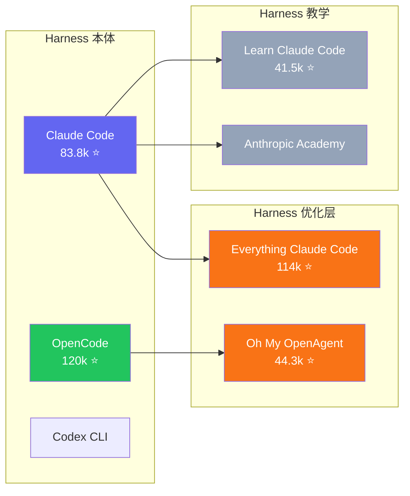
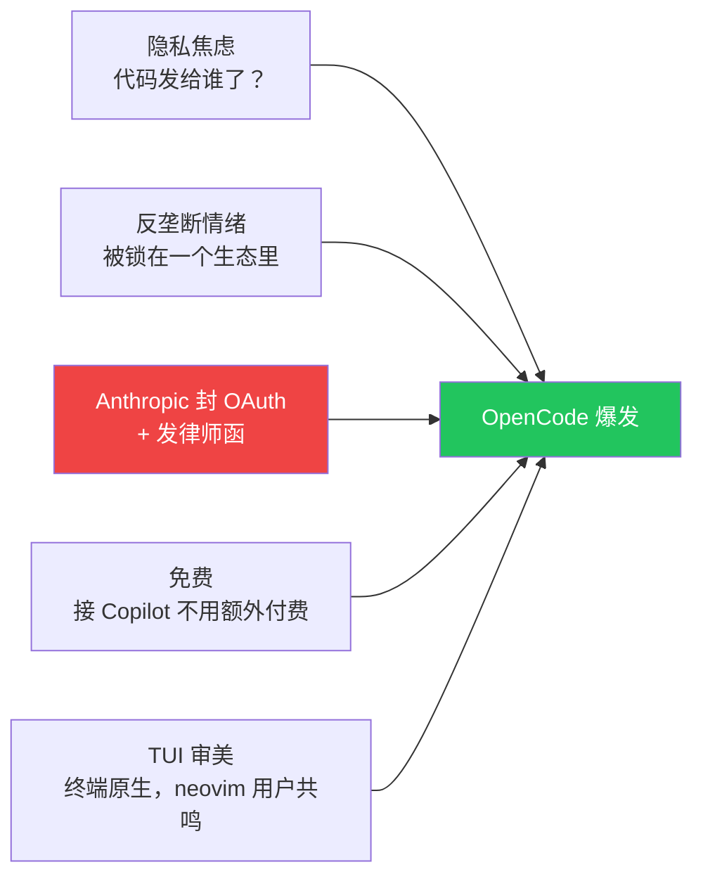

> 上一篇讨论了 Harness Engineering 作为一门工程学科正在形成（[第四篇](/posts/harness-engineering-software-engineering/)）。这篇接着问一个自然的问题：**既然大家都在造 harness，谁的更好？怎么定义"更好"？竞争的本质又是什么？**

## Harness 已经不是一个东西了

"Harness"这个词刚开始被讨论时，大家说的像是同一件事：模型外面那套系统。但只要稍微看一下当下的生态，就会发现它已经在分层。

这三层在解决不同的问题：

- **Harness 本体**（Claude Code、OpenCode、Codex CLI）提供的是 agent 的执行引擎：agent loop、工具调用、上下文管理、沙箱。你装上就能用。
- **Harness 优化层**（Everything Claude Code、Oh My OpenAgent）不替代本体，而是装在上面：更好的规则、更多的钩子、记忆持久化、验证回环、安全扫描。它们让本体跑得更好。
- **Harness 教学**（Learn Claude Code、Anthropic Academy）教你理解 harness 是怎么回事，以及怎么自己造一个。

这个分层本身就是"工程学科正在形成"的标志。就像 Web 开发从"一个人写全栈"到"前端/后端/DevOps 分层"的过程一样，harness 生态也开始有了自己的基础设施层、应用层和教育层。

## 同一层里，思路也在分化

即使是同一层的产品，做法也完全不同。以 harness 优化层为例：

**Everything Claude Code（ECC）** 的做法是：给现有 harness 注入更好的配置[^1]。

它本质上是一个 **配置包**——rules、hooks、skills、MCP configs 打包在一起，你装上之后，harness 本体的行为被规则引导得更好。但它不改变 harness 的运行方式。agent 怎么规划、怎么分工、怎么验证，这些逻辑仍然由 harness 本体决定。

**Oh My OpenAgent（OMO）** 的做法完全不同：它重新定义了 agent 怎么分工[^2]。

它不只是注入规则，而是在 harness 之上搭了一层完整的编排系统：有专门负责规划的 agent（Prometheus），有专门负责执行的 agent（Atlas），有专门负责审查的 agent（Metis、Momus），有专门负责深度研究的 agent（Hephaestus）。规划和执行被显式分离，验证链条是独立的。

| | ECC | OMO |
|---|---|---|
| 核心思路 | 给 harness 注入更好的规则 | 在 harness 之上搭编排系统 |
| 怎么工作 | rules + hooks + skills 配置包 | 多 agent 分工 + 路由 + 独立验证 |
| 规划层 | 没有独立规划，靠 rules 引导 | Prometheus 专职规划，Atlas 专职执行 |
| 跨平台 | Claude Code、Codex、OpenCode、Cursor | 主要跑在 OpenCode 上 |
| 类比 | 给车换更好的轮胎和导航 | 给车换一套自动驾驶系统 |

这不是"谁更好"的问题，而是对**"harness 该做到什么程度"**的不同回答。ECC 认为 harness 本体已经够好了，优化层只需要提供更好的配置；OMO 认为 harness 本体的编排能力不够，需要在上面再建一层。

两种思路都有道理，也都有各自的代价：ECC 更轻、更跨平台，但深度有限；OMO 更重、更深度自主，但和 OpenCode 绑定更紧。

## OpenCode 的故事：一场不是技术驱动的爆发

如果只看 GitHub 星数，OpenCode（120k）已经超过了 Claude Code（83.8k）。但这个数字背后的故事，比单纯的技术竞争有意思得多。

OpenCode 的爆发不是因为它在某个 benchmark 上跑赢了 Claude Code，而是因为它出现在了一个**情绪窗口**里：

**2026 年 1 月**，OpenCode 两周内涨了 18,000 颗星，多次登顶 Hacker News[^3]。

**2026 年 2 月**，Anthropic 宣布禁止 Claude Free/Pro/Max 的 OAuth token 被第三方工具使用[^4]。社区反应激烈——这相当于直接封杀了第三方 harness 接入 Claude 的最便宜路径。

**2026 年 3 月**，Anthropic 向 OpenCode 发出律师函，要求移除所有 Claude 相关的品牌引用[^5]。

结果呢？**律师函反而加速了增长。** OpenCode 在收到律师函后从 95k 涨到 120k+[^6]。

开发者的反应基本上是：**"你说我不能用？那我偏要用开源的。"**

这个故事说明了一件事：harness 的竞争不只是技术问题。它从第一天起就带着**开放性 vs 封闭性**的路线之争。

## 开放性之争，从数据层蔓延到了 Harness 层

如果你读过这个系列的前三篇，会发现一个熟悉的模式：

前三篇讨论的是 **数据层的开放性**——平台愿不愿意把数据开放给 agent？组织愿不愿意批准 agent 访问内部系统？

OpenCode 的故事说明，**同样的对抗正在 harness 层重演**：

- Anthropic 想让 Claude Code 成为使用 Claude 模型的唯一（或最优）harness
- 社区想要 provider-agnostic 的 harness，不被任何一家模型厂商绑定
- Anthropic 用法律手段（律师函）和技术手段（封 OAuth）来维护闭环
- 社区用开源和多 provider 适配来突破闭环

| 层级 | 封闭方的做法 | 开放方的做法 |
|---|---|---|
| 数据层（前三篇） | 平台不开放 API、不授权 agent 访问 | CLI/MCP 标准化、逆向接入 |
| Harness 层（本篇） | 封 OAuth、发律师函、模型+harness 绑定 | 开源 harness、多 provider、本地模型 |

这不是巧合。**开放性之争是这个生态的底层张力，它会在每一层重复出现。**

当模型厂商发现"卖模型"的利润空间越来越小的时候，"卖 harness"（或者通过 harness 锁定用户）就会变成新的商业逻辑。而社区的反应也会和数据层一样：用开源来对抗锁定。

## 怎么评价一个 Harness？

既然 harness 之间已经开始竞争，就会有人问：谁更好？

Terminal Bench 2.0 是目前最常被引用的 coding agent 基准测试之一。上一篇提到 LangChain 用它证明了 harness 优化的效果（同模型提升 13.7 个点）[^7]。但它的局限也很明显：

- **榜单测的是特定任务完成率**，不是日常使用体验。一个 agent 在 Terminal Bench 上跑 80%，不代表它日常比跑 60% 的更好用。
- **提交配置未必是最优**。同一个产品的不同配置可能分数差异很大，但榜单只显示一个数字。
- **产品目标和榜单目标可能冲突**。偏稳健的产品（更多安全检查、更保守的行为）在 benchmark 上可能反而分低。

所以，benchmark 能告诉你"在这套任务上、这个配置下的完成率"，但不能告诉你"这个 harness 适不适合你的场景"。

如果要更完整地评价一个 harness，可能至少需要看这几个维度：

| 维度 | 问什么 |
|---|---|
| 可扩展性 | 能不能加自定义工具、钩子、规则？ |
| 可组合性 | 能不能和其他系统（CI/CD、MCP、IDE）组合？ |
| Provider 无关性 | 换模型是否需要换 harness？ |
| 可观测性 | agent 在做什么、做到哪了、为什么失败，能不能看到？ |
| 恢复能力 | 中断之后能不能从断点继续？ |
| 验证机制 | 有没有独立的结果验证，而不是 agent 自己说"我做完了"？ |

这些维度目前还没有标准化的评测框架。但随着 harness 竞争加剧，它们迟早会被量化。

## 结语

这个系列走到第五篇，讨论的问题一直在变，但底层的张力没变：

- 前三篇问的是：**谁控制数据？**
- 第四篇问的是：**怎么让 agent 可靠地工作？**
- 这一篇问的是：**谁控制 harness？**

这三个问题看似不同，其实是同一个母题的三个切面：**在 Agent 时代，控制权在谁手里？**

数据层的答案还在博弈中。Harness 层的答案也在博弈中。唯一可以确定的是：这场竞争才刚刚开始，而且它不会只在技术层面展开。

---

*这是 "Agent 生态思考" 系列第五篇。前三篇讨论开放性，第四篇讨论可靠性，这一篇讨论生态竞争。同一个母题，三个切面。*

---

## 参考资料

[^1]: Affaan Mustafa, ["Everything Claude Code"](https://github.com/affaan-m/everything-claude-code), GitHub, 114k stars. 自我定位为 "The agent harness performance optimization system"，Anthropic 黑客松冠军项目。

[^2]: ["Oh My OpenAgent"](https://ohmyopenagent.com/zh), GitHub, 44.3k stars. 自我定位为 "The Best Agent Harness"，提供多 agent 编排系统（Sisyphus / Prometheus / Atlas / Metis / Momus）。

[^3]: Miles K, ["OpenCode's January Surge: What Sparked 18,000 New GitHub Stars in Two Weeks"](https://medium.com/@milesk_33/opencodes-january-surge-what-sparked-18-000-new-github-stars-in-two-weeks-7d904cd26844), Medium, Jan 2026.

[^4]: ["Anthropic OAuth Ban"](https://openclaw.rocks/blog/anthropic-oauth-ban), OpenClaw Blog, Feb 2026. Anthropic 明确禁止 Claude Free/Pro/Max 的 OAuth token 被第三方工具使用。

[^5]: ["Anthropic forces OpenCode to strip Claude integration"](https://theagenttimes.com/articles/anthropic-forces-opencode-to-strip-claude-integration-after--96edcc05), The Agent Times, Mar 2026.

[^6]: ["OpenCode crossed 120K GitHub stars and even Anthropic's legal threats couldn't slow it down"](https://topaiproduct.com/2026/03/20/opencode-crossed-120k-github-stars-and-even-anthropics-legal-threats-couldnt-slow-it-down/), Top AI Product, Mar 2026.

[^7]: ["Improving Deep Agents with harness engineering"](https://blog.langchain.com/improving-deep-agents-with-harness-engineering/), LangChain Blog, Feb 17, 2026.
