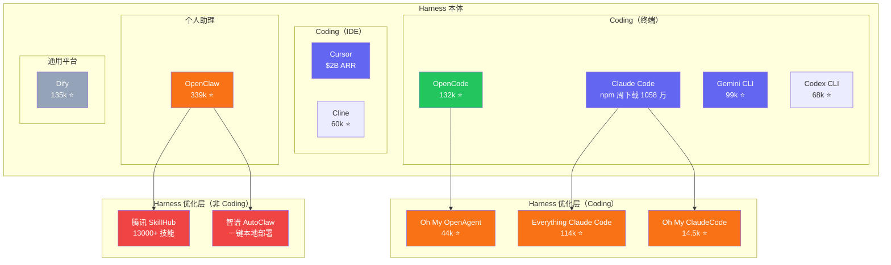
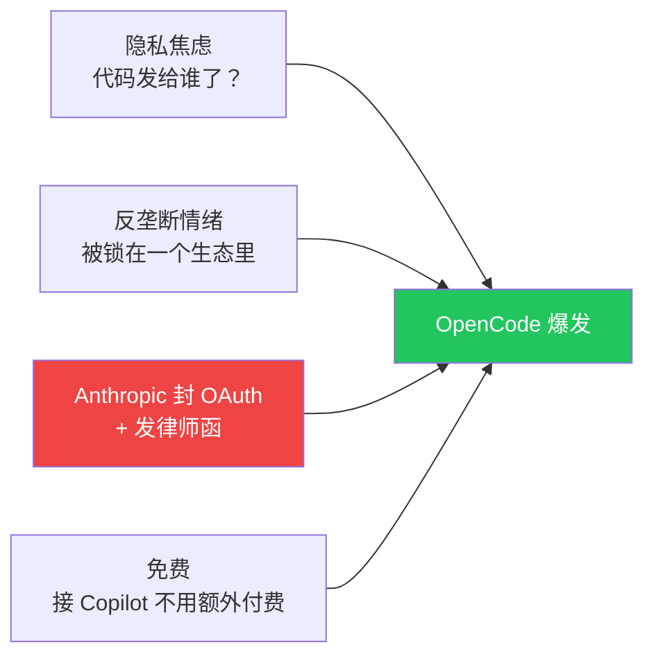

> [上一篇](/posts/harness-engineering-software-engineering/)我们讨论了 Harness Engineering 正在从散装实践变成一门工程学科。但学科刚有雏形，生态就已经很热闹了。这篇不站队，只画地图：**当前的 harness 生态长什么样？竞争沿着哪些方向在发生？各自的取舍是什么？**

## Harness 生态比你以为的大

提到 AI coding agent，你可能首先想到 Claude Code 或者 Cursor。但当前的 harness 生态远不止这几个名字，也远不止 coding 这一个领域。

当前的 harness 生态大致可以分成两层：

**Harness 本体**是你装上就能用的 agent 运行时——agent loop、工具调用、上下文管理、沙箱，全部打包好。不同领域的本体连接的工具不同：coding harness 连的是终端和文件系统，个人助理 harness 连的是邮件和日历，通用平台连的是可配置的工作流引擎。但底层逻辑是一样的：**把模型接入真实世界。**

**Harness 优化层**不替代本体，而是装在上面：更好的规则、更多的钩子、记忆持久化、验证回环。它让本体跑得更好。

几个值得注意的数字：

- **OpenClaw**（339k ⭐）是个人助理类 harness，通过 Telegram/WhatsApp 接收指令，帮用户处理邮件、航班值机、智能家居、比价购物。它的 star 数比所有 coding agent 都高。而在中国市场，围绕 OpenClaw 的优化层已经有 13 家以上的科技大厂同时入局——这个规模远超 coding agent 生态。
- **Cursor**（$2B ARR）没有公开的 GitHub star，但它的营收说明 IDE 类 harness 的商业价值可能比终端类更高。
- **Dify**（135k ⭐）是通用 agent 平台，提供可视化工作流编排，不限定领域。它代表的是"harness 工厂"这个思路——不是给你一个现成的 agent，而是给你造 agent 的工具。

**只要有模型在干活，就需要 harness。** Coding 只是最先被讨论的领域，不是唯一的领域。

## 竞争沿着哪些维度在发生

这场竞争不是单线的"谁更好"，而是同时在多个维度上展开。

### 形态之争：终端 vs IDE vs 消息通道 vs 可视化平台

不同形态面向不同的用户和场景：

- **终端类**（OpenCode、Claude Code、Codex CLI、Gemini CLI）面向习惯命令行的开发者，优势是轻量、可脚本化、可集成进 CI/CD
- **IDE 类**（Cursor、Cline）面向习惯编辑器的开发者，优势是上下文感知更直观、和编辑流程无缝衔接
- **消息通道类**（OpenClaw）面向非技术用户或个人效率场景，通过 Telegram/WhatsApp/Discord 交互，优势是零学习成本
- **可视化平台类**（Dify）面向需要定制工作流的团队，优势是可拖拽编排、不限定领域

目前没有一个形态在"统治"市场。终端类在开发者社区声量最大，但 Cursor 的营收说明 IDE 类的付费意愿更强；OpenClaw 的规模说明消息通道可能是 harness 最自然的用户入口。

### 深度之争：配置包 vs 编排系统

即使在同一个形态里，harness 做到什么深度也在分化。以 harness 优化层为例：

**Everything Claude Code（ECC）**[^1] 的做法是注入更好的配置——rules、hooks、skills、MCP configs 打包在一起。你装上之后，harness 本体的行为被规则引导得更好，但运行方式不变。

**Oh My OpenAgent（OMO）**[^2] 的做法完全不同——它在 harness 之上搭了一层编排系统：规划（Prometheus）、执行（Atlas）、审查（Metis、Momus）、深度研究（Hephaestus）各有专职 agent，规划和执行被显式分离。

| | ECC | OMO |
|---|---|---|
| 核心思路 | 给 harness 注入更好的规则 | 在 harness 之上搭编排系统 |
| 改变了什么 | 规则和钩子 | agent 的分工方式 |
| 跨平台 | Claude Code、Codex、OpenCode、Cursor | 主要跑在 OpenCode 上 |
| 代价 | 深度有限 | 更重、绑定更紧 |

这不是谁更好的问题，而是对 **"harness 该做到什么程度"** 的不同回答。

### 优化层还在快速迭代

ECC 和 OMO 不是终点。2026 年 1 月，韩国开发者 Yeachan Heo 发布了 Oh My ClaudeCode（OMC）[^11]，三个月内从零涨到 14,500 星，单日最高增长 1,400 星。

OMC 的做法是把前两者的思路合在一起，再加上 Claude Code 的 plugin 系统做原生集成：

- **ECC 的部分**：rules、skills、hooks 注入，开箱即用
- **OMO 的部分**：32 个专职 agent，5 阶段流水线（拆任务 → 写需求 → 并行执行 → 自动验证 → 修复循环）
- **新增的部分**：通过 tmux 启动多个 Claude Code / Codex / Gemini CLI 实例并行工作，以及 Skill Learning——踩过的坑自动存成文件，下次直接调用

它的核心代码有 12MB TypeScript，不是纯 prompt 配置包。但 32 个 agent 的“智慧”主要还是靠 prompt 定义，不像 OMO 那样每个 agent 有独立的行为逻辑。

OMC 的出现说明两件事：第一，优化层的迭代速度非常快，三个月就能出一代新产品；第二，优化层正在从“给 harness 加配置”演化成“在 harness 之上搭一层完整的工作系统”——深度还在加。

优化层的竞争不只发生在 coding 领域。以 OpenClaw（龙虾）为例，2026 年 3 月，中国市场围绕它的优化层集中爆发：

围绕 OpenClaw 本身的优化层包括：

- **腾讯 SkillHub**：ClawHub 的中国镜像站，13,000+ 技能本地化，因抓取数据引发争议后成为 OpenClaw 赞助商[^7]
- **智谱 AutoClaw（澳龙）**：一键安装本地版 OpenClaw，用自研模型 Pony-Alpha-2 替代 Claude，降低部署门槛[^10]
- **社区技能生态**：awesome-openclaw-skills（43k ⭐）、中文技能库（3.7k ⭐）、医疗技能库（1.8k ⭐）等

而更大的动静来自各大厂蹭龙虾热度推出的同类产品：阿里发布"悟空"[^8]，钉钉全面 CLI 化改造，目标 2000 万企业组织；字节在飞书内上线原生龙虾智能体[^9]；华为在鸿蒙推出小艺 Claw；小米推出 miclaw；蚂蚁发布"龙虾卫士"安全产品。这些不是 OpenClaw 的优化层，而是各大厂早已在做的 agent 产品，蹭着龙虾的热度推出

不过需要指出的是，这些产品目前几乎都处于实验阶段，稳定性普遍不高，更多是在抢占用户视野和生态位。但正是这种“先占坑再打磨”的节奏，反映了大厂对 harness 层价值的判断：**值得抢。** 这篇后续以 coding 为主要案例展开，但值得记住：非 coding 领域的 harness 优化层竞争，无论是参与者的量级还是入局的速度，都已经远超 coding。

### 绑定之争：provider-locked vs provider-agnostic

有些 harness 和特定模型厂商深度绑定：Claude Code 只能用 Claude，Gemini CLI 只能用 Gemini。有些 harness 刻意做到 provider-agnostic：OpenCode 支持 75+ 模型，Cline 支持自带 API key 接入任何模型。

绑定不一定是坏事——Claude Code 在 Claude 模型上的表现确实比第三方 harness 更优（因为模型和 harness 可以联合优化）。但绑定的代价是：**用户换模型就得换 harness，换 harness 就得换工作流。**

OpenCode 2026 年初的爆发就是这个维度的典型案例——下一节会展开讲。

### 商业模式之争

| 模式 | 代表 | 用户付什么 |
|---|---|---|
| 免费 + BYOK | OpenCode、Cline | 自己的 API key |
| 订阅制 | Cursor（$20/月）、OpenClaw（$16-32/月） | 月费 |
| 免费 + 增值 | OpenCode Zen | 基础免费，优化模型收费 |

目前还没有一个模式被证明是"正确答案"。Cursor 的 $2B ARR 说明订阅制在 IDE 类里可以跑通；OpenCode 的 132k 星说明免费 + BYOK 在社区里有巨大号召力。

## 一个案例：OpenCode 的爆发

OpenCode 的故事值得单独拿出来说，不是因为它技术上做了什么突破，而是因为它在短短三个月里同时触发了好几个竞争维度。

**2026 年 1 月**，OpenCode 两周内涨了 18,000 颗星，多次登顶 Hacker News[^6]。当时它只是一个支持多 provider 的开源终端 coding agent，功能上并没有碾压 Claude Code。

**2026 年 2 月**，Anthropic 宣布禁止 Claude Free/Pro/Max 的 OAuth token 被第三方工具使用[^3]。这相当于直接封杀了第三方 harness 接入 Claude 的最便宜路径。社区反应激烈。

**2026 年 3 月**，Anthropic 向 OpenCode 发出律师函，要求移除所有 Claude 相关的品牌引用[^4]。

结果呢？**律师函反而加速了增长。** OpenCode 在收到律师函后从 95k 涨到 132k[^5]。

这个故事之所以重要，是因为它同时暴露了好几个维度的张力：

- **绑定维度**：Anthropic 用法律和技术手段维护 Claude Code 的独占地位，用户用脚投票
- **商业模式维度**：免费 + BYOK + Copilot 接入，让用户零成本迁移
- **形态维度**：终端类 agent 可以和 IDE 类一样有巨大市场
- **情绪维度**：隐私焦虑、反垄断情绪——用户在意的维度远比 benchmark 分数多

两周 18,000 星，三个月从默默无闻到 132k。这个速度本身就说明：**harness 的竞争不只是产品功能的比拼，用户选择 harness 的理由也不只是"哪个更好用"。**

## 怎么评价一个 Harness

既然 harness 之间已经开始竞争，就会有人问：谁更好？

目前被引用最多的是 Terminal Bench 2.0 这类编码基准测试。但它的局限很明显：

- **榜单测的是特定任务完成率**，不是日常使用体验。一个 agent 在 Terminal Bench 上跑 80%，不代表它日常比跑 60% 的更好用。
- **提交配置未必是最优**。同一个产品的不同配置可能分数差异很大，但榜单只显示一个数字。
- **产品策略和榜单目标可能冲突**。偏稳健的产品（更多安全检查、更保守的行为）在 benchmark 上可能反而分低。

所以 benchmark 能告诉你"在这套任务上、这个配置下的完成率"，但不能告诉你"这个 harness 适不适合你的场景"。

如果要更完整地评价一个 harness，可能至少需要看这几个维度：

| 维度 | 问什么 |
|---|---|
| 可扩展性 | 能不能加自定义工具、钩子、规则？ |
| 可组合性 | 能不能和其他系统（CI/CD、MCP、IDE）组合？ |
| Provider 无关性 | 换模型是否需要换 harness？ |
| 可观测性 | agent 在做什么、做到哪了、为什么失败，能不能看到？ |
| 恢复能力 | 中断之后能不能从断点继续？ |
| 验证机制 | 有没有独立的结果验证，而不是 agent 自己说"我做完了"？ |

这些维度目前还没有标准化的评测框架。但随着 harness 竞争加剧，它们迟早会被量化。

## 怎么看这场竞争

这不是一场会产生唯一赢家的竞争。

不同形态服务不同场景，不同深度服务不同需求，不同绑定策略服务不同价值观。一个习惯终端的独立开发者和一个通过 Telegram 管理日程的普通用户，他们需要的 harness 不是同一个东西。

但有一件事是确定的：**harness 层正在变成 agent 生态里一个独立的、有自己竞争逻辑的价值层。**

模型厂商在争夺它（Claude Code、Gemini CLI、Codex CLI），开源社区在争夺它（OpenCode、Cline），平台公司在争夺它（Cursor、Dify），个人助理赛道也在争夺它（OpenClaw）。

谁最终拿到这一层的控制权，或者这一层是否会像 Web 框架一样百花齐放而不是赢家通吃——现在还没有答案。

但竞争已经开始了。

---

*这是 "Agent 生态思考" 系列第五篇。*

---

## 参考资料

[^1]: Affaan Mustafa, ["Everything Claude Code"](https://github.com/affaan-m/everything-claude-code), GitHub, 114k stars. 自我定位为 "The agent harness performance optimization system"。

[^2]: ["Oh My OpenAgent"](https://ohmyopenagent.com/zh), GitHub, 44.3k stars. 自我定位为 "The Best Agent Harness"，提供多 agent 编排系统。

[^3]: ["Anthropic OAuth Ban"](https://openclaw.rocks/blog/anthropic-oauth-ban), OpenClaw Blog, Feb 2026.

[^4]: ["Anthropic forces OpenCode to strip Claude integration"](https://theagenttimes.com/articles/anthropic-forces-opencode-to-strip-claude-integration-after--96edcc05), The Agent Times, Mar 2026.

[^5]: ["OpenCode crossed 120K GitHub stars and even Anthropic's legal threats couldn't slow it down"](https://topaiproduct.com/2026/03/20/opencode-crossed-120k-github-stars-and-even-anthropics-legal-threats-couldnt-slow-it-down/), Top AI Product, Mar 2026.

[^6]: Miles K, ["OpenCode's January Surge: What Sparked 18,000 New GitHub Stars in Two Weeks"](https://medium.com/@milesk_33/opencodes-january-surge-what-sparked-18-000-new-github-stars-in-two-weeks-7d904cd26844), Medium, Jan 2026.

[^7]: ["Tencent Joins OpenClaw Sponsors After Data-Scraping Spat With Founder"](https://www.caixinglobal.com/2026-03-17/tencent-joins-openclaw-sponsors-after-data-scraping-spat-with-founder-102423670.html), Caixin Global, Mar 17, 2026.

[^8]: [“阿里发布‘悟空’，要把‘龙虾’装进 2000 万企业组织里”](https://www.yilantop.com/article/26483), 壹览商业, 2026 年 3 月.

[^9]: [“飞书发布官方版‘龙虾’智能体”](https://www.yicai.com/news/103095280.html), 第一财经, 2026 年 3 月 19 日.

[^10]: [“Zhipu launches AutoClaw for one-click local AI deployment”](https://autoglm.zhipuai.cn/autoclaw), 智谱 AI, 2026 年 3 月 10 日.

[^11]: Yeachan Heo, ["Oh My ClaudeCode"](https://github.com/yeachan-heo/oh-my-claudecode), GitHub, 14.5k stars. npm 包名为 `oh-my-claude-sisyphus`，提供多 agent 编排、tmux 并行、跨模型调度。
