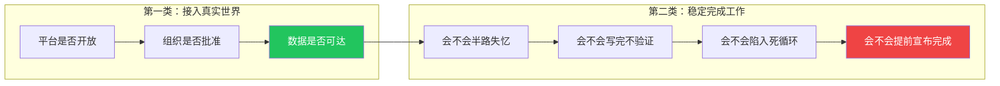
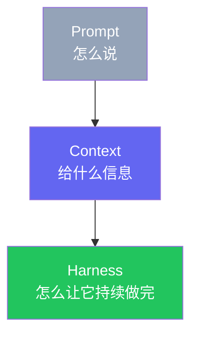
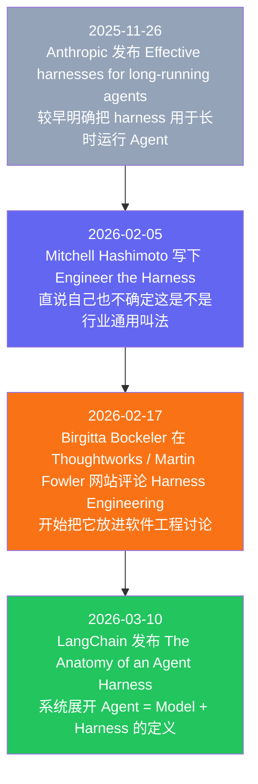
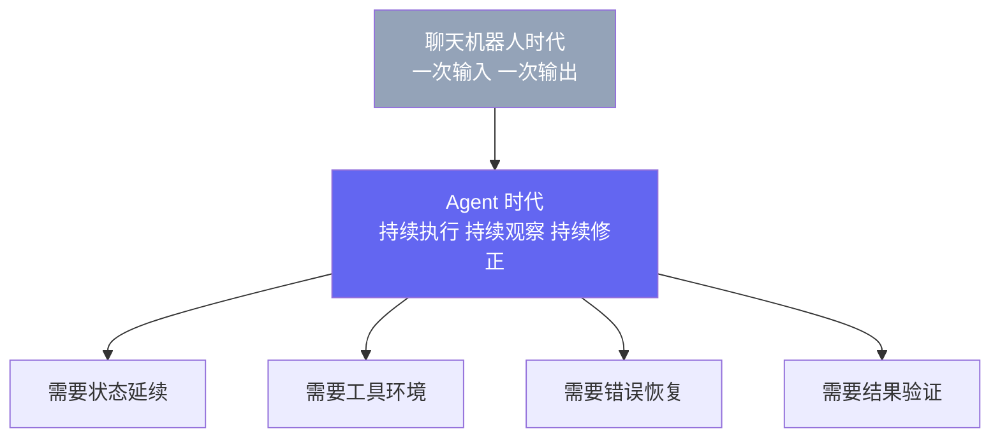
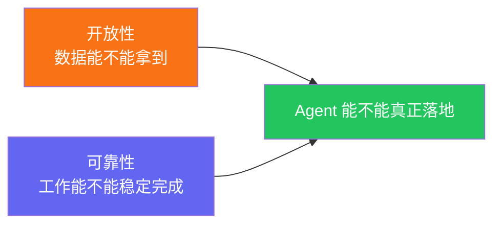

> 即使数据和权限问题暂时不再构成障碍，Agent 也不会天然变得可用。真正进入执行阶段之后，新的问题会立刻出现：状态如何延续、工具如何调用、环境如何约束、结果如何验证？这些问题本身并不新，只是最近开始被一些作者和团队集中放进 **Harness Engineering** 这个名字下面。

## Agent 落地里，最先撞上的通常是两类问题

把 Agent 接入真实世界，只是开始。**就算你走的是正规接口，Agent 依然可能把事情做坏。**

从今天的实践看，最先撞上的通常是两类问题：一类是能不能接进去，另一类是接进去之后能不能稳定地做下去。

第一类是**开放性问题**，第二类是**系统化执行问题**。

最近，第二类问题开始有了一个集中的名字：**Harness Engineering**。

## Harness 是什么

LangChain 在 2026 年 3 月的文章里提出了一个便于讨论的工作性抽象：

> **Agent = Model + Harness**[^1]

以及更直接的一句：

> **If you're not the model, you're the harness.**[^1]

翻成更直白的话就是：

**Harness 是模型之外、构建者可以工程化控制、让 Agent 真正能干活的那部分系统。**

模型本体提供的是基于输入上下文生成下一步输出的能力（通常体现为 token 级生成）。但一个能工作的 Agent 还需要别的东西：

- 它要知道自己是谁，应该怎么做事
- 它要能调用工具、读文件、跑命令
- 它要有地方保存中间状态，而不是每个窗口都从零开始
- 它要在出错后被拉回来，而不是一路错到底
- 它要在“我觉得已经完成了”和“真的已经完成了”之间，有一套验证机制

LangChain 把这些东西概括成几类：system prompts、tools/skills/MCP、bundled infrastructure（filesystem、sandbox、browser）、orchestration logic、hooks/middleware[^1]。这一定义之所以有用，不是因为它发明了什么新零件，而是因为它给“模型之外、但属于 agent runtime 与周边脚手架的设计”划出了一个非常好用的边界。

## 它不是替代 Prompt 和 Context，而是把它们包进去

很多人第一次看到 Harness Engineering，会误以为这只是 Prompt Engineering 的一个新名字。其实不是。

更准确的理解是：**Prompt 通常属于 Context 的一部分；Harness 则负责管理 Context（含 Prompt）以及工具、状态与验证闭环。**

- **Prompt Engineering** 解决的是：一句话怎么说更有效
- **Context Engineering**（本文语境下）解决的是：哪些信息应被结构化地放进窗口里，以及以什么形式放进去
- **Harness Engineering** 解决的是：有了提示词、有了上下文之后，Agent 如何在真实环境里持续执行、持续修正、持续验证

所以 Harness 不是把前两者推翻，而是把它们纳入一个更大的执行系统里。Prompt 和 Context 仍然重要，只是它们不再是全部。

## 这个词很新，但这件事并不新

如果只看名字，很容易误以为 Harness Engineering 是 2026 年突然冒出来的一门全新技术。不是。

它更像是一个新封装，而不是一项新发明。

目前能找到的时间线大致是这样的：

Anthropic 在 2025 年 11 月谈“long-running agents”时，将 Claude Agent SDK 描述为支撑长时运行 Agent 的 harness/脚手架体系，并且系统讨论了 compaction、initializer agent、progress file、feature list、git commit、end-to-end testing 这些做法[^2]。

Mitchell Hashimoto 在 2026 年 2 月写得更直白。他把自己的实践总结成一句话：**每次看到 Agent 犯一个错，就工程化地把这个错误消灭掉，让它下次别再犯。** 他甚至专门补了一句：他也不知道这是不是行业里广泛接受的说法，但他开始把这件事叫作 “harness engineering”[^3]。

换句话说，这个词确实很新；但它指向的那类工作，已经在不少团队里发生了。

## Harness Engineering 到底在做什么

如果只讲定义，Harness 很容易听起来像又一个抽象名词。更准确的理解是：

> **Harness 是 agent runtime 与周边脚手架本身；Harness Engineering 是把这套东西做成“可重复、可维护、可验证”的工程工作。**

它关心的不是“模型会不会回答问题”，而是：

- Agent 什么时候启动、什么时候停下
- 每一轮先看什么、后做什么
- 修改代码之后必须经过哪些检查
- 哪些错误允许自动重试，哪些必须中止
- 上下文快满的时候如何压缩，而不丢掉关键状态
- 新开的 agent session 如何快速理解前面发生了什么

这些问题共同指向的，不只是“模型够不够聪明”，而是**有没有一套系统来管理状态、工具、环境、验证和反馈**。

Harness Engineering 当然包含可靠性建设，但它并不等于可靠性工程。更完整地说，它至少同时覆盖四件事：

- **状态管理**：让 Agent 跨 session 继续工作，而不是每一轮都重新认识世界
- **执行环境**：给它合适的工具、文件系统、沙箱和默认约束
- **任务组织**：让它知道先做什么、后做什么，如何拆解和接续任务
- **结果验证**：让它知道什么叫真的完成，而不是主观上“觉得差不多了”

如果要把两者区分得再具体一点，可以这样看：

- **Harness**：AGENTS.md（约定 Agent 在仓库内工作边界与规则的说明文件）、bash 工具、sandbox、测试命令、progress file（用于跨 session 记录任务状态的工件）这些现成部件
- **Harness Engineering**：发现 Agent 总是不跑测试、总是提前宣布完成，于是加上 hook、验证回环和状态文件，把一次次事故改造成机制

如果再往下拆，今天常见的 Harness 大致会落在六类部件里：

1. **System Prompt**：定义身份、角色和行为规则
2. **Tools / MCP / CLI**：让 Agent 能真正读、写、查、执行
3. **Filesystem / Sandbox**：给它一个可操作、可隔离的工作环境
4. **Memory / Progress Artifacts**：让状态能跨 session 延续
5. **Orchestration**：决定谁先做、谁后做、是否需要子 Agent
6. **Hooks / Middleware**：在关键节点插入确定性的检查和回环

这六类东西没有哪一类是凭空新发明的。真正新的地方，在于大家开始把它们当作同一套系统来设计。

Anthropic 那篇文章给了一个很典型的例子。对于跨多个上下文窗口持续工作的 coding agent，他们发现单靠 compaction 不够，Agent 常见的失败方式包括：试图一次性做太多事、项目做到一半就失控、后来者读不懂前人的状态、以及未经充分验证就宣布任务完成[^2]。

于是他们没有去等“更强的模型”，而是去改环境：

- 第一轮由 initializer agent（负责初始化环境与任务骨架）先搭环境
- 生成 feature list，强制把任务拆成可检查的条目
- 让后续 coding agent 每次只推进一个 feature
- 要求每个 session 留下 progress file 和 git commit
- 明确要求做端到端验证，而不是只看代码表面

这就是 Harness Engineering 最典型的形态：**把容易失控的 Agent 行为，改造成可管理、可持续、可验证的流程。**

## 不是新零件，是新封装

这个概念之所以值得写，不是因为它提供了六个新名词，而是因为它把一堆散落已久的工程动作封装成了同一个问题域。

| 今天被装进 Harness 的东西 | 其实以前就存在 |
|---|---|
| System prompt / AGENTS.md | 工程约定、README、开发规范、运行手册 |
| Tools / MCP / CLI | shell、API SDK、企业内部工具链 |
| Filesystem / Sandbox | 本地工作区、Docker、隔离环境 |
| Memory / Progress artifacts | 文档、日志、状态文件、知识库 |
| Orchestration | 脚本编排、任务队列、CI 流程 |
| Hooks / Middleware | pre-commit hook、linter、结构测试、验证管道 |

也就是说，Harness Engineering 不是凭空发明了一个新世界。它做的事情更像 DevOps 当年做过的事：

**不是发明全新的基础设施，而是把原本分散在不同团队、不同脚本、不同工程习惯里的动作，提升为一门可以系统思考、系统复用的方法。**

Chad Fowler 在 2026 年初提出的一个说法给了这个封装更准确的定位：它不只是把旧零件装进新盒子，更像是一次 **rigor 的迁移**[^5]。

他的意思不是工程纪律消失了，而是工程纪律换了位置。过去，严格性更多体现在“人如何逐行写代码”；现在，严格性越来越体现在“系统如何约束 agent、如何暴露失败、如何验证结果”。

也就是说，Agent 时代并没有降低对工程的要求，反而把要求从“手工实现”转移到了“环境设计、反馈循环、边界约束和结果评估”上。**以前的 rigor 更靠人维持，现在的 rigor 越来越要靠系统来承载。**

Birgitta Böckeler 在 Thoughtworks 的文章里说得很到位：OpenAI 的案例让她联想到今天的软件“service template”。未来团队可能不是每次都从零搭建 agent 环境，而是从一套 harness 模板起步，再按业务继续定制[^4]。

所以，对 Harness Engineering 更准确的理解可能是：**旧实践的重新封装，加上工程 rigor 的重新安置。** 名字不是重点，**可复用的工程边界**和**纪律向真实结果靠拢的趋势**才是重点。

## 为什么它现在突然重要了

因为 Agent 已经开始触碰一类过去没有被如此系统化讨论的问题：**长时间、跨上下文、带工具、带状态、需要自我验证的自主执行。**

而且，它已经不只停留在概念层面。最近几篇一手工程文章表明，Harness 正在呈现出具体的技术形态。

首先，OpenAI 在 2026 年 2 月介绍 Codex App Server 时，已经把 harness 写成了一个明确的运行时系统：它有自己的会话原语（`Item`、`Turn`、`Thread`），用双向 `JSON-RPC` 把 agent loop、thread 管理和工具执行暴露给 CLI、IDE、桌面端和 Web 端[^6]。这说明 harness 已经不只是“方法论”，而是在变成一层明确的 runtime / protocol / state 设计。

其次，Anthropic 在 2026 年 3 月的新文章里，把 harness 从“单 agent + 验证回环”进一步推进到了 `planner / generator / evaluator` 的三 agent 结构[^7]。他们在文中给出了一组单案例对比：在其设定的同一任务与运行条件下，solo 运行约 20 分钟、成本约 9 美元；完整 harness 运行接近 6 小时、成本约 200 美元，且按文中评价口径产出质量更高[^7]。这些数字依赖任务难度、计费口径、并行与重试策略，不应直接外推为通用成本曲线。这说明 harness 不只是“加一点 guardrail”，而是在重写 agent 的工作组织方式。

再次，LangChain 也给出了一个量化例子：在其文中描述的 Terminal Bench 2.0 评测设置下，同一模型配置在主要保持模型不变、调整 harness 之后，分数从 `52.8%` 提升到了 `66.5%`，提高 `13.7` 个百分点[^8][^9]。这组结果依赖原文给定的实现细节与评分口径，本文不将其外推为通用增益。换句话说，到了这个阶段，harness 已经不只是“让系统更整洁”，而是会直接影响 agent 在特定基准上的可测表现。

聊天机器人时代，这些问题即使存在，重要性也没有这么高。你发一条消息，它回一条消息，大多数交互在单轮里就结束了。

到了 Agent 时代，问题全变了：

模型输出从“一段回答”变成“一串动作”之后，软件工程问题自然就浮了上来。

Mitchell Hashimoto 的总结很朴素，但非常说明问题：真正让 Agent 变高效的方法，不是期待它第一次就全部做对，而是给它足够快、足够好的反馈工具，让它知道自己错在哪里，并且能自行修正[^3]。

这句话听起来像常识。它也确实是常识。问题恰恰在这里：**Agent 一旦进入生产环境，这些常识就必须被重新系统化。**

最后，把视角拉远一步：

只有开放性，没有相应的系统工程，结果就是：数据接进来了，但 Agent 半路失忆、循环修改、写完不测，最终交付一个不可维护的结果。

只有系统工程，没有开放性，结果就是：你把内部工程做得再完整，也只是让 Agent 在一个拿不到真实数据的环境里空转。

两边缺一不可。

## 结论

Harness Engineering 之所以值得关注，不是因为它是一个新潮名词，而是因为它是一个信号：

**大家开始把“让 Agent 受控地工作”这件事，当成软件工程问题来做，而不是继续把希望全部寄托在更强的模型上。**

它不是新发明，而是新封装；不是魔法，而是工程；不是 Prompt Engineering 的升级版，而是把 prompt、context、tools、sandbox、memory、verification 全部拉进一个统一框架的尝试。

如果说这组问题里有一个最重要的变化，那就是：Agent 不再只是一个生成答案的模型，而开始变成一个需要被设计、被约束、被验证的执行系统。

Agent 不只是需要进入真实世界，它还需要在真实世界里**不失控地工作**。

而这，才是 Harness Engineering 真正开始重要的原因。

---

*这是 "Agent 生态思考" 系列第四篇。一个能落地的 Agent，不只是要拿到数据，也要有一套能稳定完成工作的环境。*

---

## 参考资料

[^1]: Vivek Trivedy, ["The Anatomy of an Agent Harness"](https://blog.langchain.com/the-anatomy-of-an-agent-harness/), LangChain Blog, Mar 10, 2026.

[^2]: Anthropic, ["Effective harnesses for long-running agents"](https://www.anthropic.com/engineering/effective-harnesses-for-long-running-agents), Nov 26, 2025.

[^3]: Mitchell Hashimoto, ["My AI Adoption Journey"](https://mitchellh.com/writing/my-ai-adoption-journey), Feb 5, 2026. 其中 Step 5 明确提出 "Engineer the Harness"，并将其定义为：每次看到 Agent 犯错，就工程化地让它下次不要再犯。

[^4]: Birgitta Böckeler, ["Harness Engineering"](https://martinfowler.com/articles/exploring-gen-ai/harness-engineering.html), published on Martin Fowler's site as part of Thoughtworks' "Exploring Gen AI" series, Feb 17, 2026.

[^5]: Chad Fowler, ["Relocating Rigor"](https://aicoding.leaflet.pub/3mbrvhyye4k2e), Jan 7, 2026. 其核心判断是：很多技术变革看起来像是在移除约束，实际上是在把 rigor 移动到更接近真实反馈和真实结果的位置。

[^6]: Celia Chen, ["Unlocking the Codex harness: how we built the App Server"](https://openai.com/index/unlocking-the-codex-harness/), OpenAI, Feb 4, 2026. 文章介绍了 Codex App Server 如何以 `Item / Turn / Thread` 作为会话原语，并通过双向 `JSON-RPC` 把 harness 能力暴露给不同客户端。

[^7]: Prithvi Rajasekaran, ["Harness design for long-running application development"](https://www.anthropic.com/engineering/harness-design-long-running-apps), Anthropic, Mar 24, 2026.

[^8]: ["Improving Deep Agents with harness engineering"](https://blog.langchain.com/improving-deep-agents-with-harness-engineering/), LangChain Blog, Feb 17, 2026. 文中给出的具体结果是：在其文内描述的 Terminal Bench 2.0 设置下，模型分数从 `52.8%` 提升到 `66.5%`。

[^9]: Terminal Bench 2.0 官方基准信息与结果核验入口：官方排行榜页面 [tbench.ai leaderboard](https://www.tbench.ai/leaderboard/terminal-bench/2.0)；官方仓库与方法说明 [harbor-framework/terminal-bench](https://github.com/harbor-framework/terminal-bench)。
