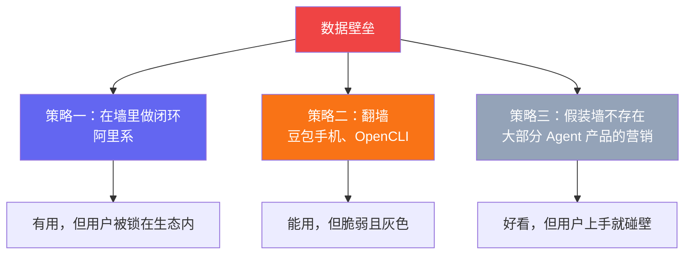
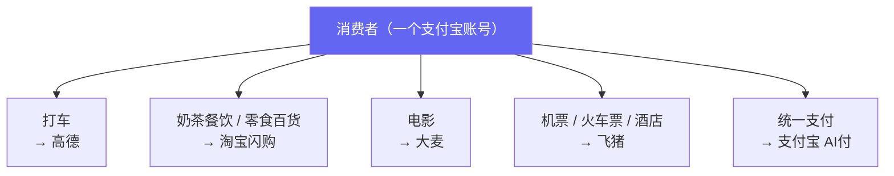
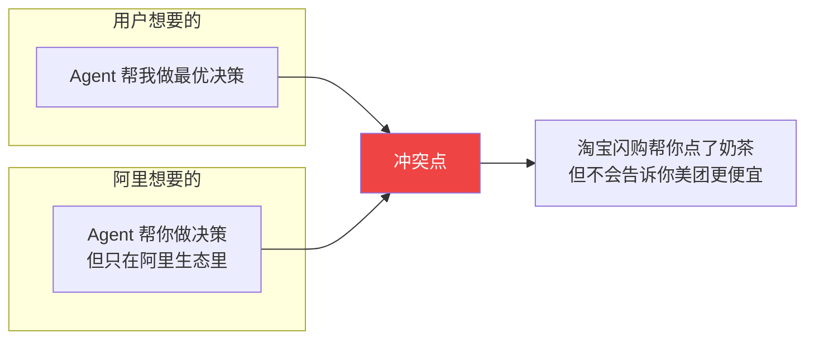
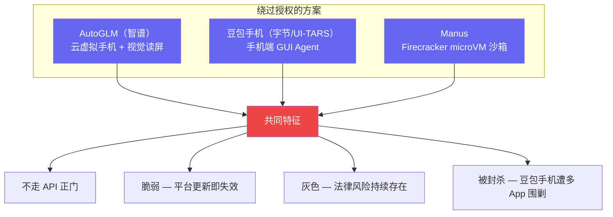
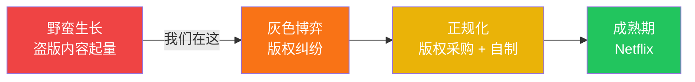
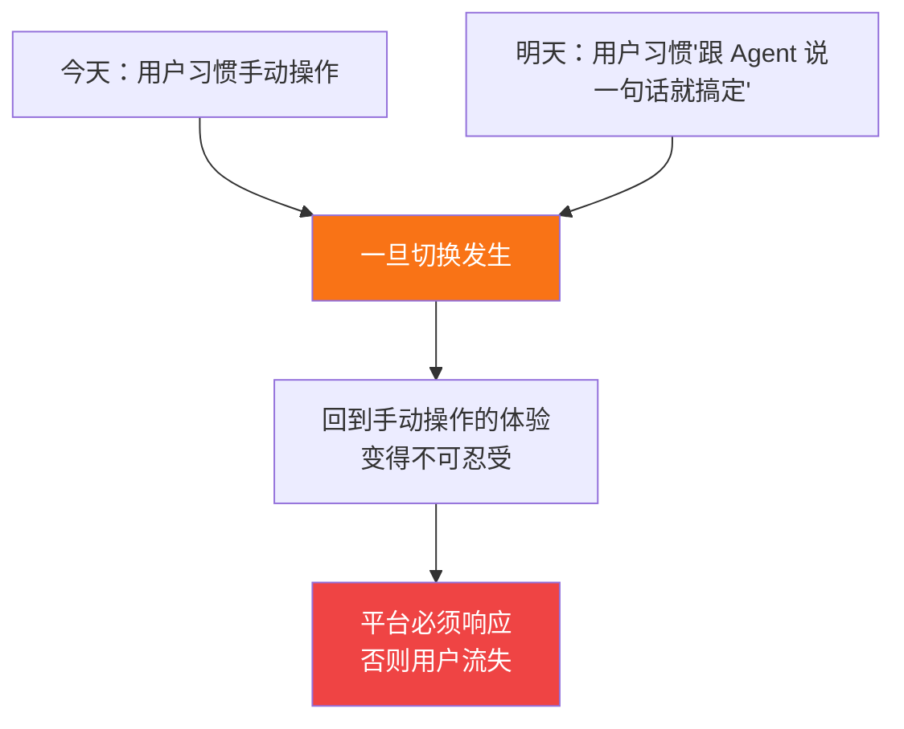
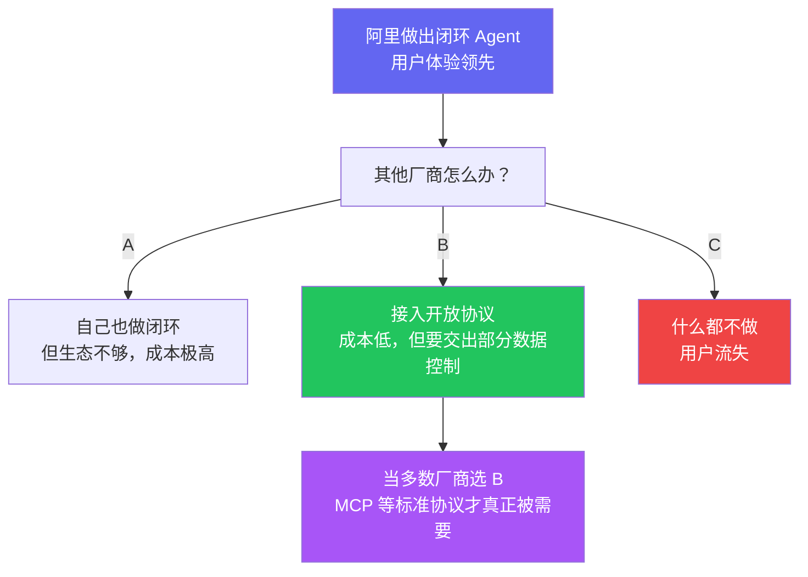
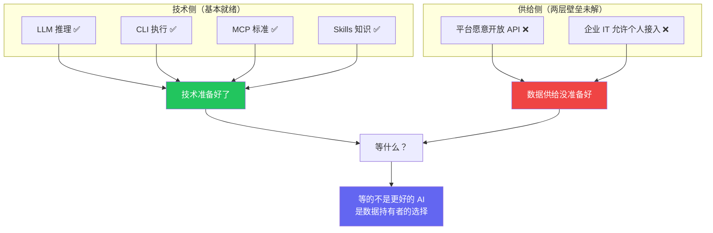

> 前两篇我们分析了：CLI vs MCP 争的是管道，真正缺的是水龙头（[第一篇](/posts/cli-vs-mcp-vs-skills/)）；Agent 落地受阻于两层壁垒——平台封锁和组织管控（[第二篇](/posts/agent-bottleneck-data-sovereignty/)）。这篇看看现实中各方在怎么应对这两面墙。

## 三种应对策略

面对数据壁垒，目前出现了三种截然不同的策略：

策略三的代表产品不少。OpenClaw 在 Mac mini 上 24/7 运行，社区有自动生成飞书日报[^2]和财务报表的 Skill；Perplexity 在 2026 年 3 月发布了 Personal Computer[^5]，同样跑在 Mac mini 上，接入 Gmail、Slack、GitHub、Notion、Salesforce 等 40+ 服务，月费 $200；Anthropic 的 Claude Cowork 则定位本地自主 Agent。Demo 视频里数据在多个平台之间流转得行云流水。

这些能力是真实的。但它们有一个共同的前提：**你已经拥有所有工具的 API 权限。** [第二篇](/posts/agent-bottleneck-data-sovereignty/)已经分析过，这个前提在大多数真实工作环境中并不成立——平台可能不开放，即使开放了你的公司 IT 也可能不批准。

有一个值得注意的现象：同样是让 AI 代替用户操作应用，在 PC 端（OpenClaw）被热捧，在手机端（豆包手机）却遭微信、支付宝等主流 App 联合封杀[^6]。原因很清楚——手机端的每个 App 都是封闭生态，系统级 AI 助手直接踩在了它们流量变现的命门上。

重点看前两种策略。

## 策略一：在围墙里做闭环——阿里的双线布局

阿里的策略最清晰：**不打破围墙，在自己的围墙里先把闭环做了。** 而且 B 端和 C 端同时推进。

### C 端：千问 App——"搜索→决策→支付→履约"全链路

千问 App 的"千问办事"功能已经接入了阿里生态的核心消费场景[^9]：

这不是 demo——阿里在用真金白银推闭环落地。千问 App 的"每日首单必减"活动[^10]每天发放 **1500 万份**优惠券，覆盖外卖、酒店、机票、打车、电影票，支付统一通过支付宝 AI付完成。用户说一句"帮我点 30 杯奶茶"，千问就能走完从理解需求、挑选商品、自动领券到直达下单页面的全流程。

量子位的评价是：阿里已成为"全球首个大规模开放'搜索-决策-支付-履约'全链路 AI 功能的科技公司"[^9]。技术上基于 MCP + A2A 协议，采用多 Agent 架构——主 Agent 拆解任务，多个子 Agent 在各自领域独立执行。

**Auth 流程在生态内部几乎无感**——首次使用时完成千问与高德/淘宝/飞猪的账号授权绑定（类似 `gh auth login` 的 OAuth 流程），之后所有操作自动带上登录态。整个阿里系共享支付宝账号体系，用户不需要反复授权。

### B 端：悟空——企业级 AI Agent 平台

2026 年 3 月 17 日，阿里发布了企业级 AI Agent 平台"悟空"[^4]，内嵌到超 2000 万企业组织的钉钉之中。钉钉 CEO 陈航的定位很明确：

> "和市面上所有的龙虾 Agent 不一样，悟空天然就长在企业组织中。"

钉钉为此进行了**完整的 CLI 化改造**——悟空原生操作钉钉的上千项能力，而非模拟人类点击。结合[第一篇](/posts/cli-vs-mcp-vs-skills/)的分析，这验证了 CLI 在 Agent 工具调用中的效率优势。阿里旗下淘宝、天猫、1688、支付宝、阿里云等 B 端能力以 Skill 形式逐步接入，首批覆盖十大行业场景[^4]。AI Agent 自动继承企业权限规则，绕过了[第二篇](/posts/agent-bottleneck-data-sovereignty/)分析的"组织管控"壁垒。

### 生态对比

| 玩家 | 有什么 | 缺什么 |
|------|--------|--------|
| **阿里（千问+悟空）** | 电商+支付+出行+本地生活+企业协作+云 | 社交、内容 |
| **腾讯** | 社交+内容+支付+企业微信 | 电商闭环、出行 |
| **字节** | 内容+本地生活+飞书 | 支付、供应链 |
| **百度** | 搜索+地图+AI 模型 | 交易闭环、企业协作 |

阿里的优势：**离交易最近，且 B 端 C 端同时闭环。** Agent 的终极价值不是聊天，是帮用户完成决策→执行→支付的完整链路。阿里是目前唯一在 C 端（千问 App）和 B 端（悟空）同时跑通这条链路的平台。

### 但这里存在一个结构性矛盾

**私有生态 Agent 的本质：用 AI 的便利性，换取用户对比价权的放弃。** 千问能帮你在淘宝闪购自动领券、凑单、下单，但它不会告诉你同一杯奶茶在美团外卖上可能更便宜。

## 策略二：翻墙——爬虫的新形态

等不及平台开放，有人开始强行突破：

这条路线上有几个代表性产品，技术形态各不相同但本质一致：

**智谱 AutoGLM**[^7]：为 AI 配备"云端虚拟手机"，Agent 在云虚拟机里通过视觉模型理解屏幕内容，模拟人类操作完成跨 App 任务（点外卖、订机票、发微博）。不需要任何 API——它直接"看"屏幕。

**豆包手机（字节/UI-TARS）**[^6]：手机端 GUI Agent，同样基于视觉驱动。一条语音指令就能完成从约人吃饭到订好场地、同步行程的全流程操作。上线后被微信、支付宝等多款 App 封杀，一部 3499 元的手机在二手市场被炒到 3.6 万元。

**Manus**[^8]：每个任务分配一台独立的 Firecracker microVM（与 AWS Lambda 同一技术），Agent 在完整的云端沙箱环境里运行浏览器、写代码、操作文件，任务完成后交付结果。

**技术形态不同，本质一致：不走 API 正门，绕过平台的授权体系来获取数据和执行操作。** 从爬网页到爬屏幕到开虚拟机，手段在升级，但脆弱性和灰色地带没有根本改善——UI 改版即失效、平台封杀即停摆、法律风险始终悬着。

而且"翻墙"不只是脆弱——**还危险**。OpenClaw 的安全事件[^1]就是警示：

- **10,000+ 实例**因配置不当泄露了用户凭证
- 社区 Skills 中有 **12% 被发现是恶意的**——注入代码、窃取数据、建立持久化后门
- **770,000 个 Agent** 被发现存在远程劫持风险

这些不是代码 bug，而是**架构层面的必然结果**——当你给 Agent shell 访问权限却没有授权边界时，安全事故是迟早的事。这也是为什么 MCP 的 OAuth + 权限隔离在企业场景中仍然有存在价值。

这些产品确实在推动一件对的事，但用的是注定不可持续的方式——不只是技术上不可持续，安全上也不可持续。

## 类比：视频网站的演进

Agent 生态现在像 2008 年的视频网站——靠"爬"来的内容（数据）给用户提供价值。用户确实获益了，但模式不可持续。

正规化需要的是平台主动开放——就像视频网站最终走向版权采购。但在 Agent 领域，这意味着平台要交出数据控制权，动的是商业模式的根基。

## 什么力量会推倒第一块砖？

不是技术。推动变化的是三件事：

### 1. 用户预期的不可逆转

如果阿里的闭环 Agent 先做出来了，用户在阿里生态里体验过"说一句话就能订酒店+买机票+规划路线"之后，回到其他平台手动搜索的体验就变得不可忍受。

### 2. 监管的外力

欧盟 DMA（数字市场法案）已经在强制大平台开放互操作。国内的《个人信息保护法》有数据可携带条款——你的数据是你的，平台有义务让你导出。

如果这类政策被认真执行，那就是真正的转折点。

### 3. 竞争的囚徒困境

就像银联/网联打通支付——不是谁主动想开放，是监管 + 竞争 + 用户预期共同推动的。

阿里现在做的事，短期看是在固化自己的围墙。**长期看反而可能是推倒围墙的第一张多米诺骨牌**——因为它会制造用户预期的差距，逼其他平台不得不跟进。

## 所以我们在等什么？

**AIGC 时代的瓶颈不是 AI 不够强，是数据持有者没有动力让 AI 替用户做选择。**

因为一旦 Agent 能帮用户做最优选择，平台就失去了操纵用户决策的能力。Agent 对民生的价值和对平台利润的威胁，是同一件事的两面。

这个问题没有技术解——它需要用户预期、监管压力和市场竞争共同推动。而这三股力量正在缓慢积聚。

第一块砖会从哪里倒？我的猜测是阿里的闭环 Agent 先跑出体验差距，然后竞争压力传导到其他平台，然后监管顺势推一把。

至于这需要多久——大概比技术乐观派想的更慢，比悲观派想的更快。

---

*这是 "Agent 生态思考" 系列第三篇。这个系列的核心观点只有一句话：**CLI vs MCP 争的是管道，缺的是水龙头。** 技术全部就绪，等的是数据持有者的选择。*

---

## 参考资料

[^1]: OpenClaw 安全事件数据来自 ScaleKit, ["MCP vs CLI: Benchmarking AI Agent Cost & Reliability"](https://www.scalekit.com/blog/mcp-vs-cli-use), Mar 2026。另见 [Skills vs MCP: The Token Efficiency War](https://menonlab-blog-production.up.railway.app/blog/skills-vs-mcp-token-efficiency-ai-agents/) 中的引用。

[^2]: OpenClaw 社区的飞书集成 Skills，包括 [feishu-ai-dailyreport](https://playbooks.com/skills/openclaw/skills/feishu-ai-dailyreport)（团队自动日报）和 [finance-report-analyzer](https://playbooks.com/skills/openclaw/skills/finance-report-analyzer)（财务报表生成）。

[^3]: Microsoft AutoGen 框架（55,000+ GitHub stars），2026 年 Q1 与 Semantic Kernel 统一为 Microsoft Agent Framework。早期企业采用案例包括 KPMG 审计自动化和 BMW 车辆遥测分析。参见 [Microsoft Agent Framework GA: Production Adoption Strategy](https://jangwook.net/en/blog/en/microsoft-agent-framework-ga-production-strategy/)。

[^4]: 阿里巴巴于 2026 年 3 月 17 日发布企业级 AI Agent 平台"悟空"，内嵌钉钉，阿里生态 ToB 能力以 Skill 形式接入。参见[新浪财经报道](https://finance.sina.com.cn/roll/2026-03-17/doc-inhrhxzp8083854.shtml)、[鲸林向海深度分析](https://www.itsolotime.com/archives/26159)。

[^5]: Perplexity 于 2026 年 3 月 11 日在 Ask 2026 开发者大会上发布 Personal Computer，运行在 Mac mini 上，$200/月（Perplexity Max 订阅），接入 40+ 服务。参见 [The Verge 报道](https://www.theverge.com/ai-artificial-intelligence/893536/perplexitys-personal-computer-turns-your-spare-mac-into-an-ai-agent)。

[^6]: 豆包手机（字节跳动 UI-TARS 技术）于 2025 年 12 月发布技术预览版，随后遭到微信、支付宝等多款主流 App 封杀。一部 3499 元的手机在二手市场被炒至 3.6 万元。参见[新浪财经："Manus、豆包手机没成的事，为何被一只'龙虾'做到了？"](https://finance.sina.com.cn/wm/2026-03-17/doc-inhrieik2013061.shtml)。

[^7]: 智谱 AutoGLM：全球首个手机 Agent，基于 GLM-4.5V 多模态模型，采用"云端虚拟手机"架构，Agent 在沙箱中运行。2025 年 12 月开源（Apache-2.0）。参见 [GitHub: Open-AutoGLM](https://github.com/zai-org/Open-AutoGLM)。

[^8]: Manus：通用 Agent 平台，每个任务分配独立 Firecracker microVM 沙箱（2 vCPU, 8GB RAM），Agent 在完整云端环境中自主运行。2026 年被 Meta 收购。参见 [Manus Sandbox 核心机制揭秘](https://www.53ai.com/news/LargeLanguageModel/2026011671960.html)。

[^9]: 千问 App "千问办事"功能接入淘宝闪购、飞猪、高德、大麦、支付宝等阿里生态，实现"搜索→决策→支付→履约"全链路。基于 MCP + A2A 协议，多 Agent 架构。参见量子位，["AI开始'动手'了，全世界第一个带头的是阿里千问"](https://zhuanlan.zhihu.com/p/1995444089915728132)。

[^10]: 千问 App "每日首单必减"活动规则：每日发放 1500 万份优惠券，覆盖外卖餐饮、零食百货、酒店、电影票、机票、火车票、打车等场景。服务由淘宝闪购、大麦、飞猪、高德提供履约支持，支付宝提供支付及优惠核销能力。数据来源：千问 App 活动规则页面（2026 年 2 月 18 日起）。
