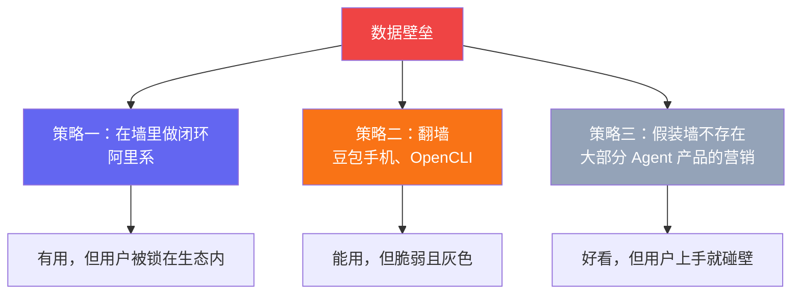
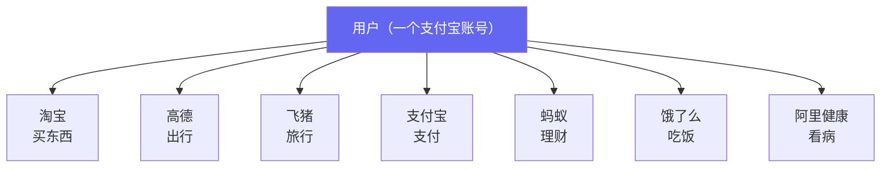
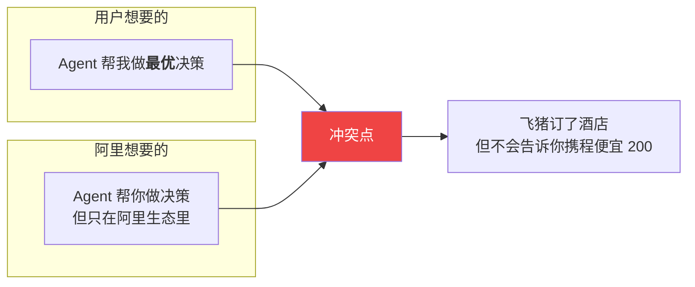
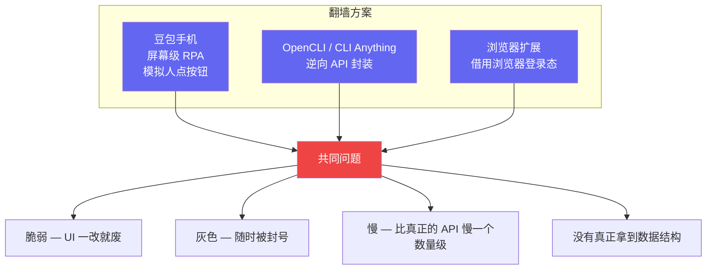
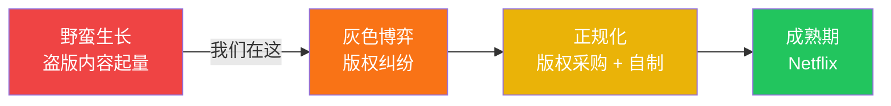
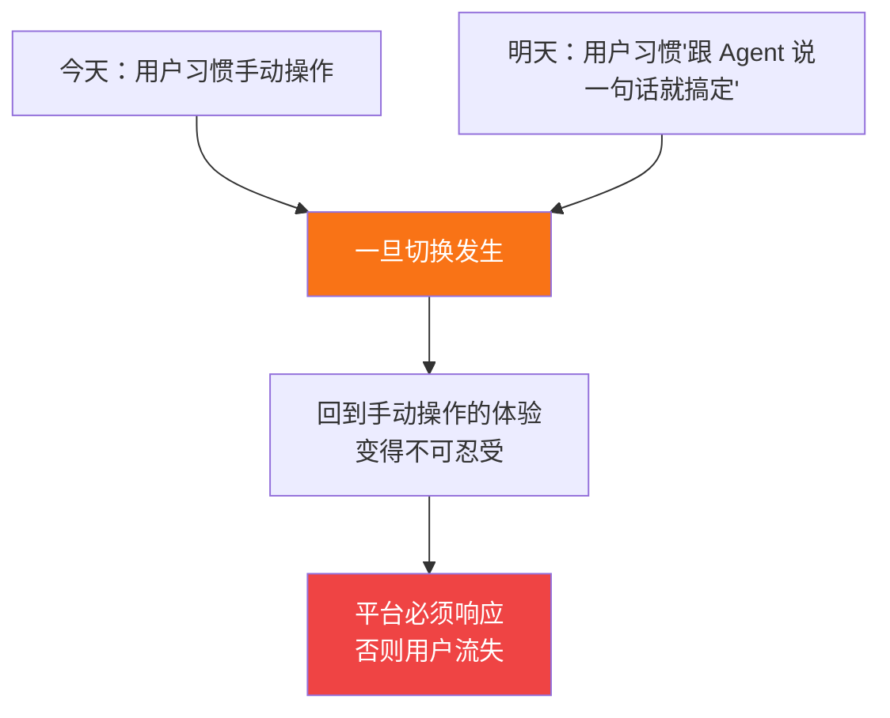
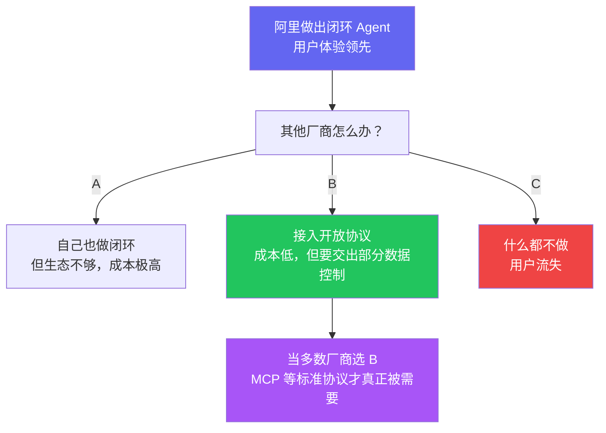
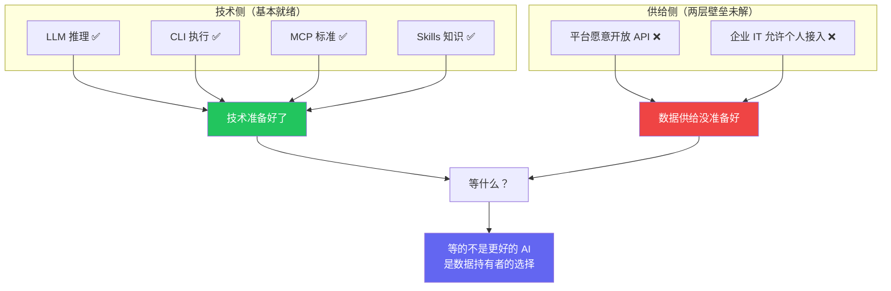

> 前两篇我们分析了：CLI vs MCP 争的是管道，真正缺的是水龙头（[第一篇](/posts/cli-vs-mcp-vs-skills/)）；Agent 落地受阻于两层壁垒——平台封锁和组织管控（[第二篇](/posts/agent-bottleneck-data-sovereignty/)）。这篇看看现实中各方在怎么应对这两面墙。

## 三种应对策略

面对数据壁垒，目前出现了三种截然不同的策略：

策略三不需要多说——打开任何一个 Agent 产品的官网，你会看到"自动化你的工作流""连接你所有的工具"之类的承诺。它们的演示视频跑得很流畅，但前提是：你有所有工具的 API 权限。[第二篇](/posts/agent-bottleneck-data-sovereignty/)已经分析过，这个前提在大多数真实工作环境中并不成立。

重点看前两种策略。

## 策略一：在围墙里做闭环——阿里的路径

在跨平台开放看不到希望的情况下，阿里选了另一条路：**不打破围墙，在自己的围墙里先把闭环做了。**

阿里手上的牌恰好覆盖了一个人日常生活的完整链路。一个 Agent 只接阿里系的数据，就已经能回答：

> "帮我规划下周末带家人去杭州玩两天，预算 3000，我妈腿不好别走太多路。"

高德知道路线和步行距离，飞猪知道酒店，淘宝能买装备，支付宝能付钱，阿里健康知道老人身体状况。

**Auth 问题天然解决了——你已经登录了支付宝，整个阿里系共享一套账号体系。**

对比其他玩家：

| 玩家 | 有什么 | 缺什么 |
|------|--------|--------|
| **阿里** | 电商+支付+出行+健康+本地生活 | 社交、内容 |
| **腾讯** | 社交+内容+支付 | 电商闭环、出行 |
| **字节** | 内容+本地生活 | 支付、出行、健康 |
| **百度** | 搜索+地图+AI 技术 | 交易闭环、支付 |

阿里的优势：**离交易最近。** Agent 的终极价值不是聊天，是帮你完成决策→执行→支付的闭环。阿里是唯一从头到尾都能闭环的。

### 但这里存在一个结构性矛盾

**私有生态 Agent 的本质：用 AI 的便利性，换取用户对比价权的放弃。**

## 策略二：翻墙——爬虫的新形态

等不及平台开放，有人开始强行突破：

豆包手机是最具代表性的案例——平台不提供 API，它就直接读取屏幕内容，模拟用户的点击操作。

**本质仍然是爬虫。** 从爬取网页变成了爬取屏幕。技术形态更新了，但脆弱性和法律灰色地带没有任何改善。

OpenCLI 等项目的思路类似——逆向工程封装平台的非公开接口，包装成 CLI 工具。短期能用，但平台一旦更新接口就会失效，且法律风险始终存在。

而且"翻墙"不只是脆弱——**还危险**。OpenClaw 的安全事件[^1]就是警示：

- **10,000+ 实例**因配置不当泄露了用户凭证
- 社区 Skills 中有 **12% 被发现是恶意的**——注入代码、窃取数据、建立持久化后门
- **770,000 个 Agent** 被发现存在远程劫持风险

这些不是代码 bug，而是**架构层面的必然结果**——当你给 Agent shell 访问权限却没有授权边界时，安全事故是迟早的事。这也是为什么 MCP 的 OAuth + 权限隔离在企业场景中仍然有存在价值。

这些产品确实在推动一件对的事，但用的是注定不可持续的方式——不只是技术上不可持续，安全上也不可持续。

## 类比：视频网站的演进

Agent 生态现在像 2008 年的视频网站——靠"爬"来的内容（数据）给用户提供价值。用户确实获益了，但模式不可持续。

正规化需要的是平台主动开放——就像视频网站最终走向版权采购。但在 Agent 领域，这意味着平台要交出数据控制权，动的是商业模式的根基。

## 什么力量会推倒第一块砖？

不是技术。推动变化的是三件事：

### 1. 用户预期的不可逆转

如果阿里的闭环 Agent 先做出来了，用户在阿里生态里体验过"说一句话就能订酒店+买机票+规划路线"之后，回到其他平台手动搜索的体验就变得不可忍受。

### 2. 监管的外力

欧盟 DMA（数字市场法案）已经在强制大平台开放互操作。国内的《个人信息保护法》有数据可携带条款——你的数据是你的，平台有义务让你导出。

如果这类政策被认真执行，那就是真正的转折点。

### 3. 竞争的囚徒困境

就像银联/网联打通支付——不是谁主动想开放，是监管 + 竞争 + 用户预期共同推动的。

阿里现在做的事，短期看是在固化自己的围墙。**长期看反而可能是推倒围墙的第一张多米诺骨牌**——因为它会制造用户预期的差距，逼其他平台不得不跟进。

## 所以我们在等什么？

**AIGC 时代的瓶颈不是 AI 不够强，是数据持有者没有动力让 AI 替用户做选择。**

因为一旦 Agent 能帮用户做最优选择，平台就失去了操纵用户决策的能力。Agent 对民生的价值和对平台利润的威胁，是同一件事的两面。

这个问题没有技术解——它需要用户预期、监管压力和市场竞争共同推动。而这三股力量正在缓慢积聚。

第一块砖会从哪里倒？我的猜测是阿里的闭环 Agent 先跑出体验差距，然后竞争压力传导到其他平台，然后监管顺势推一把。

至于这需要多久——大概比技术乐观派想的更慢，比悲观派想的更快。

---

*这是 "Agent 生态思考" 系列第三篇。这个系列的核心观点只有一句话：**CLI vs MCP 争的是管道，缺的是水龙头。** 技术全部就绪，等的是数据持有者的选择。*

---

## 参考资料

[^1]: OpenClaw 安全事件数据来自 ScaleKit, ["MCP vs CLI: Benchmarking AI Agent Cost & Reliability"](https://www.scalekit.com/blog/mcp-vs-cli-use), Mar 2026。另见 [Skills vs MCP: The Token Efficiency War](https://menonlab-blog-production.up.railway.app/blog/skills-vs-mcp-token-efficiency-ai-agents/) 中的引用。
